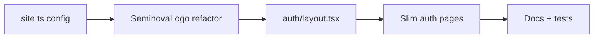

# Phase 3 Epic 4 — Auth Screen Restyle

## Prerequisites (verified)

| Prerequisite | Status |
|---|---|
| Phase 3 Epic 1 (admin CLI) | Shipped — [`scripts/admin/`](scripts/admin/) |
| Phase 3 Epic 2 (admin shell + `SeminovaLogo`) | Shipped — [`src/components/seminova-logo.tsx`](src/components/seminova-logo.tsx), [`src/app/(admin)/_components/admin-sidebar.tsx`](src/app/(admin)/_components/admin-sidebar.tsx) |
| Phase 3 Epic 3 (Users page) | Shipped — [`src/app/(admin)/users/`](src/app/(admin)/users/) |
| Phase 2 semantic tokens on auth forms | Done — forms use `text-destructive`, `text-muted-foreground`, `Card` primitives; no hardcoded colors |
| `bg-muted` token | Defined in [`src/app/globals.css`](src/app/globals.css) |
| `src/config/site.ts` | **Not built** |
| Auth shared layout | **Not built** — 6 pages duplicate the same centering wrapper ([`src/app/auth/login/page.tsx`](src/app/auth/login/page.tsx) pattern) |
| Logo on auth screens | **Not wired** — `SeminovaLogo` is admin-sidebar only today |
| shadcn `login-03` / `signup-03` | **Not installed** — use as structural reference only |

**No migration or env changes required.**

---

## Scope

Two stories from [CONTEXT.md](CONTEXT.md) ACTIVE Epic 4:

1. **Auth screens match the rest of the app** — muted full-page background, centered form, Seminova branding above card, uniform across all `/auth/**` screens
2. **Canonical app identity in one place** — `src/config/site.ts`; `SeminovaLogo` reads `name` + `logo`; README/AGENTS.md cross-reference

**In scope:** `site.ts`, `SeminovaLogo` refactor, new `auth/layout.tsx`, dedupe page wrappers, docs pointer, targeted tests, full quality gate.

**Out of scope (explicit):**
- Form fields, validation, Supabase calls, redirects — unchanged ([`src/components/login-form.tsx`](src/components/login-form.tsx) et al.)
- [`src/app/auth/confirm/route.ts`](src/app/auth/confirm/route.ts) — route handler, unaffected by layout
- Root `metadata` / page `<title>` / other hardcoded "Seminova" strings — deferred to Phase 4 "Full site.ts adoption audit" open question
- Final visual identity / purple-tinted backgrounds — Phase 4 Landing territory
- Theme toggle on auth pages — not in epic spec; do not add unless PM asks

---

## Plan structure: sequential

Story 2 (`site.ts`) is a hard dependency for Story 1 (auth shell uses the same logo component). Execute in order below — not parallelizable.



---

## Step 1 — `src/config/site.ts` (Story 2 core)

Create [`src/config/site.ts`](src/config/site.ts):

- Export `siteConfig` with:
  - `name: string` — default `'Seminova'`
  - `Logo: LucideIcon` (or a small `() => JSX.Element` component) — default `Sparkles` from `lucide-react`, matching today's icon treatment
- Keep it a plain TS module (no `'use client'`) so Server Components can import it
- Type the logo slot so a future real SVG/image component can replace the Lucide icon without refactoring consumers

**Re-skin contract:** editing `name` and `Logo` in this one file is how products rebrand sidebar + auth.

---

## Step 2 — Refactor `SeminovaLogo`

Update [`src/components/seminova-logo.tsx`](src/components/seminova-logo.tsx):

| Today | Change |
|---|---|
| Hardcoded `"Seminova"` | `siteConfig.name` |
| Hardcoded `Sparkles` | `siteConfig.Logo` |
| Default `href = '/users'` | Keep default for admin; auth layout passes `href="/"` explicitly |
| `text-sidebar-foreground` always | Accept existing `className` override; auth layout passes `text-foreground` (sidebar keeps current look via default or explicit class) |

**Admin sidebar** ([`admin-sidebar.tsx`](src/app/(admin)/_components/admin-sidebar.tsx)): no structural change expected — continues using `<SeminovaLogo className="hover:bg-transparent" />` (links to `/users` via default).

Update [`src/components/seminova-logo.unit.test.tsx`](src/components/seminova-logo.unit.test.tsx) to assert `siteConfig.name` renders (import config in test rather than hardcoding `"Seminova"`).

---

## Step 3 — shadcn reference (structural only)

Before building the layout, pull reference markup:

```bash
pnpm dlx shadcn@latest add login-03 signup-03 --dry-run
```

If files would land outside `src/app/auth/`, install to inspect then **discard route files** — only borrow the shell pattern:

- `min-h-svh flex … items-center justify-center bg-muted p-6 md:p-10`
- Logo block above `max-w-sm` content column
- No side image (login-03 style)

Do **not** replace existing form components or routes with shadcn-generated pages.

---

## Step 4 — Shared auth layout (Story 1 core)

Create [`src/app/auth/layout.tsx`](src/app/auth/layout.tsx) as a **Server Component**:

```tsx
// Shape (not final code)
<div className="bg-muted flex min-h-svh flex-col items-center justify-center p-6 md:p-10">
  <div className="flex w-full max-w-sm flex-col gap-6">
    <SeminovaLogo href="/" className="text-foreground justify-center" />
    {children}
  </div>
</div>
```

- `bg-muted` on the outer shell per CONTEXT (not on `body`)
- Logo centered above `{children}`; links to `/` (public landing)
- Applies to all auth pages including `sign-up-success` and `error` (confirm route is unaffected — no layout)

**Optional extract:** if layout + logo exceeds ~40 lines, co-locate [`src/app/auth/_components/auth-shell.tsx`](src/app/auth/_components/auth-shell.tsx) — keep under 150-line component limit.

---

## Step 5 — Slim auth pages

Remove duplicated outer wrappers from these pages (layout now owns centering + background):

| Page | After change |
|---|---|
| [`login/page.tsx`](src/app/auth/login/page.tsx) | `<LoginForm />` only |
| [`sign-up/page.tsx`](src/app/auth/sign-up/page.tsx) | `<SignUpForm />` only |
| [`forgot-password/page.tsx`](src/app/auth/forgot-password/page.tsx) | `<ForgotPasswordForm />` only |
| [`update-password/page.tsx`](src/app/auth/update-password/page.tsx) | `<UpdatePasswordForm />` only |
| [`sign-up-success/page.tsx`](src/app/auth/sign-up-success/page.tsx) | Keep inner `Card`; drop outer `min-h-svh` wrappers |
| [`error/page.tsx`](src/app/auth/error/page.tsx) | Keep inner `Card` + `Suspense`; drop outer wrappers |

**Do not edit** the four form components' internal `Card` structure — they already match the login-03 card-inside-shell pattern.

---

## Step 6 — Tests

Per [testing minimalism](.cursor/rules/testing.mdc):

| Test | Action |
|---|---|
| Existing form integration tests | Must still pass unchanged (behavior-only) |
| `seminova-logo.unit.test.tsx` | Update for `siteConfig.name` |
| **New (1 test):** auth layout smoke | Render a minimal child through auth layout (or test page export) — assert logo wordmark + `bg-muted` shell present |

Skip per-page visual tests for all 6 routes — one layout test covers the shared shell.

---

## Step 7 — Docs and quality gate

- [`README.md`](README.md) + [`AGENTS.md`](AGENTS.md): one-line pointer — app name/logo live in `src/config/site.ts` (cross-reference only; markdown cannot import TS)
- Run `/sync-repo-docs` — add Epic 4 to **Implemented now** (auth layout, `site.ts`, logo centralization)
- Full gate:

```bash
pnpm type-check && pnpm lint && pnpm format-check && pnpm test:ci
```

---

## Manual testing checklist

1. Visit each route in light + dark mode: `/auth/login`, `/auth/sign-up`, `/auth/forgot-password`, `/auth/update-password`, `/auth/sign-up-success`, `/auth/error`
2. Confirm: muted full-page background, centered logo linking to `/`, card forms unchanged, semantic tokens only
3. Admin sidebar: logo still shows `siteConfig.name`, still links to `/users`
4. Edit `site.ts` `name` locally — verify sidebar + auth logo update together
5. Login/sign-up/forgot/reset flows still work (redirects unchanged)

---

## Risk notes

| Risk | Mitigation |
|---|---|
| `SeminovaLogo` default `href="/users"` on auth if forgotten | Auth layout passes `href="/"` explicitly |
| shadcn install overwrites customized UI | `--dry-run` first; never `-o` on owned `ui/` primitives |
| `text-sidebar-foreground` looks wrong on auth | Auth layout overrides via `className="text-foreground"` |
| Form integration tests break | Forms untouched; only page wrappers change |

**Risk level:** LOW — presentation-only; no auth/data-path changes.

---

## Completes Phase 3

After this epic ships + docs sync, Phase 3 (App Shell + Auth restyle) is complete. Next planned work: **Phase 4 — Landing Page** (includes deferred `site.ts` metadata audit).
