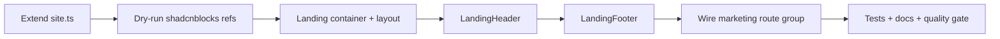

# Phase 4 Epic 1 — Header & Footer Chrome

## Prerequisites (verified)

| Prerequisite | Status |
|---|---|
| Phase 3 shipped (admin shell, auth restyle, `site.ts`, `SeminovaLogo`) | Done — [`src/config/site.ts`](src/config/site.ts), [`src/components/seminova-logo.tsx`](src/components/seminova-logo.tsx) |
| Semantic tokens + mobile-first rules | Done — [`src/app/globals.css`](src/app/globals.css), [`DESIGN.md`](DESIGN.md) |
| shadcnblocks registry | Configured — [`components.json`](components.json) |
| `sheet` primitive (mobile nav) | Installed — [`src/components/ui/sheet.tsx`](src/components/ui/sheet.tsx) |
| Public route `/` | Starter shell only — [`src/app/page.tsx`](src/app/page.tsx) (hardcoded "Next.js Supabase Starter", inline nav/footer) |
| Landing mockup | [`.mockups/seminova_landing_mockup_final.html`](.mockups/seminova_landing_mockup_final.html) (CONTEXT references `landing-page.html` — rename or update CONTEXT in doc sync) |
| GitHub URL | **Confirmed:** `https://github.com/aaronwllms/seminova` |
| Terms / Privacy | **Confirmed:** stub labels only — visible in footer, not navigable |

**No migration, proxy, or env changes required.**

---

## Scope

From [CONTEXT.md](CONTEXT.md) Phase 4 Epic 1:

**In scope**
- Sticky landing header (navbar1 visual language, flat links, Login + Sign Up → `/auth/login`, `/auth/sign-up`)
- Landing footer (logo + name, nav links, social icons, copyright + legal stub row)
- Shared horizontal container: `max-w-7xl mx-auto px-6 lg:px-8` — width only; sections flush vertically
- Header/footer read identity from [`src/config/site.ts`](src/config/site.ts)
- Replace starter chrome on `/`; leave a minimal main placeholder for Epic 2 content
- Targeted tests + quality gate + `/sync-repo-docs`

**Out of scope (later epics)**
- Hero, features grid, tech-stack strip — **Epic 2**
- Root `metadata` / hardcoded "Seminova" grep audit — **Epic 3**
- Theme switcher on landing (not in spec; current footer toggle removed with starter shell)
- Functional `/terms` / `/privacy` routes
- Logged-in header state (`AuthButton` email display) — spec calls for Login/Sign Up only

---

## Plan structure: sequential

Header depends on extended `site.ts` nav config; footer shares the same config; page wiring comes last. Not parallelizable.



---

## Step 1 — Extend `src/config/site.ts`

Add landing-specific config alongside existing `name` + `Logo` (keep `SeminovaLogo` working unchanged).

Suggested shape:

```typescript
export const siteConfig = {
  name: 'Seminova',
  Logo: Sparkles,
  links: {
    github: 'https://github.com/aaronwllms/seminova',
    // x: optional — omit social row entry until URL is known
  },
  nav: [
    { label: 'Home', href: '/' },
    { label: 'Features', href: '#features' }, // Epic 2 adds id="features"
    { label: 'GitHub', href: 'https://github.com/aaronwllms/seminova', external: true },
  ],
  social: [
    { label: 'GitHub', href: 'https://github.com/aaronwllms/seminova', icon: 'github' },
    // X/Twitter omitted until URL confirmed
  ],
  legal: [
    { label: 'Terms' },   // stub — no href
    { label: 'Privacy' }, // stub — no href
  ],
}
```

Use a small typed interface; external links get `rel="noopener noreferrer"` + `target="_blank"`. Legal stubs render as `<span>` (not `<a>`) for WCAG honesty.

---

## Step 2 — shadcnblocks reference (structure only)

Same pattern as Phase 3 admin shell — **dry-run first, port manually, do not blindly `-o` owned UI**:

```bash
pnpm dlx shadcn@latest add @shadcnblocks/navbar1 --dry-run
pnpm dlx shadcn@latest add @shadcnblocks/footer1 --dry-run   # adjust block id if dry-run fails
```

Extract from references:
- **Header:** logo left, flat nav center/right, auth CTAs right, sticky `top-0 z-50 bg-background/95 backdrop-blur border-b`, mobile hamburger → `Sheet` (already installed)
- **Footer:** two-row layout — brand + nav + social on top; copyright + legal stubs on bottom with `border-t`

**Simplify vs blocks:** no dropdown/mega menus, no CDN logo images, no hardcoded colors — semantic tokens only.

Install any **missing** primitives the dry-run reports (e.g. `navigation-menu`) with `-y -o` only for net-new `ui/` files.

---

## Step 3 — Landing layout primitives

**Route group** — keeps `/` URL, isolates public marketing chrome from auth/admin layouts:

```
src/app/
  (marketing)/
    layout.tsx              # wraps children with header + footer
    page.tsx                # minimal main placeholder (Epic 2 fills in)
    _components/
      landing-container.tsx # max-w-7xl mx-auto px-6 lg:px-8
      landing-header.tsx
      landing-footer.tsx
      landing-auth-buttons.tsx  # Login + Sign Up; EnvVarWarning when !hasEnvVars
```

Delete [`src/app/page.tsx`](src/app/page.tsx) after moving to `(marketing)/page.tsx`.

**`landing-container.tsx`** — single source for the 1280px alignment rule; header/footer inner content and future Epic 2 sections all use it.

**`(marketing)/layout.tsx`** — Server Component shell:

```tsx
<>
  <LandingHeader />
  {children}
  <LandingFooter />
</>
```

**`(marketing)/page.tsx`** — Epic 1 placeholder only:

```tsx
<main id="main-content" className="bg-background" />
```

Epic 2 drops hero/features/stack between header and footer inside this main.

---

## Step 4 — `LandingHeader`

| Concern | Approach |
|---|---|
| Brand | Reuse `SeminovaLogo` with `href="/"` and `className="text-foreground"` (auth layout precedent) |
| Nav links | Map `siteConfig.nav`; `Link` for internal, `<a>` for external |
| Auth CTAs | `LandingAuthButtons` — mirrors [`AuthButton`](src/components/auth-button.tsx) guest state (`Sign in` outline + `Sign up` default); reuse [`EnvVarWarning`](src/components/env-var-warning.tsx) when env missing |
| Sticky | `sticky top-0 z-50` on `<header>` |
| Mobile | Hide desktop nav below `md`; `Sheet` + menu icon for flat link list + auth buttons |
| a11y | `<header>`, `<nav aria-label="Main">`, skip link optional (nice-to-have, not blocking) |
| Size | Keep ≤150 lines — extract `LandingMobileNav` subcomponent if needed |

**Label consistency:** CONTEXT says "Login"; existing auth routes use "Sign in" on [`AuthButton`](src/components/auth-button.tsx). Match existing auth copy (`Sign in` / `Sign up`) unless PM prefers "Login".

---

## Step 5 — `LandingFooter`

Match mockup structure ([`.mockups/seminova_landing_mockup_final.html`](.mockups/seminova_landing_mockup_final.html)):

- **Row 1:** `SeminovaLogo` (no href or `href="/"`) + nav links + social icon buttons (GitHub via `lucide-react` `Github` icon)
- **Row 2:** `© {year} {siteConfig.name}. All rights reserved.` + legal stubs as non-link `<span>` elements
- **Flow:** normal document flow, `border-t`, `bg-background` — not sticky
- **Responsive:** stack rows on small screens (`flex-col gap-4 md:flex-row md:justify-between`)

---

## Step 6 — Tests

Per [testing minimalism](.cursor/rules/testing.mdc) — 2–3 high-value tests:

| Test | Assert |
|---|---|
| `landing-header.unit.test.tsx` | Renders `siteConfig.name`, nav labels, Sign in/up links to `/auth/login` and `/auth/sign-up` |
| `landing-footer.unit.test.tsx` | Copyright includes `siteConfig.name`; Terms/Privacy text present; GitHub link has correct `href` |
| Optional integration smoke | Render `(marketing)/page` — header + footer present, no starter "Next.js Supabase Starter" text |

Skip visual/CSS class assertions and per-breakpoint sheet behavior.

---

## Step 7 — Docs and quality gate

- Run `/sync-repo-docs` — update AGENTS.md **Implemented now** (landing chrome, `(marketing)` route group, extended `site.ts`)
- Rename mockup to `.mockups/landing-page.html` **or** note correct path in CONTEXT during `/sync-context-md` (optional doc hygiene)
- Full gate:

```bash
pnpm type-check && pnpm lint && pnpm format-check && pnpm test:ci
```

---

## Manual testing checklist

1. Visit `/` in light + dark — sticky header stays pinned on scroll; footer scrolls normally
2. Resize to mobile — hamburger opens sheet with nav + auth buttons
3. Click Sign in / Sign up → existing auth screens
4. Click GitHub (nav + icon) → opens `https://github.com/aaronwllms/seminova` in new tab
5. Terms / Privacy visible but not clickable
6. Content edges align: header inner width matches footer inner width (`max-w-7xl`)
7. Admin `/users` and auth `/auth/login` layouts unchanged
8. Edit `site.ts` `name` locally — header/footer wordmark updates

---

## Risk notes

| Risk | Mitigation |
|---|---|
| `SeminovaLogo` uses `text-sidebar-foreground` | Override with `text-foreground` on landing |
| shadcnblocks install overwrites customized `ui/` | `--dry-run` first; manual port into `_components/` |
| `#features` dead anchor until Epic 2 | Acceptable; Epic 2 adds `id="features"` on features section |
| Header component >150 lines | Extract mobile nav subcomponent |
| Removing `ThemeSwitcher` from `/` | Intentional — not in epic spec |

**Risk level:** LOW — presentation-only on public route; no auth/data-path changes.

---

## Unblocks

- **Epic 2** — drops hero, features (`id="features"`), and tech-stack into `(marketing)/page.tsx` using the same `LandingContainer`
- **Epic 3** — metadata + remaining hardcoded "Seminova" strings (root [`layout.tsx`](src/app/layout.tsx) title still says "Next.js and Supabase Starter Kit")
