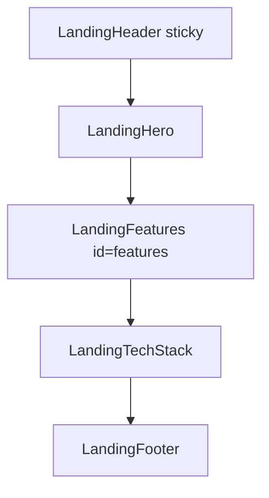
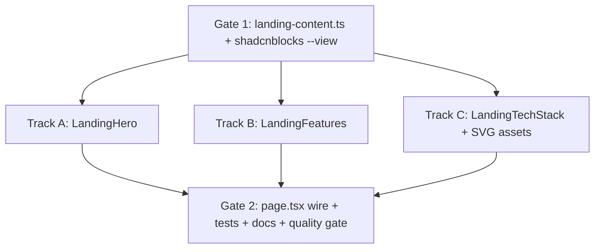

# Phase 4 Epic 2 — Landing Page Content

## Prerequisites (verified)

| Prerequisite | Status |
|---|---|
| Phase 4 Epic 1 — `(marketing)` route group, header/footer, `LandingContainer` | Done — [`src/app/(marketing)/`](src/app/(marketing)/), [`landing-container.tsx`](src/app/(marketing)/_components/landing-container.tsx) |
| `#features` nav anchor wired in header | Done — [`site.ts`](src/config/site.ts) `nav` includes `{ label: 'Features', href: '#features' }`; Epic 2 must add `id="features"` |
| shadcnblocks registry | Configured — [`components.json`](components.json) |
| `button`, `badge`, `card` primitives | Installed — [`src/components/ui/`](src/components/ui/) |
| `@shadcnblocks/hero7` + `@shadcnblocks/feature17` | Resolve via dry-run; **do not install with `-o`** (would overwrite owned `button.tsx`, `badge.tsx`, `avatar.tsx`) |
| Main placeholder | [`src/app/(marketing)/page.tsx`](src/app/(marketing)/page.tsx) — empty `<main>` shell |
| Visual reference | [`.mockups/seminova_landing_mockup_final.html`](.mockups/seminova_landing_mockup_final.html) |

**No migration, proxy, env, or auth changes required.**

---

## Scope

From [CONTEXT.md](CONTEXT.md) Phase 4 Epic 2:

**In scope**
- **Hero** — hero7 visual language: centered title, description, single CTA; **no** star-rating / avatar social-proof row
- **Features** — feature17 visual language: centered intro + six-up icon grid with **locked copy** (order and text from CONTEXT)
- **Tech-stack strip** — horizontal logo row for stack tools (Next.js, Supabase, Vercel, Tailwind/shadcn, etc.)
- All sections use [`LandingContainer`](src/app/(marketing)/_components/landing-container.tsx); sections flush vertically (no inter-section gaps), matching mockup
- Targeted unit tests + `/sync-repo-docs` + full quality gate

**Out of scope**
- Pricing, testimonials, fake social proof
- Root `metadata` / site-wide "Seminova" grep — **Epic 3**
- Theme switcher on landing
- PM/agent workflow explainer page (deferred open question)
- Functional `/terms` / `/privacy` routes

---

## Section order

CONTEXT lists hero → tech stack → features as bullets; the **mockup order** is hero → features → tech stack → footer. **Follow the mockup** — features explain value before the stack strip reinforces what's included, and `#features` anchor scrolls to the right block.



---

## Plan structure: Build in Parallel

Gate 1 defines content + reference structure. Three section components have disjoint file ownership and can be built in parallel. Gate 2 wires the page and runs tests.



---

## Gate 1 — Landing content config

Create [`src/config/landing-content.ts`](src/config/landing-content.ts) — marketing copy separate from identity/nav in [`site.ts`](src/config/site.ts).

```typescript
export interface LandingFeature {
  title: string
  description: string
  icon: LucideIcon  // resolved in component, not stored as JSX
}

export interface LandingTechLogo {
  name: string
  src: string
  width: number
  height: number
}

export const landingContent = {
  hero: {
    title: '…',           // PM approves — see proposed copy below
    description: '…',
    cta: { label: 'Get started', href: '/auth/sign-up' },
  },
  features: {
    label: 'Features',
    heading: '…',         // PM approves
    items: [ /* 6 items — locked titles + descriptions from CONTEXT */ ],
  },
  techStack: {
    label: 'Built with',    // sr-only or visible — mockup uses logos only
    logos: [ /* see Step 5 */ ],
  },
}
```

**Proposed hero copy** (PM approval at build time):

- **Title:** "Start curated, not from scratch"
- **Description:** "An opinionated, AI-native starter with a real design-system structure, agent conventions, and admin shell — so your product begins consistent instead of blank."
- **CTA:** "Get started" → `/auth/sign-up` via `Button asChild` + `Link` (internal route, not raw `<a>`)

**Locked feature cards** (exact copy from CONTEXT — order matters):

1. Design-system token layer
2. Primitive-first components
3. Accessibility by default
4. Admin shell out of the box
5. Agent-ready conventions
6. PM/agent collaboration model

**Lucide icon mapping** (suggested):

| Card | Icon |
|---|---|
| Design-system token layer | `Palette` |
| Primitive-first components | `Blocks` |
| Accessibility by default | `Accessibility` |
| Admin shell out of the box | `LayoutDashboard` |
| Agent-ready conventions | `Bot` |
| PM/agent collaboration model | `Users` |

---

## Gate 1 — shadcnblocks reference (structure only)

Dry-run confirmed block IDs. Use `--view` only — **manual port** into `(marketing)/_components/`, same pattern as Epic 1:

```bash
pnpm dlx shadcn@latest add @shadcnblocks/hero7 --view
pnpm dlx shadcn@latest add @shadcnblocks/feature17 --view
```

**Port from hero7** ([`hero7.tsx` dry-run output](https://shadcnblocks.com)):
- Centered `h1` + `p.text-muted-foreground` + single `Button size="lg"`
- Drop entire reviews/avatars/stars block (hardcoded `yellow-400` — violates semantic-token rule)
- Replace `container` with `LandingContainer`; reduce `py-32` → `py-14 md:py-16` per mockup

**Port from feature17**:
- `Badge` label + centered `h2` intro
- `md:grid-cols-2` icon-circle grid (`bg-accent` circles, `h3` + description)
- Slice to 6 items (block defaults to 12; CONTEXT specifies 6)
- Omit bottom CTA `buttons` block (not in spec)
- Add `id="features"` on `<section>` for header anchor
- Reduce `py-32` → `py-12 md:py-14` per mockup

**Simplify vs blocks:** no CDN images, no hardcoded colors, no `src/components/hero7.tsx` at repo root — keep components in `_components/`.

---

## Track A — `LandingHero`

**File:** [`src/app/(marketing)/_components/landing-hero.tsx`](src/app/(marketing)/_components/landing-hero.tsx)

| Concern | Approach |
|---|---|
| Data | Read `landingContent.hero` |
| Layout | `section` → `LandingContainer` → centered column (`text-center`, `max-w-3xl` on title) |
| CTA | `Button asChild size="lg"` wrapping `Link href="/auth/sign-up"` |
| a11y | Single `h1` on page; description is plain `p` |
| Size | Target ≤150 lines (hero7 sans social proof is ~40 lines) |

Server Component — no `'use client'` needed.

---

## Track B — `LandingFeatures`

**Files:**
- [`landing-features.tsx`](src/app/(marketing)/_components/landing-features.tsx) — section shell + grid
- [`landing-feature-item.tsx`](src/app/(marketing)/_components/landing-feature-item.tsx) — single card row (keeps parent under 150 lines)

| Concern | Approach |
|---|---|
| Anchor | `<section id="features" aria-labelledby="features-heading">` |
| Intro | `Badge variant="secondary"` + `h2 id="features-heading"` |
| Grid | `grid gap-8 md:grid-cols-2 md:gap-12` — mobile stacks icon beside text (feature17 pattern) |
| Icons | `const Icon = feature.icon; <Icon className="size-5" aria-hidden />` in accent circle |
| Copy | Map `landingContent.features.items` — assert length 6 in config, not runtime |

Extract `LandingFeatureItem` if parent approaches 150 lines.

---

## Track C — `LandingTechStack`

**Files:**
- [`landing-tech-stack.tsx`](src/app/(marketing)/_components/landing-tech-stack.tsx)
- [`public/tech/*.svg`](public/tech/) — monochrome SVGs using `currentColor` for light/dark compatibility

**Stack logos (5 — matches mockup placeholder count):**

| Tool | Asset |
|---|---|
| Next.js | `public/tech/nextjs.svg` |
| Supabase | `public/tech/supabase.svg` |
| Vercel | `public/tech/vercel.svg` |
| Tailwind CSS | `public/tech/tailwind.svg` |
| shadcn/ui | `public/tech/shadcn.svg` |

| Concern | Approach |
|---|---|
| Images | `next/image` with explicit `width`/`height` from config; `loading="lazy"` (below fold) |
| Alt text | `alt=""` + `role="presentation"` if logo is decorative beside visible `name`, **or** `alt={name}` if name is sr-only |
| Layout | `flex flex-wrap items-center justify-center gap-8 md:gap-10 py-7` inside `LandingContainer` |
| Styling | `text-muted-foreground` wrapper so SVGs inherit theme color — **no** hardcoded brand hex in components |
| Links | Optional — logos as static marks (not links); GitHub already in header |

Source SVGs from official brand assets or Simple Icons (MIT); commit small optimized files.

---

## Gate 2 — Wire page

Update [`src/app/(marketing)/page.tsx`](src/app/(marketing)/page.tsx):

```tsx
export default function Home() {
  return (
    <main id="main-content" className="bg-background">
      <LandingHero />
      <LandingFeatures />
      <LandingTechStack />
    </main>
  )
}
```

No layout changes — header/footer remain in [`layout.tsx`](src/app/(marketing)/layout.tsx).

---

## Tests

Per [testing minimalism](.cursor/rules/testing.mdc) — 3 focused unit files (~5–8 tests total):

| File | Assert |
|---|---|
| `landing-hero.unit.test.tsx` | Hero title + description visible; CTA links to `/auth/sign-up` |
| `landing-features.unit.test.tsx` | Section has `id="features"`; all 6 locked titles render in order |
| `landing-tech-stack.unit.test.tsx` | All configured stack names present; images have `src` + dimensions |

Skip CSS class assertions, snapshot tests, and per-logo pixel checks.

Note: `page.tsx` / `layout.tsx` are coverage-excluded in [`vitest.config.ts`](vitest.config.ts); `_components/` are in scope for 80% thresholds.

---

## Docs and quality gate

- Run `/sync-repo-docs` — update AGENTS.md **Implemented now** (landing content sections complete)
- Optional `/sync-context-md` — mark Epic 2 narrative when shipping (or wait for full Phase 4)
- Full gate:

```bash
pnpm type-check && pnpm lint && pnpm format-check && pnpm test:ci
```

---

## Manual testing checklist

1. Visit `/` — hero, features, tech strip render between sticky header and footer
2. Light + dark mode — logos and text use semantic tokens (no broken contrast)
3. Click **Features** in header — scrolls/jumps to `#features` section
4. Click **Get started** — `/auth/sign-up`
5. Resize mobile → desktop — features grid stacks then goes 2-column; tech logos wrap
6. Confirm one `h1` on page; features use `h2`/`h3` hierarchy
7. Admin `/users` and auth `/auth/login` unchanged
8. No pricing, testimonials, or star ratings anywhere

---

## Risk notes

| Risk | Mitigation |
|---|---|
| shadcnblocks install overwrites owned `ui/` | `--view` only; port manually to `_components/` |
| feature17 reference is 185 lines | Split into `landing-features` + `landing-feature-item` |
| Brand SVG theming in dark mode | Use `currentColor` SVGs + `text-muted-foreground`; test both themes |
| CONTEXT vs mockup section order | Follow mockup (documented above) |
| Hero copy not finalized in CONTEXT | Proposed strings in config; PM approves before merge |
| Feature card #4 copy may evolve post–Phase 5 | Locked for this epic per CONTEXT; open question tracks future revisit |

**Risk level:** LOW — presentation-only on public `/`; no auth/data-path changes.

---

## Unblocks

- **Epic 3** — metadata + remaining hardcoded "Seminova" strings (`layout.tsx` title still "Next.js and Supabase Starter Kit")
- **Deferred explainer page** — features cards link to future in-app PM/agent workflow page (not this epic)
