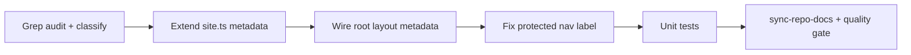

# Phase 4 Epic 3 — Site Identity Audit

## Prerequisites (verified)

| Prerequisite | Status |
|---|---|
| Phase 4 Epic 1 (header/footer via `site.ts`) | `Complete` |
| Phase 4 Epic 2 (landing content) | `Complete` |
| [`src/config/site.ts`](src/config/site.ts) | Ships `name`, `Logo`, nav/social/legal — **no metadata fields yet** |
| [`SeminovaLogo`](src/components/seminova-logo.tsx) + landing copyright | Already read `siteConfig.name` |
| Root metadata | **Stale** — still starter copy in [`src/app/layout.tsx`](src/app/layout.tsx) |

**No migration, proxy, or env changes required.**

---

## Scope

From [CONTEXT.md](CONTEXT.md) Phase 4 Epic 3:

**User story:** As a maintainer re-skinning Seminova for a new product, every visible app-name reference updates from one place (`site.ts`).

**In scope**
- Grep audit of `src/` for hardcoded app-name / "Seminova" strings not routed through `site.ts`
- Extend `site.ts` with metadata fields (`description`; title derived from `name`)
- Wire root `metadata` export in [`src/app/layout.tsx`](src/app/layout.tsx) (fixes browser tab `<title>` and SEO description)
- Wire any other **user-visible** app-name strings found in `src/` — notably [`src/app/protected/layout.tsx`](src/app/protected/layout.tsx) line 19 (`"Next.js Supabase Starter"`)
- Targeted unit test(s) for the metadata helper / config contract
- `/sync-repo-docs` + full quality gate

**Out of scope (document in audit, do not change)**
- Product/docs identity: `README.md`, `CONTEXT.md`, `AGENTS.md`, `DESIGN.md`, `.cursor/**`, `.mockups/**`
- npm package name in [`package.json`](package.json) (`"name": "seminova"`)
- Code identifiers: `SeminovaLogo` component/file name (not user-visible; already consumes `siteConfig`)
- Protected layout starter chrome beyond the nav label (footer “Powered by Supabase”, theme toggle) — Phase 6 rebuilds the non-admin shell
- Renaming `SeminovaLogo` → generic `AppLogo` — optional future cleanup, not this epic
- Functional `/terms` / `/privacy` routes

---

## Plan structure: sequential

Audit → config extension → wire consumers → tests/docs → quality gate. Single track; no parallel file ownership.



---

## Step 1 — Grep audit and classification

Run a focused search under `src/`:

```bash
rg -i "seminova|starter kit|next\.js supabase" src/
```

**Expected findings (as of plan date):**

| Location | User-visible? | Action |
|---|---|---|
| [`src/app/layout.tsx`](src/app/layout.tsx) `metadata.title` / `description` | Yes (tab title, SEO) | Wire to `site.ts` |
| [`src/app/protected/layout.tsx`](src/app/protected/layout.tsx) nav link text | Yes | Replace with plain `<Link href="/">{siteConfig.name}</Link>` |
| [`src/config/site.ts`](src/config/site.ts) `name: 'Seminova'` | Canonical source | Keep — this is the single edit point for re-skin |
| `SeminovaLogo`, `landing-copyright`, header/footer tests | Already wired | No change |
| [`src/config/landing-content.ts`](src/config/landing-content.ts) | Generic copy, no product name | No change |

Record any **new** hits in the PR/commit notes. If a hit is user-visible and not in the exclusion list, wire it; if ambiguous, prefer wiring through `site.ts`.

---

## Step 2 — Extend `site.ts`

Add metadata to [`SiteConfig`](src/config/site.ts):

```typescript
export interface SiteConfig {
  name: string
  description: string  // SEO + social preview default
  Logo: LucideIcon
  // ...existing nav/social/legal
}
```

Defaults aligned with [`package.json`](package.json) description:

- `name: 'Seminova'` (unchanged)
- `description: 'An opinionated, AI-native starter for building SaaS products with Next.js and Supabase.'`

Export a small pure helper for testability and reuse:

```typescript
import type { Metadata } from 'next'

export const getSiteMetadata = (metadataBase: URL): Metadata => ({
  metadataBase,
  title: {
    default: siteConfig.name,
    template: `%s | ${siteConfig.name}`,
  },
  description: siteConfig.description,
})
```

Keep the module server-safe (no `'use client'`). The existing Lucide `Logo` import is fine — already imported today.

---

## Step 3 — Wire root layout metadata

In [`src/app/layout.tsx`](src/app/layout.tsx), replace the hardcoded starter metadata:

```typescript
// Before
title: 'Next.js and Supabase Starter Kit',
description: 'The fastest way to build apps with Next.js and Supabase',

// After
import { getSiteMetadata } from '@/config/site'
export const metadata = getSiteMetadata(new URL(defaultUrl))
```

This closes the primary deferred item from [Phase 3 Epic 4 plan](.cursor/plans/phase_3_epic_4_auth_restyle_ce982ff9.plan.md).

**Manual check:** load `/` and `/auth/login` — browser tab should show **Seminova** (not starter kit text).

---

## Step 4 — Wire protected-shell nav label (Option A — locked)

In [`src/app/protected/layout.tsx`](src/app/protected/layout.tsx), replace:

```tsx
<Link href={'/'}>Next.js Supabase Starter</Link>
```

With a plain text link only — **no `SeminovaLogo`**:

```tsx
import { siteConfig } from '@/config/site'
// ...
<Link href="/">{siteConfig.name}</Link>
```

**PM decision:** Phase 6 rebuilds the non-admin shell entirely, so do not invest in visual parity here. Smallest diff that fixes the wrong app name is correct.

Do **not** restyle the protected shell footer or add logo chrome in this epic.

---

## Step 5 — Tests

Add [`src/config/site.unit.test.ts`](src/config/site.unit.test.ts) (co-located with config):

- Assert `getSiteMetadata()` returns `title.default` and `description` from `siteConfig`
- Assert `title.template` includes `siteConfig.name` (future page titles inherit brand)

Existing `SeminovaLogo` / landing header-footer tests already assert `siteConfig.name` renders — no duplication needed.

Optional: add a one-line assertion in a protected-layout test only if a test file already exists; **do not** create a large new layout test file for a string swap.

---

## Step 6 — Docs sync and quality gate

Run [`/sync-repo-docs`](.cursor/skills/sync-repo-docs/SKILL.md):

- Update [AGENTS.md](AGENTS.md) **Implemented now** bullet for site identity — note metadata + full `src/` app-name audit complete (Phase 4 Epic 3)
- README only if setup/onboarding copy references stale starter title (likely no change)

Quality bar:

```bash
pnpm type-check && pnpm lint && pnpm format-check && pnpm test:ci
```

---

## Risks and edge cases

| Risk | Mitigation |
|---|---|
| Changing tab title breaks bookmark expectations | Intended — re-skinners edit `site.ts` once |
| `metadataBase` on Vercel preview URLs | Existing `VERCEL_URL` logic unchanged; only title/description source changes |
| Over-scoping into docs/mockups renames | Stick to exclusion table; epic is **in-app** identity |
| Phase 4 phase completion | This is the last Phase 4 epic — after implementation, PM may run `/sync-context-md` to archive Phase 4; that is separate from mark-epic-complete |

---

## Manual testing checklist

- [ ] `/` — browser tab title = `siteConfig.name`; view-source / devtools shows updated `description`
- [ ] `/auth/login` — same root metadata (shared layout)
- [ ] Log in as non-admin → `/protected` — nav shows `siteConfig.name`, not starter text
- [ ] Change `siteConfig.name` locally → header, footer, auth logo, copyright, tab title, and protected nav all update together
- [ ] Light/dark mode unaffected

---

## Close-out

When implementation is fully finished, run the **mark-epic-complete** skill (`.cursor/skills/mark-epic-complete/SKILL.md`) to append `` `Complete` `` to `### Epic 3: Site Identity Audit` in [CONTEXT.md](CONTEXT.md).
