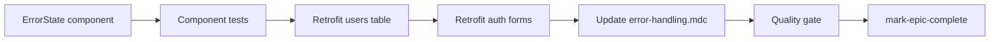

# Phase 5 Epic 1 — Shared Error State Component

## Prerequisites (verified)

| Prerequisite | Status |
|---|---|
| Phase 4 shipped (landing, site identity) | Done — [CONTEXT.md](CONTEXT.md) roadmap |
| Inline error pattern duplicated in 5 surfaces | Baseline — same `<p role="alert" className="text-destructive text-sm">` in users table + 4 auth forms |
| `Button` + `Skeleton` primitives | Done — [`src/components/ui/button.tsx`](src/components/ui/button.tsx), [`src/components/ui/skeleton.tsx`](src/components/ui/skeleton.tsx) |
| `lucide-react` icons in use | Done — e.g. [`src/components/ui/sheet.tsx`](src/components/ui/sheet.tsx) |
| No shared error component yet | Confirmed — only inline pattern in [`error-handling.mdc`](.cursor/rules/error-handling.mdc) lines 130–140 |

**No migration, proxy, env, or locked-rule changes required** (those belong to Epic 4).

---

## Scope

From [CONTEXT.md](CONTEXT.md) Phase 5 Epic 1:

**In scope**
- Shared error-display component: user-facing message; copy-to-clipboard + card chrome **only when `code` is provided** (validation-only errors stay plain `text-destructive`)
- Retrofit [`users-table.tsx`](src/app/(admin)/users/_components/users-table.tsx)
- Retrofit all four auth forms — capture raw Supabase `AuthError.code` alongside message; pass both to `ErrorState` (unmapped; taxonomy/sanitization deferred to Phase 7)
- Update [`.cursor/rules/error-handling.mdc`](.cursor/rules/error-handling.mdc) to reference the new component (replace "Until Phase 5 reference components land" interim guidance)
- Targeted unit/integration tests + quality gate

**Out of scope (later epics)**
- Users table skeleton loading — **Epic 2**
- Toast system — **Epic 3**
- In-app promote/demote — **Epic 4**
- Mapping raw Supabase `AuthError` codes to error-handling.mdc taxonomy or per-code copy safety — **Phase 7** (Security Audit); Epic 1 passes codes through raw
- Adding `alert` shadcn primitive — composite built from existing `Button` is sufficient

---

## Plan structure: sequential

Component must exist before retrofits; rules/docs update after retrofits prove the API. Single track, no parallel file ownership conflicts.



---

## Step 1 — Create `ErrorState` component

**File:** [`src/components/error-state.tsx`](src/components/error-state.tsx) (app-level composite, not `ui/` — same tier as auth forms)

**API (RORO-friendly props interface):**

```typescript
interface ErrorStateProps {
  message: string
  code?: string        // e.g. FORBIDDEN, INTERNAL_ERROR from server actions
  detail?: string      // optional extra context (stack-safe strings only)
  className?: string
}
```

**Behavior — two modes, gated on `code` (no prop changes):**

**With `code` (system/server errors)** — full treatment:
- Client component (`'use client'`) — clipboard requires browser API
- Container: `role="alert"`, card/border chrome, semantic tokens (`text-destructive`, `border-destructive/…`, `bg-destructive/…` subtle fill — token-only)
- Layout: message text + icon `Button` (`variant="ghost"`, `size="icon"`) with `Copy` from `lucide-react`
- Copy text format (multi-line, paste-friendly for debugging chats):

  ```
  {message}
  Code: {code}
  Detail: {detail}    // only when detail also provided
  ```

- On copy success: brief "Copied" feedback via `aria-live="polite"` region (or button label swap) — no toast (Epic 3)
- `aria-label="Copy error details"` on the button; `focus-visible:ring-ring` per a11y rules

**Without `code` (validation-only errors, e.g. password mismatch)** — minimal treatment:
- Plain `<p role="alert" className="text-destructive text-sm">` with message only
- No copy button, no card/border chrome
- Matches today's inline auth-form pattern visually — copy affordance is reserved for errors that carry diagnostic context

**Shared:**
- Extract a pure `buildErrorCopyText({ message, code, detail? })` helper (code required) for the copy path — testable in isolation
- Keep file ≤150 lines; extract subcomponent only if needed

**Reference patterns:** icon button a11y in [`ui-accessibility.mdc`](.cursor/rules/ui-accessibility.mdc); button composition in [`ui-shadcn.mdc`](.cursor/rules/ui-shadcn.mdc)

---

## Step 2 — Unit tests for `ErrorState`

**File:** [`src/components/error-state.unit.test.tsx`](src/components/error-state.unit.test.tsx)

Mock `navigator.clipboard.writeText` at the browser boundary.

**H/I/B coverage (4 tests):**
- **With code:** renders message + copy button; click copy → clipboard called with formatted text including code; "Copied" feedback shown
- **Without code:** renders message only as plain destructive text; **no copy button** in the document (`queryByRole('button', { name: /copy/i })` absent)
- **Boundary:** message + `detail` but no `code` → still plain text path (no copy — `code` is the gate, not `detail`)

Do not test CSS classes or internal state names.

---

## Clarifications (confirmed pre-implementation)

### Step 3 — `listUsersAction` error codes

**Verdict: action already returns codes; client drops them. Wire-through only — no `actions.ts` changes.**

[`actions.ts`](src/app/(admin)/users/actions.ts) already implements the error-handling.mdc response envelope on every failure path:

| Failure | `error.code` | `error.message` |
|---------|--------------|-----------------|
| No claims / auth error | `FORBIDDEN` | `Unauthorized` |
| Non-admin | `FORBIDDEN` | `Forbidden` |
| Invalid page | `VALIDATION_ERROR` | `Page must be a positive integer` |
| `listAdminUsersPage` throws | `INTERNAL_ERROR` | `Something went wrong loading users. Please try again.` |

The discriminated union type (`ListUsersActionError`, lines 19–25) includes `code`. [`users-table.tsx`](src/app/(admin)/users/_components/users-table.tsx) reads only `result.error.message` (line 50) and never stores `result.error.code`. This epic fixes that gap on the **client** by storing and passing `code` to `ErrorState`.

### Step 4 — Auth form error codes

**Verdict: Supabase `AuthError.code` exists at the API but is discarded today. Epic 1 captures and passes it through raw — no taxonomy mapping.**

All four forms currently use `useState<string | null>(null)` for error message only. In catch blocks they set `error.message` and drop `error.code`.

Per [CONTEXT.md](CONTEXT.md) Epic 1: capture the raw `.code` from caught Supabase `AuthError` and pass it to `ErrorState` alongside `message`. Mapping to taxonomy (e.g. `SUPABASE_AUTH_ERROR`) and deciding what's safe to surface per code is **Phase 7** — explicitly out of scope here.

**Client-validation-only errors** (e.g. sign-up's `'Passwords do not match'`) have no Supabase code — `errorCode` stays `null`; `ErrorState` receives `code` only when set.

---

## Step 3 — Retrofit users table (client wire-through)

**Files:** [`users-table.tsx`](src/app/(admin)/users/_components/users-table.tsx) only — **`actions.ts` unchanged**

- Replace lines 94–98 inline `<p role="alert">` with `<ErrorState message={errorMessage} code={errorCode} />`
- On `!result.success`: `setErrorMessage(result.error.message)` **and** `setErrorCode(result.error.code)` (new state)
- On success: clear both `errorMessage` and `errorCode`
- Type `errorCode` from `ListUsersActionResult` (import the error code union or derive from action types) — no string widening

**Test:** add one case to [`users-table.unit.test.tsx`](src/app/(admin)/users/_components/users-table.unit.test.tsx) — mock `listUsersAction` failure with a known `code` (e.g. `INTERNAL_ERROR`) → assert error message visible + copy button present; optionally assert copy payload includes code via component interaction.

---

## Step 4 — Retrofit auth forms (message + raw Supabase code)

**Per form** — add parallel state and update catch/validation paths:

```typescript
const [error, setError] = useState<string | null>(null)
const [errorCode, setErrorCode] = useState<string | null>(null)
```

**On submit start** — clear both: `setError(null); setErrorCode(null)`

**In catch blocks** — extract message as today, plus raw code when the caught value is a Supabase auth error:

```typescript
} catch (caught: unknown) {
  setError(caught instanceof Error ? caught.message : 'An error occurred')
  setErrorCode(
    isAuthError(caught) && typeof caught.code === 'string'
      ? caught.code
      : null,
  )
}
```

Use `isAuthError` from `@supabase/supabase-js` (or an equivalent narrow type guard) — do **not** map codes to the error-handling.mdc taxonomy.

**Client validation** (sign-up password mismatch) — set message only; leave `errorCode` null:

```typescript
setError('Passwords do not match')
setErrorCode(null)
```

**UI** — replace inline `<p role="alert">` with:

```tsx
{error ? <ErrorState message={error} code={errorCode ?? undefined} /> : null}
```

**Files (same placement — after fields, before submit):**
- [`login-form.tsx`](src/components/login-form.tsx)
- [`sign-up-form.tsx`](src/components/sign-up-form.tsx)
- [`forgot-password-form.tsx`](src/components/forgot-password-form.tsx)
- [`update-password-form.tsx`](src/components/update-password-form.tsx)

**DRY option:** if the catch extraction is identical across all four forms, extract a small pure helper (e.g. `extractAuthFormError(caught: unknown)` in `src/utils/`) returning `{ message, code? }` — same behavior, one place to maintain. Not required if inline is clearer.

**Tests:** update at least one auth integration test (e.g. [`login-form.integration.test.tsx`](src/components/login-form.integration.test.tsx)) to mock a Supabase error with a `code` property and assert it reaches copy payload via `ErrorState` interaction. Existing message-only assertions should still pass.

**Explicitly out of scope:** taxonomy translation, generic message substitution, per-code copy filtering — Phase 7.

---

## Step 5 — Update error-handling rule

**File:** [`.cursor/rules/error-handling.mdc`](.cursor/rules/error-handling.mdc)

In **Error UI Patterns** (lines 130–140):
- Remove interim "Until Phase 5 reference components land" wording
- Point to [`src/components/error-state.tsx`](src/components/error-state.tsx) as the canonical inline error pattern
- Note: pass `code` when available to unlock copy affordance — server-action taxonomy codes (users table) or raw Supabase `AuthError.code` (auth forms, unmapped until Phase 7); message-only path for client validation errors
- Keep route-level `error.tsx` guidance unchanged

---

## Step 6 — Quality gate

```bash
pnpm type-check && pnpm lint && pnpm format-check && pnpm test:ci
```

Fix any issues before closing.

**Manual smoke checklist:**
- `/users` — trigger a load failure (e.g. disconnect network or temporarily break env) → error shows with copy button; pasted text includes message + taxonomy code (e.g. `INTERNAL_ERROR`)
- `/auth/login` — bad credentials → error shows with copy button; pasted text includes **message + raw Supabase code** (e.g. `invalid_credentials`), not message alone
- `/auth/sign-up` — password mismatch (client validation) → plain destructive text only; **no copy button**
- Keyboard: Tab to copy button, Enter activates, focus ring visible
- Screen reader: error announced via `role="alert"`

**No `/sync-repo-docs` required** — no new routes, schema, env vars, or AGENTS.md-level features; Epic 1 is a shared UI pattern retrofit.

---

## Step 7 — Mark epic complete

Once implementation passes the quality gate, run the **mark-epic-complete** skill to append `` `Complete` `` to `### Epic 1: Shared Error State Component` in [CONTEXT.md](CONTEXT.md) ACTIVE section and update the Last updated date.
