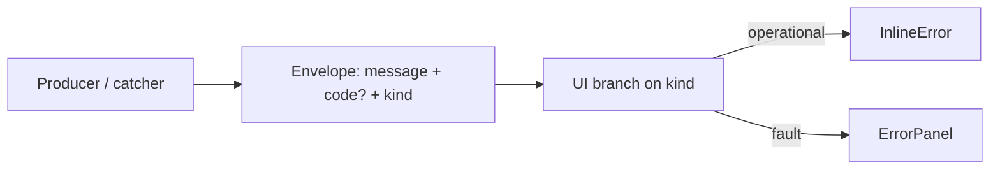

# Phase 5 Epic 2 — Error Severity Architecture

## Prerequisites (verified)

| Prerequisite | Status |
|---|---|
| Epic 1 shipped (`ErrorState` + code wire-through) | Done — [`src/components/error-state.tsx`](src/components/error-state.tsx) |
| Auth error helper exists | Done — [`src/utils/extract-auth-form-error.ts`](src/utils/extract-auth-form-error.ts) |
| Users action returns typed error codes | Done — [`src/app/(admin)/users/actions.ts`](src/app/(admin)/users/actions.ts) |
| Visual reference | Done — [`.mockups/error-states.html`](.mockups/error-states.html) |

**No migration, proxy, env, or locked-rule changes required.**

---

## Problem this epic fixes

Epic 1 gated copy-to-debug on `code` presence. Supabase auth errors like `invalid_credentials` carry a code but are **routine operational outcomes** — they wrongly got the heavy `ErrorPanel` treatment. The fix: carry severity as **`kind` data** from the producer; UI renders what it's told.



---

## Scope

**In scope** (from [CONTEXT.md](CONTEXT.md) Epic 2 + mockup):
- Shared `ErrorKind` type and `kind` on server-action + auth-form error envelopes
- Two components replacing `ErrorState`: `InlineError` (operational) and `ErrorPanel` (fault)
- Classification at producers (not UI inference)
- Retrofit users table + four auth forms
- Delete `error-state.tsx` — no compatibility shim
- Update [`.cursor/rules/error-handling.mdc`](.cursor/rules/error-handling.mdc)
- Targeted tests + quality gate

**Out of scope**
- Per-code taxonomy mapping / copy sanitization — **Phase 7**
- Skeleton loading — **Epic 3**
- Toasts — **Epic 4**
- `detail` prop — dropped; reintroduce only when a real caller needs it
- `/sync-repo-docs` — no new routes, schema, or AGENTS.md-level features

---

## Plan structure: sequential

Types and components must land before retrofits; producers must set `kind` before surfaces can branch. Single track.

---

## Step 1 — Shared `ErrorKind` type

**File:** [`src/types/app-error.ts`](src/types/app-error.ts) (new)

```typescript
export type ErrorKind = 'operational' | 'fault'

export interface AppError {
  message: string
  kind: ErrorKind
  code?: string
}
```

Keep minimal — no `detail`. Re-export `ErrorKind` / `AppError` where needed.

---

## Step 2 — Create `InlineError` component

**File:** [`src/components/inline-error.tsx`](src/components/inline-error.tsx)

Per [`.mockups/error-states.html`](.mockups/error-states.html) and CONTEXT:

- **Props:** `{ message: string; className?: string }` only
- **Markup:** `role="alert"`, flex row, `items-center`, `gap-1.5`, `text-destructive text-sm`
- **Icon:** `AlertCircle` from `lucide-react`, `size-[15px]`, `aria-hidden`
- **No** container, border, fill, or copy affordance
- Plain component — no `'use client'` (no hooks). All consumers are client components today, so this has no practical RSC boundary effect; just omit the directive.

---

## Step 3 — Create `ErrorPanel` component

**File:** [`src/components/error-panel.tsx`](src/components/error-panel.tsx)

Move `buildErrorCopyText` here from `error-state.tsx` (drop `detail` param).

**Props:** `{ message: string; code?: string; className?: string }`

Per mockup (semantic tokens only — never mockup oklch literals):

- `'use client'` — clipboard API
- Container: `role="alert"`, `border-destructive/30 bg-destructive/5`, rounded, `p-3`, flex `items-center justify-between gap-3.5`
- Body: `AlertTriangle` (`size-[18px]`, `aria-hidden`) + message (`text-destructive text-sm`)
- Copy: ghost `Button` `size="icon-sm"`, `aria-label="Copy error details"`, `Copy` icon, `focus-visible:ring-ring`
  - **Verified:** `icon-sm` is defined in [`src/components/ui/button.tsx`](src/components/ui/button.tsx) (`'icon-sm': 'size-8'`) and is already used by Epic 1's `ErrorStateWithCopy` — use as-is; do not rely on an undefined variant or add a new one
- Copy payload: `message` + `Code: {code}` when code present; message-only line when not
- Brief "Copied" via `aria-live="polite"` — **no toast** (Epic 4)

---

## Step 4 — Unit tests for new components

**Files:**
- [`src/components/inline-error.unit.test.tsx`](src/components/inline-error.unit.test.tsx)
- [`src/components/error-panel.unit.test.tsx`](src/components/error-panel.unit.test.tsx)

**InlineError (2 tests):** renders message + alert role; no copy button.

**ErrorPanel (3 tests):** renders message + copy button; click copies formatted text with code; `aria-live` shows "Copied".

Migrate/adapt from [`error-state.unit.test.tsx`](src/components/error-state.unit.test.tsx); delete old test file with component.

---

## Step 5 — Set `kind` at producers

### 5a — Server action

**File:** [`src/app/(admin)/users/actions.ts`](src/app/(admin)/users/actions.ts)

Extend `ListUsersActionError.error`:

```typescript
error: {
  message: string
  code: 'FORBIDDEN' | 'VALIDATION_ERROR' | 'INTERNAL_ERROR'
  kind: ErrorKind
}
```

**Classification at each return** (only place with full context):

| `code` | `kind` |
|--------|--------|
| `FORBIDDEN` | `operational` |
| `VALIDATION_ERROR` | `operational` |
| `INTERNAL_ERROR` | `fault` |

**Kind assignment:** inline at each `return` in `actions.ts` — set `kind` alongside `message` and `code`. Do **not** add a new `_lib/` file for a one-function mapper.

Note: [`src/app/(admin)/users/_lib/`](src/app/(admin)/users/_lib/) already exists (`list-admin-users.ts`, `admin-user-row.ts`) for data-layer helpers, but a 3-branch kind map does not warrant a new file there.

### 5b — Auth form error helper

**File:** [`src/utils/extract-auth-form-error.ts`](src/utils/extract-auth-form-error.ts)

Return `AppError` shape:

- `isAuthError(caught)` → `{ message, code, kind: 'operational' }`
- Any other throw (network, `Error`, null) → `{ message, kind: 'fault' }` (code omitted unless useful later)

**Update** [`src/utils/extract-auth-form-error.unit.test.ts`](src/utils/extract-auth-form-error.unit.test.ts):
- Auth error → `kind: 'operational'` + raw code
- Generic `Error` → `kind: 'fault'`, no code
- `null` → `kind: 'fault'`, fallback message

---

## Step 6 — Retrofit all five surfaces

Replace `ErrorState` imports with `InlineError` / `ErrorPanel`. Consolidate parallel `error` + `errorCode` state into a single `AppError | null` (or equivalent) per surface.

**Branching pattern (same everywhere):**

```tsx
{error?.kind === 'fault' ? (
  <ErrorPanel message={error.message} code={error.code} />
) : error ? (
  <InlineError message={error.message} />
) : null}
```

### Users table — [`users-table.tsx`](src/app/(admin)/users/_components/users-table.tsx)

- On `!result.success`: store `{ message, code, kind }` from `result.error`
- `INTERNAL_ERROR` → `ErrorPanel` with copy (unchanged UX intent, new chrome)
- `FORBIDDEN` / `VALIDATION_ERROR` → `InlineError` (no copy) — unlikely in normal admin flow but correctly classified

### Auth forms (4 files)

- [`login-form.tsx`](src/components/login-form.tsx)
- [`sign-up-form.tsx`](src/components/sign-up-form.tsx)
- [`forgot-password-form.tsx`](src/components/forgot-password-form.tsx)
- [`update-password-form.tsx`](src/components/update-password-form.tsx)

- Catch path: `setFormError(extractAuthFormError(caught))` — single setter
- Client validation (sign-up password mismatch): `setFormError({ message: 'Passwords do not match', kind: 'operational' })`
- Clear: `setFormError(null)` on submit start

**Key behavior change:** bad credentials → `InlineError`, **no copy button** (fixes Epic 1 bug).

---

## Step 7 — Update surface tests

**Before editing:** grep all four auth-form integration tests for error/copy assertions — don't assume only login breaks.

| File | Current error coverage | Required change |
|------|------------------------|-----------------|
| [`login-form.integration.test.tsx`](src/components/login-form.integration.test.tsx) | `AuthApiError` → asserts copy button **present** (2 tests) | Operational path: message visible, **copy button absent**; delete the "raw Supabase code in copied payload" test (no copy on operational errors) |
| [`sign-up-form.integration.test.tsx`](src/components/sign-up-form.integration.test.tsx) | Client validation "passwords do not match" — message only | Strengthen: assert copy button **absent** (operational, no catch path) |
| [`forgot-password-form.integration.test.tsx`](src/components/forgot-password-form.integration.test.tsx) | Plain `Error('Unable to send reset email')` — message only | Fault path (`extractAuthFormError` → `kind: 'fault'`): add assert copy button **present**. Operational path (real `AuthError`, e.g. rate-limited) is **not test-covered** — sanity-check at smoke only |
| [`update-password-form.integration.test.tsx`](src/components/update-password-form.integration.test.tsx) | Plain `Error('Password is too weak')` — message only | Fault path: add assert copy button **present**. Same smoke-only note for real `AuthError` → `InlineError` |
| [`users-table.unit.test.tsx`](src/app/(admin)/users/_components/users-table.unit.test.tsx) | `INTERNAL_ERROR` → copy button present | Keep — fault path unchanged |
| [`extract-auth-form-error.unit.test.ts`](src/utils/extract-auth-form-error.unit.test.ts) | Message + code only | Add `kind` assertions per Step 5b |

---

## Step 8 — Remove Epic 1 component

Delete:
- [`src/components/error-state.tsx`](src/components/error-state.tsx)
- [`src/components/error-state.unit.test.tsx`](src/components/error-state.unit.test.tsx)

Grep confirms no other imports remain.

---

## Step 9 — Update error-handling rule

**File:** [`.cursor/rules/error-handling.mdc`](.cursor/rules/error-handling.mdc)

Supersede Epic 1's **Error UI Patterns** section (lines ~130–140):

- Document operational vs fault philosophy
- Add `kind: 'operational' | 'fault'` to response-envelope examples (server actions + auth helper)
- Point to `InlineError` for operational, `ErrorPanel` for fault
- Note: set `kind` at producer/catcher — UI must not infer from `code` presence
- Reference mockup: `.mockups/error-states.html` (appearance only; implementation uses semantic tokens)
- Keep route-level `error.tsx` guidance unchanged

---

## Step 10 — Quality gate

```bash
pnpm type-check && pnpm lint && pnpm format-check && pnpm test:ci
```

**Manual smoke checklist:**
- `/auth/login` — wrong password → red inline message with circle icon, **no copy button**
- `/auth/sign-up` — password mismatch → same inline treatment
- `/auth/forgot-password` — trigger a real Supabase `AuthError` if possible (e.g. rate-limited reset) → **InlineError**, no copy. Tests use plain `Error` and only exercise the fault/`ErrorPanel` path; operational path on this form is smoke-only
- `/auth/update-password` — same sanity check as forgot-password: real `AuthError` → **InlineError**; plain throw → `ErrorPanel` (test-covered fault path only)
- `/users` — trigger `INTERNAL_ERROR` (e.g. break env temporarily) → bordered panel, triangle icon, copy works; pasted text includes message + `INTERNAL_ERROR`
- Keyboard: Tab to copy on fault panel only; focus ring visible
- Light + dark: both components readable (mockup toggle is the visual spec)

---

## Step 11 — Mark epic complete

Once the quality gate passes, run the **mark-epic-complete** skill to append `` `Complete` `` to `### Epic 2: Error Severity Architecture` in [CONTEXT.md](CONTEXT.md) and update Last updated.
