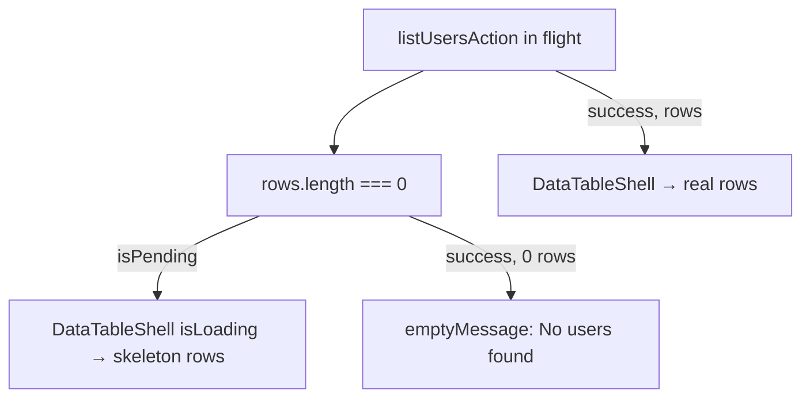

# Phase 5 Epic 3 — Skeleton Loading State for Users Table

## Prerequisites (verified)

| Prerequisite | Status |
|---|---|
| Epic 1 + 2 shipped (error severity) | Done — [`InlineError`](src/components/inline-error.tsx), [`ErrorPanel`](src/components/error-panel.tsx) |
| Users table with `useTransition` loading | Done — [`users-table.tsx`](src/app/(admin)/users/_components/users-table.tsx) line 111: `emptyMessage={isPending ? 'Loading users…' : 'No users found.'}` |
| `Skeleton` primitive (unused in app surfaces) | Done — [`src/components/ui/skeleton.tsx`](src/components/ui/skeleton.tsx) |
| `DataTableShell` canonical wrapper | Done — [`src/components/data-table1.tsx`](src/components/data-table1.tsx) |
| 5-column users table | Done — [`users-columns.tsx`](src/app/(admin)/users/_components/users-columns.tsx): Email, Verified, Created, Last sign-in, Role |

**No migration, proxy, env, or locked-rule changes required.**

---

## Problem

Initial load (and any fetch while `rows` is empty) shows centered text `"Loading users…"` inside a single table cell. Epic 3 replaces that with pulsing skeleton rows shaped to the table's column layout — consistent with the design system's `Skeleton` primitive and the sidebar's existing skeleton usage ([`SidebarMenuSkeleton`](src/components/ui/sidebar.tsx)).



**Preserve existing behavior:** when paginating/searching with stale rows already on screen, keep showing stale data (buttons disabled via `isPending`) — skeleton only when the table body is empty.

---

## Scope

**In scope** (from [CONTEXT.md](CONTEXT.md) Epic 3):
- Reusable data-table loading skeleton using `Skeleton`
- Retrofit users table (remove `"Loading users…"` text hack)
- Document pattern in [`.cursor/rules/data-tables.mdc`](.cursor/rules/data-tables.mdc)
- Targeted tests + quality gate

**Out of scope**
- Toast system — **Epic 4**
- Promote/demote — **Epic 5**
- Skeleton overlay while stale rows visible — not requested; keep current stale-data UX
- `/sync-repo-docs` — polish on existing `/users` surface; no new routes or scripts (same as Epic 2)
- HTML mockup — none exists; follow shadcn skeleton conventions + column proportions from real table

---

## Plan structure: sequential

Skeleton helper must land before shell integration; shell integration before users-table retrofit; rule doc + tests last.

---

## Step 1 — Column meta for skeleton sizing

**File:** [`src/components/data-table1.tsx`](src/components/data-table1.tsx) (top of file, after imports)

Augment TanStack Table `ColumnMeta` alongside the existing `searchable` flag:

```typescript
declare module '@tanstack/react-table' {
  interface ColumnMeta<TData, TValue> {
    searchable?: boolean
    /** Tailwind classes for the Skeleton in each cell when loading (e.g. "h-5 w-16 rounded-full") */
    skeletonClassName?: string
  }
}
```

**Default fallback** when `skeletonClassName` is absent: `h-4 w-full max-w-[8rem]` — good enough for generic columns; users table overrides per column in Step 4.

---

## Step 2 — Extract `DataTableSkeletonBody`

**File:** [`src/components/data-table-skeleton-body.tsx`](src/components/data-table-skeleton-body.tsx) (new, keep under 150 lines)

Props:

```typescript
interface DataTableSkeletonBodyProps<TData> {
  columns: Array<ColumnDef<TData, unknown>>
  rowCount?: number // default 8 — see Step 3 for rationale
}
```

Implementation:
- Render `rowCount` × `columns.length` cells using existing [`TableRow`](src/components/ui/table.tsx) + [`TableCell`](src/components/ui/table.tsx)
- Each cell: `<Skeleton className={cn('...', column.columnDef.meta?.skeletonClassName ?? default)} aria-hidden />`
- Row keys: `skeleton-row-${index}`

**Why a separate file:** [`data-table1.tsx`](src/components/data-table1.tsx) is already 147 lines; extracting keeps both files within the ≤150-line locked rule.

---

## Step 3 — Extend `DataTableShell` with `isLoading`

**File:** [`src/components/data-table1.tsx`](src/components/data-table1.tsx)

Add optional props to `DataTableShellProps`:

```typescript
isLoading?: boolean
loadingRowCount?: number // default 8 — deliberate, not page size (see below)
loadingLabel?: string // default "Loading…"
```

**Default row count — deliberate UX choice (not page size):**

Server-side page size is locked at 50 rows ([`data-tables.mdc`](.cursor/rules/data-tables.mdc) Pagination Pattern). Skeleton row count is **intentionally decoupled** from page size: rendering 50 pulsing skeleton rows would dominate the viewport, increase DOM cost, and imply false precision about how many rows will arrive. **8 rows** is enough to communicate "table loading" while preserving layout stability — the same convention used by shadcn/data-table loading examples and the sidebar skeleton pattern.

Where the default is set, add a brief code comment capturing this reasoning:

```typescript
/** Skeleton rows shown while loading — intentionally fewer than page size (50). */
const DEFAULT_LOADING_ROW_COUNT = 8
```

Use this constant as the default for both `DataTableSkeletonBody` and `DataTableShell`'s `loadingRowCount` prop.

**TableBody branching** (replace current binary empty/data):

1. `isLoading && table.getRowModel().rows.length === 0` → `<DataTableSkeletonBody columns={columns} rowCount={loadingRowCount} />`
2. `rows.length > 0` → existing data rows (unchanged)
3. else → existing empty row with `emptyMessage`

Remove loading responsibility from `emptyMessage` — it becomes purely `"No users found."` at the call site.

**Accessibility:** when skeleton renders, include a visually hidden status line inside the bordered shell (not inside each skeleton cell):

```tsx
<span className="sr-only">{loadingLabel}</span>
```

Keep `aria-busy={isPending}` on the users-table wrapper — already present at line 107.

---

## Step 4 — Per-column skeleton shapes in users columns

**File:** [`src/app/(admin)/users/_components/users-columns.tsx`](src/app/(admin)/users/_components/users-columns.tsx)

Add `meta.skeletonClassName` per column to approximate real content:

| Column | Suggested class | Rationale |
|--------|-----------------|-----------|
| Email | `h-4 w-48 max-w-full` | Long text field |
| Verified | `h-5 w-20 rounded-md` | Badge pill |
| Created | `h-4 w-28` | Date label |
| Last sign-in | `h-4 w-28` | Date label |
| Role | `h-5 w-14 rounded-md` | Small badge |

---

## Step 5 — Wire users table

**File:** [`src/app/(admin)/users/_components/users-table.tsx`](src/app/(admin)/users/_components/users-table.tsx)

Changes:
- Pass `isLoading={isPending}` to `DataTableShell`
- Set `emptyMessage="No users found."` (static — no ternary)
- Pass `loadingLabel="Loading users…"` for the sr-only text

Remove the `isPending ? 'Loading users…'` emptyMessage hack entirely.

---

## Step 6 — Unit tests

### 6a — Skeleton body component

**File:** [`src/components/data-table-skeleton-body.unit.test.tsx`](src/components/data-table-skeleton-body.unit.test.tsx)

2–3 high-value tests:
- Renders `rowCount × columnCount` skeleton elements (`data-slot="skeleton"`)
- Respects `meta.skeletonClassName` on a column (spot-check one custom class)

### 6b — Users table loading behavior

**File:** [`src/app/(admin)/users/_components/users-table.unit.test.tsx`](src/app/(admin)/users/_components/users-table.unit.test.tsx)

Add 1 test:
- Mock `listUsersAction` with a never-resolving promise
- Assert skeleton elements present (`getAllBy...` on `[data-slot="skeleton"]`)
- Assert visible `"Loading users…"` text is **absent** (sr-only only)
- Assert `"No users found."` is **absent** while loading

Existing tests (debounce, error panel, pagination) should remain unchanged.

---

## Step 7 — Add `## Loading Pattern` to data-tables rule

**File:** [`.cursor/rules/data-tables.mdc`](.cursor/rules/data-tables.mdc)

This is **net-new content** — not an edit to Search or Pagination. Match the existing section structure exactly:

- Heading: `## Loading Pattern` (same level as `## Search Pattern` and `## Pagination Pattern`)
- Opening prose paragraph, then bullet list, then optional `**Why:**` paragraph (same rhythm as Search Pattern)
- **Placement:** after `## Pagination Pattern`, before `## Reference Implementations`

Draft content to land (adapt wording only if needed for consistency):

```markdown
## Loading Pattern

While a fetch is in flight and the table body is empty, show skeleton rows — not placeholder text in `emptyMessage`.

- Use `DataTableShell` `isLoading` when loading and `table.getRowModel().rows.length === 0`.
- Skeleton rows render via `DataTableSkeletonBody` using the `Skeleton` primitive (`src/components/ui/skeleton.tsx`).
- Per-column sizing via `columnDef.meta.skeletonClassName` (see users columns for reference).
- Default skeleton row count: 8 — intentionally fewer than page size (50). Enough to signal loading without flooding the viewport or implying a specific result count.
- When stale rows are already on screen (pagination/search refetch), keep showing stale data; disable controls via `isPending` — do not flash skeleton over existing rows.
- `emptyMessage` is for the zero-results state only.

**Why:** placeholder text in a single merged cell reads as an empty state, not a loading state; skeleton rows preserve column structure and match the design-system loading convention.

## Reference Implementations
```

Update the Reference Implementations bullet to note skeleton loading:

```markdown
- `src/app/(admin)/users/_components/users-table.tsx` — Users table, search on `email`, skeleton loading via `DataTableShell`
```

---

## Step 8 — Quality gate

```bash
pnpm type-check && pnpm lint && pnpm format-check && pnpm test:ci
```

**Manual smoke checklist:**
- `/users` as admin — initial load shows pulsing skeleton rows under real column headers (Email, Verified, Created, Last sign-in, Role); no centered loading text
- After load — real user rows; empty project shows `"No users found."` (not skeleton)
- Search debounce + pagination — buttons disable during fetch; stale rows remain visible (no skeleton flash)
- Light + dark — skeleton readable (`bg-accent animate-pulse`)
- Screen reader — sr-only loading announcement present during skeleton state

---

## Step 9 — Mark epic complete

Once the quality gate passes, run the **mark-epic-complete** skill to append `` `Complete` `` to `### Epic 3: Skeleton Loading State for Users Table` in [CONTEXT.md](CONTEXT.md) and update Last updated.
