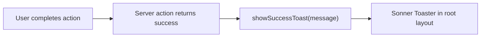

# Phase 5 Epic 4 — Toast Notification System

## Prerequisites (verified)

| Prerequisite | Status |
|---|---|
| Epics 1–3 shipped | Done — [`InlineError`](src/components/inline-error.tsx), [`ErrorPanel`](src/components/error-panel.tsx), [`DataTableSkeletonBody`](src/components/data-table-skeleton-body.tsx) |
| Root `ThemeProvider` | Done — [`src/app/layout.tsx`](src/app/layout.tsx) wraps app in `next-themes` |
| shadcn config | Done — [`components.json`](components.json) (`new-york`, CSS variables, lucide) |
| Toast/sonner in repo | **None** — greenfield install |

**No migration, proxy, env, or locked-rule changes required** (locked-rule change is Epic 5's promote/demote story).

---

## Problem

Brief success confirmations (promote/demote, settings save) need non-blocking feedback without a full page state change. Epic 2 explicitly reserved toasts for this purpose — [`ErrorPanel`](src/components/error-panel.tsx) copy feedback uses `aria-live`, not toasts. Epic 5 and Phase 6 need a shared toast primitive before they can confirm actions.



**Boundary (non-negotiable):**

| Feedback type | Component | Epic |
|---|---|---|
| Operational error (bad creds, validation) | `InlineError` | 2 |
| Fault error (internal, network) | `ErrorPanel` | 2 |
| Copy-to-debug feedback | `aria-live` on ErrorPanel | 2 |
| **Success confirmation** | **Toast (this epic)** | **4** |

---

## Scope

**In scope** (from [CONTEXT.md](CONTEXT.md) Epic 4):
- Install sonner via shadcn CLI (canonical primitive-first pattern)
- Wire `<Toaster />` at app root with theme sync
- Thin app-level success API for Epic 5 / Phase 6 callers
- Document toast-vs-error boundary in [`.cursor/rules/error-handling.mdc`](.cursor/rules/error-handling.mdc)
- Targeted tests + quality gate

**Out of scope**
- In-app promote/demote UI — **Epic 5** (first real consumer)
- Settings save toast — **Phase 6**
- Error toasts / destructive toasts for failures
- `/sync-context-md` or phase ship — epic-level only

---

## Plan structure: sequential

Provider must exist before callers; utility and rules follow install. Single track.

---

## Step 1 — Install sonner primitive

```bash
pnpm dlx shadcn@latest add sonner -y -o
```

**Expected artifacts:**
- [`src/components/ui/sonner.tsx`](src/components/ui/sonner.tsx) — shadcn `Toaster` wrapper using `useTheme` from `next-themes`
- `sonner` added to [`package.json`](package.json) dependencies

**Verify after install:**
- Component uses semantic token classNames (`bg-background`, `text-foreground`, `border-border`) — no hardcoded colors
- If CLI adds CSS to [`src/app/globals.css`](src/app/globals.css), keep it; do not duplicate

**Do not** hand-roll a custom toast component — own the shadcn output per locked rules.

---

## Step 2 — Wire Toaster in root layout

**File:** [`src/app/layout.tsx`](src/app/layout.tsx)

Import and mount inside `ThemeProvider` (sonner needs resolved theme):

```tsx
import { Toaster } from '@/components/ui/sonner'

// Inside ThemeProvider > ReactQueryProvider, alongside TooltipProvider children:
<>
  <TooltipProvider>{children}</TooltipProvider>
  <Toaster />
  <Analytics />
  ...
</>
```

**Placement:** after page content, before devtools — standard shadcn pattern. `Toaster` is a client component; root layout stays a Server Component.

**Defaults to keep (shadcn baseline):** position bottom-right, reasonable auto-dismiss duration. No custom positioning unless shadcn default fails visually in admin shell — fix only if smoke test shows clipping under sidebar.

---

## Step 3 — App-level success toast helper

**File:** [`src/utils/app-toast.ts`](src/utils/app-toast.ts) (new)

**Location confirmed — use `src/utils/`, not `src/lib/`:**

| Path | Role in this repo |
|---|---|
| [`src/utils/`](src/utils/) | **Canonical** for app-level utilities — `admin.ts`, `env.ts`, `extract-auth-form-error.ts`, `tailwind.ts`, each with co-located `*.unit.test.ts` |
| [`src/lib/utils.ts`](src/lib/utils.ts) | Unused shadcn scaffold (`cn()` only); zero `@/lib/` imports in `src/` — repo uses `@/utils/tailwind` instead |
| `src/app/**/_lib/` | Route-scoped helpers only (e.g. [`users/_lib/admin-user-row.ts`](src/app/(admin)/users/_lib/admin-user-row.ts)) — wrong scope for a cross-app toast API |

`components.json` aliases `utils` → `@/utils/tailwind` (shadcn `cn` path); new app helpers still belong alongside siblings in `src/utils/`.

Thin wrapper so Epic 5/6 import one canonical function instead of scattering raw `toast()` calls:

```typescript
import { toast } from 'sonner'

export const showSuccessToast = (message: string): void => {
  toast.success(message)
}
```

**Why a wrapper:** single place to adjust duration/position later; makes intent obvious (`showSuccessToast` vs `toast.error`); easy to unit-test via sonner mock.

**Do not** add error/warning variants in this epic — errors stay in the error-severity components.

---

## Step 4 — Unit test for `showSuccessToast`

**File:** [`src/utils/app-toast.unit.test.ts`](src/utils/app-toast.unit.test.ts)

```typescript
vi.mock('sonner', () => ({ toast: { success: vi.fn() } }))

it('calls toast.success with the message', () => {
  showSuccessToast('User promoted to admin')
  expect(toast.success).toHaveBeenCalledWith('User promoted to admin')
})
```

One high-value test — verifies the canonical API without testing sonner internals.

**Optional integration smoke** (1 test if straightforward): render `<Toaster />` + button that calls `showSuccessToast`, assert message appears in DOM. Only add if reliable in jsdom; otherwise unit mock is sufficient and Epic 5 will integration-test real usage.

---

## Step 5 — Extend test-utils for future toast assertions

**File:** [`src/test/test-utils.tsx`](src/test/test-utils.tsx)

Add `<Toaster />` to the test `Wrapper` so Epic 5 promote/demote tests can query toast text without per-file setup:

```tsx
import { Toaster } from '@/components/ui/sonner'

const Wrapper = ({ children }) => (
  <QueryClientProvider client={queryClient}>
    {children}
    <Toaster />
  </QueryClientProvider>
)
```

No new tests required for this file change alone.

---

## Step 6 — Document toast pattern in error-handling rule

**File:** [`.cursor/rules/error-handling.mdc`](.cursor/rules/error-handling.mdc)

Add a new section **`## Success Feedback (Toasts)`** after the existing **Error UI Patterns** section:

- Use [`showSuccessToast`](src/utils/app-toast.ts) (or `toast.success` from `sonner` only inside that module) for brief **success confirmations** after a completed mutation — e.g. promote/demote, settings save
- **Never** use toasts for errors — operational → `InlineError`, fault → `ErrorPanel`
- **Never** use toasts for copy-to-debug feedback — `ErrorPanel` uses `aria-live`
- Toaster is mounted once in root layout; callers are client components or client callbacks after server actions
- Keep messages short (one line), user-facing, no internal codes

Cross-reference Epic 2's explicit "no toast for copy" decision so future agents don't conflate the two feedback channels.

---

## Step 7 — Quality gate

```bash
pnpm type-check && pnpm lint && pnpm format-check && pnpm test:ci
```

**Manual smoke checklist** (no production consumer yet — verify infrastructure):
- Run `pnpm dev`, temporarily trigger `showSuccessToast('Test')` from any existing client component (e.g. a one-line `onClick` on a dev-only path), confirm toast appears bottom-right in light and dark mode
- **Remove the temporary trigger immediately after smoke** — do not leave it in the working tree
- Confirm toast uses semantic tokens (background/border match theme, not raw hex)
- Confirm toast auto-dismisses without blocking interaction

**Mandatory cleanup verification** (run before Step 9 — blocking gate):

```bash
# Must return zero matches outside src/utils/app-toast*.ts
rg "showSuccessToast\(['\"]Test['\"]\)" src/
rg "showSuccessToast" src/ --glob '!src/utils/app-toast*'
```

Also scan `git diff` for any stray `onClick` / dev-only imports of `showSuccessToast` in component files. Only [`src/utils/app-toast.ts`](src/utils/app-toast.ts) and its unit test may reference the helper in this epic's diff; no committed consumer until Epic 5.

If either check finds a hit, remove the temporary code and re-run before proceeding.

---

## Step 8 — Doc sync

Run `/sync-repo-docs` to add a bullet under **Implemented now** in [AGENTS.md](AGENTS.md), e.g.:

> **Toast system (Phase 5 Epic 4):** sonner via shadcn [`Toaster`](src/components/ui/sonner.tsx) in root layout; [`showSuccessToast`](src/utils/app-toast.ts) for success confirmations; errors remain `InlineError` / `ErrorPanel`.

---

## Step 9 — Mark epic complete

**Prerequisite:** Step 7 cleanup verification passed (no temporary smoke triggers in committed files).

After all steps pass, run the **mark-epic-complete** skill to append `` `Complete` `` to `### Epic 4: Toast Notification System` in [CONTEXT.md](CONTEXT.md).

---

## Epic 5 handoff notes

Epic 5 will be the first real consumer:

```typescript
// After successful promote/demote server action (client callback):
showSuccessToast('User promoted to admin')
```

Epic 5 also requires the locked-rule change for in-app admin promotion — that is Epic 5's scope, not this epic's.
