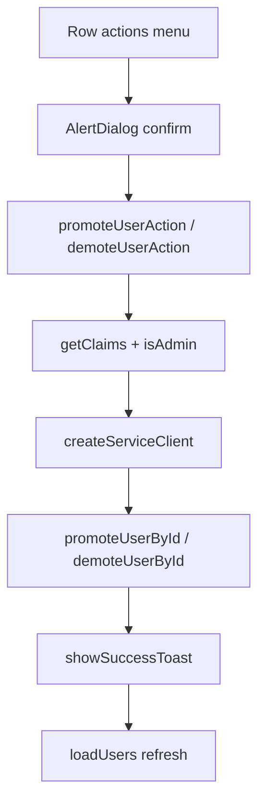

# Phase 5 Epic 5 — In-App Admin Promote/Demote

## Prerequisites (verified)

| Prerequisite | Status |
|---|---|
| Epics 1–4 `Complete` | Error severity (`InlineError` / `ErrorPanel`), skeleton loading, toast system |
| Users table + `listUsersAction` | [`src/app/(admin)/users/`](src/app/(admin)/users/) — canonical data-table pattern |
| CLI promote/demote logic | [`scripts/admin/lib/admin-users.ts`](scripts/admin/lib/admin-users.ts) — `mergePromoteMetadata`, `mergeDemoteMetadata`, email-based `promoteUser` / `demoteUser` |
| Toast consumer API | [`showSuccessToast`](src/utils/app-toast.ts) + `<Toaster />` in root layout |
| `alert-dialog` primitive | **Not installed** — add via shadcn CLI |

**PM decisions (confirmed):** block self-demotion; require AlertDialog confirmation before mutate.

---

## Problem

Admins must run `pnpm promote-admin` / `pnpm demote-admin` from a terminal with `SUPABASE_SECRET_KEY`. Epic 5 adds the same capability on `/users` for admins already signed in — first real consumer of `showSuccessToast`.



**Locked-rule change (required):** AGENTS.md currently says admin role is set *only* via secret-key CLI. This epic updates that rule to permit in-app promote/demote by authenticated admins, with CLI remaining as an alternative.

---

## Scope

**In scope**
- Extract shared role-mutation helpers into [`src/utils/admin-role-mutations.ts`](src/utils/admin-role-mutations.ts) — single implementation imported by both `/users` server actions and [`scripts/admin/lib/admin-users.ts`](scripts/admin/lib/admin-users.ts) (CLI must not import from a route `_lib` folder)
- `promoteUserById` / `demoteUserById` using `auth.admin.getUserById` + `updateUserById` (no full-user scan)
- Server actions in [`actions.ts`](src/app/(admin)/users/actions.ts) with same envelope as `listUsersAction`
- Row actions column on users table: Promote / Demote via `DropdownMenu` + `AlertDialog`
- All mutation successes (including idempotent `already_admin` / `not_admin`) → `showSuccessToast` with end-state copy, then table refresh — per [`.cursor/rules/notifications.mdc`](.cursor/rules/notifications.mdc); errors → `InlineError` / `ErrorPanel` by `kind` (never toast)
- Block self-demotion (server guard + hide/disable Demote on own row)
- Update page copy (remove "CLI-only" subtitle)
- Update AGENTS.md locked rule + README admin CLI section
- Targeted tests (mutation lib + table interaction)

**Out of scope**
- Last-admin guard (CLI parity — no lockout prevention)
- JWT refresh for demoted user mid-session (document in manual test checklist; demoted user may retain access until re-login)
- Moving admin role to `profiles` column
- Phase 7 per-code auth error taxonomy

---

## Step 1 — Extract shared mutation lib

**Goal:** One source of truth for metadata merge + Supabase admin API calls, living in app-level utils (not a route-scoped `_lib` folder).

Create [`src/utils/admin-role-mutations.ts`](src/utils/admin-role-mutations.ts):

- Move `mergePromoteMetadata`, `mergeDemoteMetadata`, result types from [`scripts/admin/lib/admin-users.ts`](scripts/admin/lib/admin-users.ts)
- Add `promoteUserById(client, userId)` and `demoteUserById(client, userId)`:
  - `auth.admin.getUserById(userId)` — `not_found` if missing
  - Idempotent paths: `already_admin` / `not_admin` (same as email-based functions)
  - `updateUserById` with merge helpers on promote/demote
- Reuse `isAdminFromAppMetadata` from [`src/utils/admin.ts`](src/utils/admin.ts) instead of duplicate `isUserAdmin`

Refactor [`scripts/admin/lib/admin-users.ts`](scripts/admin/lib/admin-users.ts) to import merge helpers and by-id functions from `@/utils/admin-role-mutations` — delegate email-based `promoteUser` / `demoteUser` to the by-id functions after `findUserByEmail`. **CLI must not import from `src/app/(admin)/users/_lib/`.**

Co-locate unit tests at [`src/utils/admin-role-mutations.unit.test.ts`](src/utils/admin-role-mutations.unit.test.ts) — move/adapt cases from [`scripts/admin/lib/admin-users.unit.test.ts`](scripts/admin/lib/admin-users.unit.test.ts) that cover merge helpers and by-id mutation paths.

---

## Step 2 — Server actions

Extend [`src/utils/admin.ts`](src/utils/admin.ts): add `sub?: string` to `JwtClaims`.

Extend [`src/app/(admin)/users/actions.ts`](src/app/(admin)/users/actions.ts):

**Shared helper** (private in file): `assertAdminCaller()` — `createClient()` → `getClaims()` → `isAdmin`; derive `callerUserId` from `claims.sub`.

- Missing session/claims or `!isAdmin` → `FORBIDDEN` / operational
- Missing or empty `sub` → `FORBIDDEN` / operational (authentication failure — do not fall through with `undefined` caller id)
- Success → `{ callerUserId: claims.sub }` (non-empty string)

The self-demotion check (`userId === callerUserId` on demote) must only run when `callerUserId` is a verified non-empty string — never pass because `callerUserId` was `undefined`.

**New exports:**
- `promoteUserAction({ userId: string })`
- `demoteUserAction({ userId: string })`

Both import `promoteUserById` / `demoteUserById` from `@/utils/admin-role-mutations`.

**Validation & guards:**
- `userId` required, non-empty string (UUID format check optional but recommended)
- `FORBIDDEN` / operational if `assertAdminCaller` fails (includes missing `sub`)
- `VALIDATION_ERROR` / operational if `userId === callerUserId` on demote (self-demotion block)
- `NOT_FOUND` / operational if target user missing

**Success envelope** — all mutation outcomes that satisfy the caller's intent return `success: true` with a discriminated `data.status` the client maps to `showSuccessToast` copy (same client path for every success; no separate toast tier):

| `data.status` | Toast message (example) |
|---|---|
| `promoted` | "User promoted to admin" |
| `already_admin` | "User is already an admin" |
| `demoted` | "User demoted from admin" |
| `not_admin` | "User is not an admin" |

Include `email` in `data` for logging context only — not shown in toast. Idempotent statuses skip `updateUserById` (same as CLI) but are still successes, not errors.

**Logging** (per [`logging.mdc`](.cursor/rules/logging.mdc)):
- Success: `console.warn('[users-promote] …')` / `console.warn('[users-demote] …')` with email only
- Failure: `console.error('[users-promote] …', error)`

**Error envelope** — extend action error codes with `NOT_FOUND`; keep `kind` at producer.

---

## Step 3 — Install AlertDialog primitive

```bash
pnpm dlx shadcn@latest add alert-dialog -y -o
```

Verify semantic tokens in [`src/components/ui/alert-dialog.tsx`](src/components/ui/alert-dialog.tsx); no hardcoded colors.

---

## Step 4 — Users table UI

### 4a. Pass caller context from page

Update [`page.tsx`](src/app/(admin)/users/page.tsx) to a Server Component that reads session via `getClaims()`, extracts caller id from `claims.sub` (typed on `JwtClaims`), and passes `currentAdminUserId` to `<UsersTable />`.

Update subtitle: e.g. "Signed-up accounts from Supabase Auth. Admins can promote or demote roles from the table."

### 4b. Column factory

Refactor [`users-columns.tsx`](src/app/(admin)/users/_components/users-columns.tsx):

- Export `createUsersColumns({ currentAdminUserId, onPromote, onDemote, pendingUserId })` instead of static `usersColumns`
- Add **Actions** column (not sortable, right-aligned):
  - `DropdownMenu` trigger: icon button with `aria-label="Actions for {email}"`
  - Show **Promote to admin** when `!row.isAdmin`
  - Show **Demote from admin** when `row.isAdmin` && `row.id !== currentAdminUserId`
  - Disable menu items while `pendingUserId === row.id`

Reference dropdown pattern: [`admin-nav-user.tsx`](src/app/(admin)/_components/admin-nav-user.tsx).

### 4c. Confirmation + mutation flow

In [`users-table.tsx`](src/app/(admin)/users/_components/users-table.tsx):

- State: `confirmAction: { type: 'promote' | 'demote'; userId; email } | null`, `pendingUserId`, `actionError`
- Row menu opens `AlertDialog` with destructive styling for demote
- On confirm: call `promoteUserAction` / `demoteUserAction`, then:
  - `success: true` (any status — `promoted`, `already_admin`, `demoted`, `not_admin`) → map `data.status` to end-state copy via `showSuccessToast`, then `loadUsers()` so Role badge and row actions reflect current state
  - `success: false` → set `actionError` (table-level `InlineError` / `ErrorPanel`; clear on next action)

**Success toast mapping** (client helper, e.g. `getRoleMutationToastMessage(status)` in `src/utils/` alongside mutations or inline in `users-table.tsx`):

```typescript
// All paths call showSuccessToast — per notifications.mdc, idempotent no-ops are successes
switch (result.data.status) {
  case 'promoted': return 'User promoted to admin'
  case 'already_admin': return 'User is already an admin'
  case 'demoted': return 'User demoted from admin'
  case 'not_admin': return 'User is not an admin'
}
```

Do not add `showInfoToast` or a neutral toast variant for idempotent outcomes.
- Keep stale rows visible during refetch (`isPending` disables controls per data-tables rule)

Extract `UserRowActions` + `PromoteDemoteDialog` subcomponents if `users-table.tsx` approaches 150-line limit.

---

## Step 5 — Locked rule + docs

**AGENTS.md** — update Admin gate bullet to:

> `app_metadata.role === 'admin'` is the canonical admin check. Set via in-app promote/demote on `/users` (admin-gated server actions + service client) **or** secret-key CLI (`pnpm promote-admin`, `pnpm demote-admin`). Do not move to a `profiles` column without PM approval.

**README.md** — note in-app path as primary UX; CLI remains for bootstrap / automation.

**Optional rule touch:** brief note in [`security.mdc`](.cursor/rules/security.mdc) that service client is used for admin role mutations (already implied).

Run **`/sync-repo-docs`** to align AGENTS.md **Implemented now** with in-app promote/demote.

---

## Step 6 — Tests

Follow minimalism ([`testing.mdc`](.cursor/rules/testing.mdc)):

| File | Cases |
|---|---|
| [`src/utils/admin-role-mutations.unit.test.ts`](src/utils/admin-role-mutations.unit.test.ts) | Happy promote/demote; idempotent already_admin/not_admin; not_found; metadata merge preserves other keys |
| `actions` unit tests (new `actions.unit.test.ts` or integration) | Admin gate FORBIDDEN; missing/empty `sub` → FORBIDDEN; self-demotion VALIDATION_ERROR; success envelope |
| `users-table.unit.test.tsx` | Extend mocks: confirm → `showSuccessToast` with correct copy for `promoted` → `listUsersAction` refetched; demote hidden for own row; idempotent toast copy covered in action-layer tests |

Mock server actions at module boundary (same pattern as existing `listUsersAction` mock). Use test-utils wrapper (Toaster already mounted per Epic 4).

---

## Step 7 — Quality gate

```bash
pnpm type-check && pnpm lint && pnpm format-check && pnpm test:ci
```

**Manual checklist:**
- [ ] Sign in as admin → `/users` → promote a non-admin via row menu → success toast + Admin badge appears
- [ ] Demote another admin via row menu → success toast + badge clears
- [ ] **Idempotent paths (not reachable via row menu — simulate stale-row race):** invoke `promoteUserAction` directly against a user who is already admin → `success: true` with `already_admin` → client shows "User is already an admin" success toast (not an error), then refreshes table
- [ ] Invoke `demoteUserAction` directly against a user who is already non-admin → `success: true` with `not_admin` → "User is not an admin" success toast, then refreshes table
- [ ] Own row: no Demote option in row menu; `demoteUserAction` with own `userId` returns `VALIDATION_ERROR` (not because `sub` was missing)
- [ ] `assertAdminCaller` with missing/empty `sub` returns `FORBIDDEN` — self-demotion check never passes on `undefined` caller id
- [ ] Non-admin cannot call actions (FORBIDDEN)
- [ ] CLI `pnpm promote-admin` / `pnpm demote-admin` still work after lib refactor
- [ ] Light + dark mode on AlertDialog and row menu

---

## Step 8 — Mark epic complete

After all steps pass, run the **mark-epic-complete** skill to append `` `Complete` `` to `### Epic 5: In-App Admin Promote/Demote` in CONTEXT.md.

This is the **final epic in Phase 5**. After marking complete, run **`/sync-context-md`** in a follow-up session to archive Phase 5 and advance the roadmap (mark-epic-complete does not ship phases).
