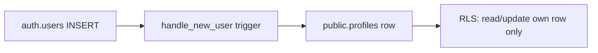

# Phase 6 Epic 1 — Profiles Data Foundation

## Prerequisites (verified)

| Prerequisite | Status |
|---|---|
| Phase 5 `Shipped` | Error severity, skeleton loading, toast, in-app promote/demote all complete |
| Custom schema | **None** — `supabase/` folder does not exist yet; `auth.users` only |
| `pnpm db:push` / `pnpm db:types` | **Referenced in docs but not in [`package.json`](package.json)** — promised in Phase 6; must land in this epic |
| Admin gate | Stays on `app_metadata.role` — **no `role` column on `profiles`** (locked rule) |
| App routes unchanged | `/protected` remains non-admin landing until Epic 4 |

**Epic scope (from [CONTEXT.md](CONTEXT.md)):** data layer only — no shared chrome (Epic 2), no storage bucket (Epic 3), no settings page or redirect changes (Epic 4).

---

## Problem

Every product built from Seminova needs a home for app-level user data. Today there is zero custom schema; Epic 2–4 all depend on a `profiles` row existing for every authenticated user immediately after signup.



---

## Scope

**In scope**
- Minimal Supabase project scaffolding: [`supabase/config.toml`](supabase/config.toml), [`supabase/migrations/`](supabase/migrations/)
- `pnpm db:push` and `pnpm db:types` scripts in [`package.json`](package.json) (add `supabase` as devDependency for reproducible CLI)
- **One migration file** (UTC timestamp via [create-migration skill](.cursor/skills/create-migration/SKILL.md)) creating:
  - `public.profiles` — `id uuid primary key references auth.users(id) on delete cascade`
  - Columns only: `display_name text`, `avatar_url text`, `bio text` (all nullable)
  - `enable row level security`
  - `handle_new_user()` trigger on `auth.users` after insert (`security definer`, `set search_path = ''`) — per [create-db-functions.mdc](.cursor/rules/create-db-functions.mdc)
  - **Backfill** existing `auth.users` into `profiles` (`on conflict do nothing`) so dev accounts created before the migration get a row
  - Owner-scoped RLS for `authenticated` only — separate policies per operation; no `anon` access; no user-facing DELETE policy (row removed via `on delete cascade` from auth):
    - **SELECT:** `using ((select auth.uid()) = id)` only (no `with check`)
    - **UPDATE:** both `using ((select auth.uid()) = id)` and `with check ((select auth.uid()) = id)` — prevents reading another user's row for update and blocks reassignment of `id` on write
- Generated types at [`src/types/database.types.ts`](src/types/database.types.ts) after human runs `db:types`
- Thin type alias [`src/types/profile.ts`](src/types/profile.ts) exporting `Profile` / `ProfileUpdate` from generated types (Epic 2+ import surface)
- Doc sync: [`AGENTS.md`](AGENTS.md) **Data model (summary)** — migration count `1`, `profiles` table detail, custom migrations note; [`README.md`](README.md) scripts table + migration workflow; soften "added with Phase 6" note in [`.cursor/rules/supabase.mdc`](.cursor/rules/supabase.mdc) if still present

**Out of scope**
- Any UI, route, or layout work (Epics 2–4)
- Avatar storage bucket (Epic 3)
- `react-hook-form` / settings form (Epic 4)
- Repointing post-login redirect or removing `/protected` (Epic 4)
- Profile fetch/update server actions (Epic 4; shell may read profile in Epic 2)
- Moving admin role to `profiles`

---

## Implementation steps (sequential)

### Step 1 — Bootstrap migration tooling

1. Add `supabase` devDependency and scripts to [`package.json`](package.json):
   - `db:push` → `supabase db push`
   - `db:types` → `supabase gen types typescript --linked > src/types/database.types.ts` (or equivalent using project ref from linked project)
2. Initialize committed Supabase config (`supabase init` output): at minimum `config.toml` + empty `migrations/` directory.
3. Document one-time human setup in [`README.md`](README.md):
   - Install/link: `supabase link` (human only — agents must not run per [do-migrations-agent.mdc](.cursor/rules/do-migrations-agent.mdc))
   - Apply: `pnpm db:push` (CLI confirms before applying)
   - Types: `pnpm db:types` after push

**Note:** CI will not run `db:push`; existing Vitest suite must still pass without a live DB connection.

### Step 2 — Write the profiles migration

Follow [`.cursor/skills/create-migration/SKILL.md`](.cursor/skills/create-migration/SKILL.md):

- Header: `-- Generated using 'Create Database Migration' skill`
- Lowercase SQL per [postgres-sql-style-guide.mdc](.cursor/rules/postgres-sql-style-guide.mdc)
- `comment on table public.profiles is '...'`
- Trigger function inserts only `id` (display fields default null)
- RLS policies per [create-rls-policies.mdc](.cursor/rules/create-rls-policies.mdc): `to authenticated`, separate SELECT / UPDATE policies with explicit clause shapes:

```sql
-- SELECT: using only
create policy "..." on public.profiles
for select to authenticated
using ((select auth.uid()) = id);

-- UPDATE: using + with check (both required)
create policy "..." on public.profiles
for update to authenticated
using ((select auth.uid()) = id)
with check ((select auth.uid()) = id);
```

- Optional INSERT policy for `authenticated` with `with check ((select auth.uid()) = id)` as belt-and-suspenders; primary creation path remains the trigger

**Schema shape (authoritative for this epic):**

| Column | Type | Notes |
|--------|------|-------|
| `id` | `uuid` PK, FK → `auth.users(id)` | 1:1 with auth user |
| `display_name` | `text` nullable | |
| `avatar_url` | `text` nullable | URL string; bucket lands Epic 3 |
| `bio` | `text` nullable | |

No `created_at` / `updated_at` / `role` — CONTEXT limits columns explicitly; add only if PM expands scope.

### Step 3 — Human gate (required before types + doc truth)

**Agent stops and instructs the PM:**

1. Review the SQL in `supabase/migrations/`
2. Run `pnpm db:push` (confirm when prompted)
3. Run `pnpm db:types`
4. Verify: sign up a new user → row appears in `profiles`; existing user gets backfilled row; authenticated user can select/update own row only

Agents **must not** run `db:push`, `db:reset`, `db:seed`, or `supabase link`.

### Step 4 — TypeScript surface

After generated types exist:

- Add [`src/types/profile.ts`](src/types/profile.ts) — re-export `Database['public']['Tables']['profiles']['Row']` as `Profile` and `Update` as `ProfileUpdate`
- No server actions or hooks yet — Epic 2/4 will consume these types

### Step 5 — Documentation sync

Run `/sync-repo-docs` (or equivalent minimal edits):

- [`AGENTS.md`](AGENTS.md): **Custom migrations: 1**; Profile row in data model table with columns + RLS summary + trigger note; add `src/types/database.types.ts` and `src/types/profile.ts` to "Where things live" if helpful
- [`README.md`](README.md): add `db:push` / `db:types` to Scripts table + short "Database migrations" subsection
- Do **not** edit CONTEXT.md epic tags here — that's `mark-epic-complete`

### Step 6 — Quality gate

```bash
pnpm type-check && pnpm lint && pnpm format-check && pnpm test:ci
```

**Testing stance for this epic:** No new Vitest tests required for raw SQL — RLS correctness is validated manually at the human gate (local Supabase or linked project). App-layer profile tests land with Epic 2/4 when fetch/update code exists. Do not pad coverage with migration-file assertions.

---

## Manual testing checklist (PM)

- [ ] `pnpm db:push` applies cleanly on linked project
- [ ] `pnpm db:types` regenerates without error; `pnpm type-check` passes
- [ ] New signup auto-creates `profiles` row (trigger)
- [ ] Pre-existing auth user has backfilled `profiles` row
- [ ] Authenticated user can read/update **only** their own profile (Supabase SQL editor or client with user JWT)
- [ ] Unauthenticated / other-user access denied (RLS)
- [ ] No `role` column on `profiles`
- [ ] Admin promote/demote on `/users` still works unchanged

---

## Risks and edge cases

| Risk | Mitigation |
|------|------------|
| First-time `supabase link` not done | README documents one-time human step; `db:push` fails clearly if unlinked |
| Existing dev users without profiles | Backfill `insert … select from auth.users` in same migration |
| `postgres-sql-style-guide` default `identity` PK | Overridden — `profiles.id` **is** `auth.users.id` (CONTEXT 1:1 rule) |
| Types file missing in PR until human pushes | Plan expects human gate before types commit; CI stays green because no app code queries `profiles` yet |

---

## Final step

Once all implementation steps and the manual checklist pass, run the **mark-epic-complete** skill to append `` `Complete` `` to `### Epic 1: Profiles Data Foundation` in [CONTEXT.md](CONTEXT.md) and update **Last updated**.
