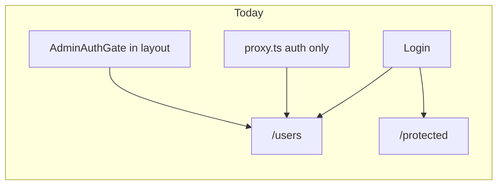
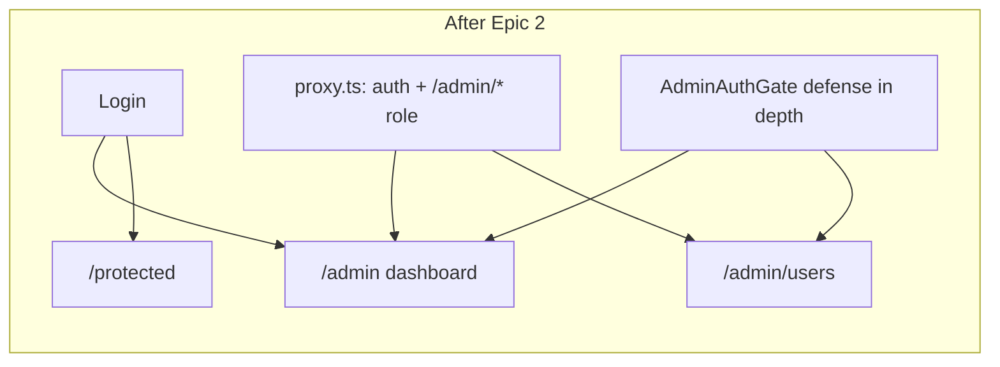

# Phase 6 Epic 2 — Admin Namespace Foundation

## Goal

Establish `/admin` as the admin console home and `/admin/users` as the users table — replacing today's root-level `/users` URL (served by the invisible `(admin)` route group). Admins land on `/admin` after login; everything under `/admin/*` requires the admin role.

## Current state



| What | Where today |
|------|-------------|
| Admin layout + gate | [`src/app/(admin)/layout.tsx`](src/app/(admin)/layout.tsx) |
| Users table | [`src/app/(admin)/users/`](src/app/(admin)/users/) → URL `/users` |
| Post-login redirect | [`getPostAuthRedirectPath`](src/utils/admin.ts) → `'/users'` |
| Admin gate | Layout-only via [`AdminAuthGate`](src/app/(admin)/_components/admin-auth-gate.tsx); proxy has **no** role check |
| Nav / breadcrumb / logo | Hardcoded `'/users'` in sidebar, breadcrumb, [`SeminovaLogo`](src/components/seminova-logo.tsx) default |

Epic 1 (`profiles` migration) is complete per CONTEXT.md — no schema work in this epic.

## Target state



---

## Step 1 — Admin path constants

Add [`src/constants/admin-paths.ts`](src/constants/admin-paths.ts) as the single source of truth:

- `ADMIN_HOME = '/admin'`
- `ADMIN_USERS = '/admin/users'`

Import these everywhere app routes reference admin URLs (redirects, nav, breadcrumb, logo default, tests). Avoids scattered literals and gives Epic 3 a pattern to follow for `PROFILE_PATH`.

Update [`getPostAuthRedirectPath`](src/utils/admin.ts) return type to `'/admin' | '/protected'` and return `ADMIN_HOME` for admins.

---

## Step 2 — Route restructure: `(admin)` → `admin`

**Folder move** (not just find-replace):

| From | To |
|------|-----|
| `src/app/(admin)/` | `src/app/admin/` |

This makes `/admin` a real URL segment. Move all 20 existing files (layout, `_components/*`, `users/*`) intact.

**Import path updates** — anywhere using `@/app/(admin)/`:

- [`src/app/(admin)/layout.tsx`](src/app/(admin)/layout.tsx) → `@/app/admin/_components/admin-auth-gate`

**Coverage exclusions** in [`vitest.config.ts`](vitest.config.ts) — update `(admin)` paths to `admin`.

**Rule/doc path references** that cite `(admin)` file paths (e.g. [`.cursor/rules/error-handling.mdc`](.cursor/rules/error-handling.mdc), [`.cursor/rules/data-tables.mdc`](.cursor/rules/data-tables.mdc)) — update to `src/app/admin/...`.

No backward-compat redirect at `/users` unless PM explicitly wants one (CONTEXT does not require it; old bookmarks 404).

---

## Step 3 — `/admin` dashboard landing

Add [`src/app/admin/page.tsx`](src/app/admin/page.tsx) — a minimal but honest console home (not a dead-end stub):

- Page heading (e.g. "Admin")
- One-line description of the console
- A [`Card`](src/components/ui/card.tsx) linking to Users (`ADMIN_USERS`) — the only nav item today
- Semantic tokens only; keep under 150 lines

`AdminAuthGate` + layout shell apply automatically (no separate gate per page).

---

## Step 4 — Nav, breadcrumb, logo

**Sidebar** ([`admin-sidebar.tsx`](src/app/(admin)/_components/admin-sidebar.tsx)):

- `NAV_ITEMS` href → `ADMIN_USERS`
- Active state: `pathname === item.href` still works for `/admin/users`; consider `pathname.startsWith(item.href)` only if needed for future nested routes

**Breadcrumb** ([`admin-breadcrumb.tsx`](src/app/(admin)/_components/admin-breadcrumb.tsx)):

- Home link → `ADMIN_HOME`
- Extend `BREADCRUMB_LABELS` (e.g. map `users` → "Users")
- On `/admin` (dashboard): show current page only ("Admin" or "Dashboard") — no redundant Home crumb
- On `/admin/users`: **Home / Users**

**Logo** ([`seminova-logo.tsx`](src/components/seminova-logo.tsx)):

- Default `href` → `ADMIN_HOME` (admin sidebar is the only consumer of the default; marketing/auth already pass `href="/"`)

---

## Step 5 — Redirect retargeting

| File | Change |
|------|--------|
| [`src/utils/admin.ts`](src/utils/admin.ts) | `getPostAuthRedirectPath` → `ADMIN_HOME` |
| [`src/app/protected/page.tsx`](src/app/protected/page.tsx) | Admin bounce → `ADMIN_HOME` |
| [`src/components/login-form.tsx`](src/components/login-form.tsx) | No change needed if it calls `getPostAuthRedirectPath` |
| [`src/components/update-password-form.tsx`](src/components/update-password-form.tsx) | Same |

---

## Step 6 — Blanket `/admin/*` gating in proxy

Extend [`src/supabase/proxy.ts`](src/supabase/proxy.ts) after the existing auth check. Use a **boundary-safe** path check — do **not** use `pathname.startsWith('/admin')` alone (that would match sibling routes like `/administrative`):

```typescript
// After session check, before return:
const { pathname } = request.nextUrl
const isAdminPath = pathname === '/admin' || pathname.startsWith('/admin/')

if (isAdminPath && user && !isAdmin(user as JwtClaims)) {
  const url = request.nextUrl.clone()
  url.pathname = '/protected'
  return NextResponse.redirect(url)
}
```

- Import `isAdmin` + `JwtClaims` from `@/utils/admin`
- **Defense in depth:** keep [`AdminAuthGate`](src/app/(admin)/_components/admin-auth-gate.tsx) in the admin layout — proxy rejects early; layout still gates if proxy is bypassed in tests/dev

**Tests** — add to [`src/supabase/proxy.unit.test.ts`](src/supabase/proxy.unit.test.ts):

- Non-admin authenticated user on `/admin` or `/admin/users` → redirect to `/protected`
- Admin on `/admin/users` → 200
- Unauthenticated on `/admin` → still redirects to `/auth/login` (existing auth rule fires first)
- Non-admin on `/administrative` → 200 (boundary check must **not** treat this as an admin path)

---

## Step 7 — Test updates

| File | Update |
|------|--------|
| [`src/utils/admin.unit.test.ts`](src/utils/admin.unit.test.ts) | Expect `ADMIN_HOME` from `getPostAuthRedirectPath` |
| [`src/components/login-form.integration.test.tsx`](src/components/login-form.integration.test.tsx) | `mockPush` → `'/admin'` |
| [`src/components/update-password-form.integration.test.tsx`](src/components/update-password-form.integration.test.tsx) | Same |

Users table / actions tests move with the folder — no `/users` app-path strings in those files. Run full suite at end.

---

## Step 8 — Documentation sync

**Locked-rule wording (direct edit — not via `/sync-repo-docs`):**

Per AGENTS.md change protocol, edit the **Locked rules › Admin gate** bullet directly:

- Change `in-app promote/demote on /users` → `in-app promote/demote on /admin/users`
- Leave the rest of the bullet unchanged (CLI scripts, `app_metadata.role`, profiles caveat)

**Non-locked references — run `/sync-repo-docs`:**

- [`AGENTS.md`](AGENTS.md) — routes list (`/admin`, `/admin/users`), post-login redirect, file paths under `src/app/admin/` (**exclude** the Locked rules section — handled above)
- [`README.md`](README.md) — admin workflow URLs (`localhost:3000/admin`, `/admin/users`)
- [`.cursor/rules/security.mdc`](.cursor/rules/security.mdc) — `/users` → `/admin/users` in secret-key usage note

Do **not** run `/sync-context-md` or mark the phase shipped — only Epic 2 completes here.

---

## Step 9 — Quality bar + manual smoke

```bash
pnpm type-check && pnpm lint && pnpm format-check && pnpm test:ci
```

**Manual checklist:**

- [ ] Sign in as **admin** → lands on `/admin` (dashboard), not `/users`
- [ ] `/admin` shows honest landing with link to Users
- [ ] `/admin/users` — table loads, search/pagination/promote-demote still work
- [ ] Sign in as **non-admin** → still lands on `/protected`
- [ ] Non-admin manually visiting `/admin` or `/admin/users` → redirected to `/protected`
- [ ] Unauthenticated visiting `/admin` → `/auth/login`
- [ ] Sidebar logo → `/admin`; Users nav → `/admin/users` with correct active state
- [ ] Breadcrumb on `/admin/users` reads Home / Users
- [ ] Marketing `/` and auth pages unchanged

---

## Step 10 — Mark epic complete

Once implementation and quality bar pass, run the **`mark-epic-complete`** skill to append `` `Complete` `` to `### Epic 2: Admin Namespace Foundation` in CONTEXT.md and update the file's **Last updated** date.

---

## Out of scope (later epics)

- Shared chrome / `(app)` route group (Epic 3)
- Avatar storage (Epic 4)
- Profile page / retiring `/protected` (Epic 5)
- `/users` backward-compat redirect (PM decision — not in CONTEXT)

## Risk

**Medium** — touches a shipped Phase 3 surface across routes, redirects, proxy, tests, and docs. Mitigation: path constants + grep for remaining `/users` app-route literals before merge.
