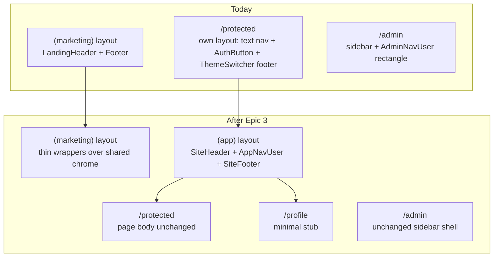

# Phase 6 Epic 3 — Shared Chrome + Authenticated Shell

## Goal

Authenticated non-admin surfaces share the same visual chrome as the marketing site (header, container, logo, footer). A new `(app)` route group wraps `/protected` and a `/profile` stub. The app header shows a **circle** avatar (from `profiles`) with a dropdown for profile + sign-out — reusing admin nav-user **behavior**, not its rectangle sidebar presentation.

## Current vs target



| Surface | Today | After |
|---------|-------|-------|
| Marketing `/` | [`LandingHeader`](src/app/(marketing)/_components/landing-header.tsx) / [`LandingFooter`](src/app/(marketing)/_components/landing-footer.tsx) | Same visuals via shared primitives (full section nav) |
| `/protected` | Standalone [`protected/layout.tsx`](src/app/protected/layout.tsx) | Under `(app)` layout; **page body unchanged** |
| App chrome | N/A | Logo → `APP_HOME`; footer **without** section nav |
| Post-login redirect | Non-admins → `/protected` via [`getPostAuthRedirectPath`](src/utils/admin.ts) | **Unchanged** until Epic 5 (uses `APP_HOME` constant) |
| Profile data in UI | Types only | First read in app header; **one query per request** |

## Architecture decisions

**Slot-based header.** Extract a shared `SiteHeader` with `rightSlot`, optional `mobileNav`, and `logoHref` (default `'/'`). Marketing passes [`LandingAuthButtons`](src/app/(marketing)/_components/landing-auth-buttons.tsx) / mobile sheet; app layout passes `AppNavUser` and sets `logoHref={APP_HOME}`.

**Footer: shared primitive, two modes.** Extract `SiteFooter` with `showNav?: boolean` (default `true`). Marketing renders full footer (logo + **section nav** + social + copyright + legal) as today. App layout passes `showNav={false}` — logo + social + copyright + legal only.

**Rationale (encode in plan):** [`siteConfig.nav`](src/config/site.ts) includes in-page anchors (`#features`) that have no target on authenticated pages; rendering them in the app footer would produce dead links. No "back to website" link in this epic (deferred).

**Container width unifies to `max-w-7xl`.** [`LandingContainer`](src/app/(marketing)/_components/landing-container.tsx) becomes shared `SiteContainer`.

**Single profile fetch per request.** Wrap `getCurrentUserProfile` in React `cache()` **and** `await` it once in the async `(app)/layout.tsx`, passing props to `AppNavUser`. No Suspense boundary around the header user menu — the layout blocks until profile data resolves, so no skeleton fallback. Do **not** mount two independent async loaders in `rightSlot` and `mobileNav`. Reuse one `AppNavUser` element in both responsive slots.

**Initials utility.** Move [`getEmailInitials`](src/app/admin/_components/admin-user-utils.ts) to `src/utils/user-initials.ts` and add `getProfileInitials({ displayName, email })`.

---

## Step 1 — Route constants

No app-home constant exists today — `/protected` is a string literal in [`getPostAuthRedirectPath`](src/utils/admin.ts) and elsewhere.

Add [`src/constants/app-paths.ts`](src/constants/app-paths.ts):

```typescript
export const APP_HOME = '/protected' as const   // non-admin post-login landing; Epic 5 → PROFILE_PATH
export const PROFILE_PATH = '/profile' as const
```

Wire `getPostAuthRedirectPath` return type and non-admin branch to `APP_HOME` (mirror [`ADMIN_HOME`](src/constants/admin-paths.ts) pattern). Update [`admin.unit.test.ts`](src/utils/admin.unit.test.ts) imports if needed. Epic 5 repoints post-login redirect to `PROFILE_PATH`; this epic only wires dropdown + stub.

---

## Step 2 — Extract shared chrome primitives

Move layout-only pieces from `(marketing)/_components/` to `src/components/`:

| New file | Source | Notes |
|----------|--------|-------|
| `site-container.tsx` | `landing-container.tsx` | `max-w-7xl px-6 lg:px-8` |
| `site-nav-links.tsx` | `landing-nav-links.tsx` | Config-driven from `siteConfig.nav` |
| `site-copyright.tsx` | `landing-copyright.tsx` | Async server component |
| `site-footer.tsx` | `landing-footer.tsx` | Props: `showNav?: boolean` (default `true`), `logoHref?: string` (default `'/'`) |
| `site-header.tsx` | `landing-header.tsx` structure | Props: `rightSlot`, optional `mobileNav`, `logoHref?: string` (default `'/'`) |

When `showNav={false}`, `SiteFooter` skips the `SiteNavLinks` row — layout adjusts (logo + social on first row; copyright + legal below).

Keep marketing-specific pieces in `(marketing)/_components/`:
- `landing-auth-buttons.tsx`, `landing-mobile-nav.tsx`

**Co-locate tests** with new primitives — migrate/adapt existing [`landing-header.unit.test.tsx`](src/app/(marketing)/_components/landing-header.unit.test.tsx) and footer test. Add `site-footer.unit.test.tsx` case: `showNav={false}` omits nav links.

---

## Step 3 — Refactor marketing to consume primitives (zero visual change)

```tsx
// landing-header.tsx
<SiteHeader
  logoHref="/"
  rightSlot={<LandingAuthButtons />}
  mobileNav={<LandingMobileNav />}
/>

// landing-footer.tsx
<SiteFooter logoHref="/" />   {/* showNav defaults true — full nav as today */}
```

**Gate:** existing landing header/footer unit tests pass without assertion changes.

---

## Step 4 — Profile helper + initials util

**`src/utils/user-initials.ts`** — `getEmailInitials`, `getProfileInitials`

**`src/app/(app)/_lib/get-current-user-profile.ts`** (route-scoped):

```typescript
import { cache } from 'react'

export const getCurrentUserProfile = cache(async () => {
  // getUser() → profiles select display_name, avatar_url
  // return { displayName, avatarUrl, email }
})
```

Log fetch errors with `[app-shell]` tag; degrade to email-only initials.

Update [`admin-user-utils.ts`](src/app/admin/_components/admin-user-utils.ts) to import shared `getEmailInitials`.

---

## Step 5 — `AppNavUser` client component

Create [`src/app/(app)/_components/app-nav-user.tsx`](src/app/(app)/_components/app-nav-user.tsx) (`'use client'`, ≤150 lines): circle `Avatar`, dropdown (Profile → `PROFILE_PATH`, Sign out), ghost/icon trigger, `getProfileInitials`, sign-out via `createClient().auth.signOut()` → `/auth/login`, `aria-label` on trigger.

Unit tests: `app-nav-user.unit.test.tsx` (dropdown + profile href); `user-initials.unit.test.ts` (H/I/B).

---

## Step 6 — `(app)` route group + layout

```
src/app/(app)/
  layout.tsx                          ← async Server Component; awaits getCurrentUserProfile()
  _components/app-nav-user.tsx
  _lib/get-current-user-profile.ts
  protected/page.tsx                  ← moved from src/app/protected/
  profile/page.tsx
```

**[`(app)/layout.tsx`](src/app/(app)/layout.tsx)** — fetch once, single menu instance:

```tsx
import { cache } from 'react' // via getCurrentUserProfile

export default async function AppLayout({ children }) {
  const profile = await getCurrentUserProfile()
  const userMenu = <AppNavUser {...profile} />

  return (
    <>
      <SiteHeader
        logoHref={APP_HOME}
        rightSlot={<div className="hidden md:block">{userMenu}</div>}
        mobileNav={<div className="md:hidden">{userMenu}</div>}
      />
      <main id="main-content" className="...">{children}</main>
      <SiteFooter logoHref={APP_HOME} showNav={false} />
    </>
  )
}
```

`cache()` on `getCurrentUserProfile` is the safety net if any future child also calls it; the layout pattern above guarantees one `AppNavUser` props resolution and one DB read per request.

**Delete** [`src/app/protected/layout.tsx`](src/app/protected/layout.tsx).

**Move** [`src/app/protected/page.tsx`](src/app/protected/page.tsx) → `src/app/(app)/protected/page.tsx` with **zero body changes**.

---

## Step 7 — `/profile` stub

Minimal placeholder at [`src/app/(app)/profile/page.tsx`](src/app/(app)/profile/page.tsx) — Epic 5 replaces in place.

---

## Step 8 — Tests, docs, quality bar

**Tests:** user-initials, app-nav-user, site-footer `showNav={false}`, landing wrappers unchanged.

**Docs:** `/sync-repo-docs` — `(app)` group, `APP_HOME`, `PROFILE_PATH`, shared chrome, app footer nav omission.

```bash
pnpm type-check && pnpm lint && pnpm format-check && pnpm test:ci
```

**Manual checklist:**
- [ ] Marketing `/` — header, footer, nav, auth CTAs visually unchanged
- [ ] Sign in as non-admin → `/protected`; page content same; new chrome (no theme toggle in footer)
- [ ] **App-header logo → app home (`/protected` / `APP_HOME`), not marketing `/`**
- [ ] **App footer shows no marketing section-nav links (no dead `#features` anchors)**
- [ ] Circle avatar in header; dropdown shows Profile + Sign out
- [ ] Profile link → `/profile` stub renders
- [ ] Sign out works
- [ ] Admin login → `/admin` unchanged
- [ ] Non-admin visiting `/admin` still redirects to `/protected`
- [ ] User with `display_name` / `avatar_url` shows correct initials or image

---

## Step 9 — Mark epic complete

Run **`mark-epic-complete`** skill when finished.

---

## Out of scope

- Avatar storage (Epic 4); full profile page + theme toggle (Epic 5)
- Repointing `getPostAuthRedirectPath` to `PROFILE_PATH` (Epic 5)
- Removing `/protected` (Epic 5)
- "Back to website" footer link (deferred)
- Admin `AdminNavUser` presentation (unchanged)

## Risk

**Medium** — marketing visual parity; first `profiles` UI read. Footer/header logo both use `APP_HOME` in app layout so users stay in authenticated IA.
