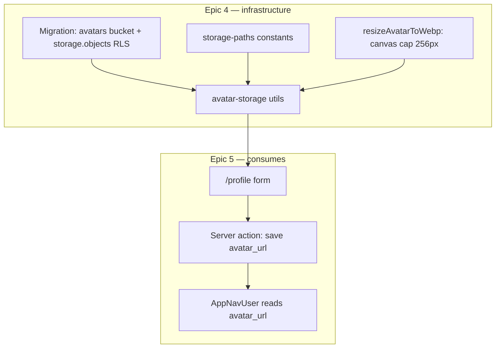

# Phase 6 Epic 4 — Avatar Storage

## Goal

Establish the canonical Supabase Storage pattern for Seminova: a public-read `avatars` bucket where authenticated users can write/replace only files in their own folder. Provide reusable app utilities so Epic 5 can wire avatar upload on `/profile` without re-deriving bucket names, paths, or validation.

## Scope boundary


| In scope                                                                                                          | Out of scope (Epic 5)                                   |
| ----------------------------------------------------------------------------------------------------------------- | ------------------------------------------------------- |
| One migration: bucket + storage RLS                                                                               | Profile page UI                                         |
| Bucket config (size limit, MIME allowlist)                                                                        | `react-hook-form` + `zod` form pattern                  |
| Path convention + resize-to-WebP upload utils + unit tests                                                        | Updating `profiles.avatar_url` after upload             |
| Document pattern in `[supabase.mdc](.cursor/rules/supabase.mdc)` + `[AGENTS.md](AGENTS.md)` via `/sync-repo-docs` | Post-login redirect, `/protected` removal, theme toggle |
| Human `pnpm db:push` gate                                                                                         | End-to-end upload UX verification (smoke in Epic 5)     |


Epic 1 already ships `[profiles.avatar_url](supabase/migrations/20260622120000_create_profiles.sql)`; Epic 4 only defines **where** the URL points.

## Architecture




**Path convention (critical for RLS):** `{userId}/avatar.webp` — user UUID as the **first** path segment so `(storage.foldername(name))[1]` matches `(select auth.uid())::text`. The full path is a **constant** per user (always `avatar.webp`); re-uploads overwrite the same object via `upsert: true` — no orphaned files when the user changes input format.

**Canonical format:** All stored avatars are WebP. `uploadUserAvatar` validates the **original** file (MIME allowlist + 2 MiB cap), then resizes/re-encodes client-side before upload. Input JPEG/PNG/WebP is accepted; output is always WebP.

**Public URL:** Bucket `public: true`; store the full URL from `getPublicUrl(path)` in `profiles.avatar_url` (Epic 5). No signed URLs per [CONTEXT.md](CONTEXT.md) Epic 4 AC.

**Security model:** Defense in depth — bucket MIME/size limits in SQL, path-scoped storage RLS on writes, client-side validation on the **original** file before resize (Epic 5 adds server-side validation on the profile save action). Stored objects are always WebP at the fixed path; re-upload replaces in place.

## Step 1 — Migration (agent writes SQL only)

Use the **[create-migration** skill](.cursor/skills/create-migration/SKILL.md). Create exactly one file: `supabase/migrations/YYYYMMDDHHMMSS_create_avatars_bucket.sql` (UTC timestamp from system date).

**Bucket insert** on `storage.buckets`:

- `id` / `name`: `avatars`
- `public`: `true`
- `file_size_limit`: `2097152` (2 MiB — reasonable avatar default)
- `allowed_mime_types`: `image/jpeg`, `image/png`, `image/webp`

**RLS on `storage.objects`** — separate policy per operation (match [profiles migration](supabase/migrations/20260622120000_create_profiles.sql) style; use `(select auth.uid())` wrapper):


| Operation | Role            | Rule                                                                                                                                                   |
| --------- | --------------- | ------------------------------------------------------------------------------------------------------------------------------------------------------ |
| INSERT    | `authenticated` | `bucket_id = 'avatars'` AND `(select auth.uid())::text = (storage.foldername(name))[1]`                                                                |
| UPDATE    | `authenticated` | same `USING` + `WITH CHECK` (required for upsert overwrite)                                                                                            |
| DELETE    | `authenticated` | same `USING`                                                                                                                                           |
| SELECT    | optional        | Public bucket serves reads via CDN URL; explicit public SELECT policy is optional — include only if upsert/list behavior requires it per Supabase docs |


Do **not** use `FOR ALL` combined policies. Header comment: `-- Generated using 'Create Database Migration' skill`.

**Agent must not** run `pnpm db:push`, `db:reset`, or `supabase migration new` (`[do-migrations-agent.mdc](.cursor/rules/do-migrations-agent.mdc)`).

## Step 2 — Human migration gate

PM reviews SQL, then runs:

```bash
pnpm db:push
pnpm db:types   # only if storage schema affects generated types; safe to run either way
```

Manual spot-check in Supabase Dashboard → Storage: bucket exists, public, MIME/size limits visible. Full upload authorization test deferred to Epic 5; optional dashboard upload to `{your-user-id}/avatar.webp` confirms bucket wiring.

## Step 3 — App constants

Add `[src/constants/storage-paths.ts](src/constants/storage-paths.ts)`:

- `AVATAR_BUCKET = 'avatars'`
- `AVATAR_MAX_BYTES` (mirror migration limit — applies to **input** file before resize)
- `AVATAR_ALLOWED_MIME_TYPES` (mirror migration allowlist — input validation only)
- `AVATAR_CANONICAL_FILENAME = 'avatar.webp'` (stored object name; constant)
- `AVATAR_MAX_DIMENSION = 256` (resize cap in px)
- `AVATAR_WEBP_QUALITY = 0.85`
- `buildAvatarStoragePath(userId: string): string` → `{userId}/avatar.webp` (no extension parameter)

Keep constants DRY — utils import from here; migration comment references the same values.

## Step 4 — Upload utilities

Add `[src/utils/avatar-storage.ts](src/utils/avatar-storage.ts)`. File is client-only (`'use client'` boundary or only imported from client components) — canvas APIs are browser-only.

1. `**validateAvatarFile(file: File)**` — returns `{ valid: true }` or `{ valid: false, message: string }` using constants (size, MIME on the **original** file). User-facing messages only. Runs first; gates input before resize.
2. `**resizeAvatarToWebp(file: File): Promise<Blob>**` — canvas-based resize + re-encode:
  - Load source via `createImageBitmap(file)` or `Image` + object URL (prefer `createImageBitmap` for cleanup)
  - Compute draw dimensions capped at **256×256**, preserve aspect ratio, **never upscale** beyond source width/height
  - Draw to offscreen `canvas`, export via `canvas.toBlob(..., 'image/webp', AVATAR_WEBP_QUALITY)` (~0.85)
  - Reject if `toBlob` returns null
  - Revoke object URLs in `finally`
3. `**getAvatarPublicUrl(storagePath: string)**` — uses `[createClient](src/supabase/client.ts)` + `storage.from(AVATAR_BUCKET).getPublicUrl(storagePath).data.publicUrl`
4. `**uploadUserAvatar({ userId, file })**` — pipeline:
  - `validateAvatarFile(file)` — abort on invalid
  - `resizeAvatarToWebp(file)` — always yields WebP `Blob`
  - `storagePath = buildAvatarStoragePath(userId)` → `{userId}/avatar.webp`
  - `upload(storagePath, webpBlob, { upsert: true, contentType: 'image/webp' })` — fixed path guarantees replace on re-upload
  - Return `{ publicUrl: getAvatarPublicUrl(storagePath) }` or map errors for Epic 5

Log failures with `[avatar-storage]` tag per `[logging.mdc](.cursor/rules/logging.mdc)`. No `profiles` table writes in this module.

## Step 5 — Unit tests

Add `[src/utils/avatar-storage.unit.test.ts](src/utils/avatar-storage.unit.test.ts)` — minimal H/I/B:

- **Validation (original file):** valid JPEG/PNG/WebP under size limit passes; oversize and disallowed MIME fail with distinct messages; exact max-size passes, max+1 fails
- **Path builder:** `buildAvatarStoragePath(uuid)` always returns `{uuid}/avatar.webp` (no extension argument)
- **Upload path after processing:** mock `resizeAvatarToWebp` to return a WebP blob; assert `uploadUserAvatar` with a PNG input calls `storage.upload` with path ending in `/avatar.webp` and `contentType: 'image/webp'`
- **Canvas boundary:** do not run real image encoding in jsdom — mock `HTMLCanvasElement.prototype.toBlob` (and `createImageBitmap` / `Image` load if needed) at the browser seam; mock `createClient` / `storage.from` at the Supabase boundary for one happy upload test

Do not add UI tests.

Run: `pnpm test:ci -- src/utils/avatar-storage.unit.test.ts`

## Step 6 — Document the convention

`**[.cursor/rules/supabase.mdc](.cursor/rules/supabase.mdc)**` — add a concise **Storage** section (~30–50 lines):

- Bucket-per-concern naming
- Path pattern: `{ownerId}/avatar.webp` — fixed canonical path per user; first segment for RLS
- Client-side resize to WebP (256px cap) before upload; input validation on original file
- Public vs private buckets (avatars = public-read, owner writes)
- Pointer to migration file and `[avatar-storage.ts](src/utils/avatar-storage.ts)`
- Cross-ref `[security.mdc](.cursor/rules/security.mdc)` for upload validation

`**[AGENTS.md](AGENTS.md)**` via `/sync-repo-docs`:

- Data model table: add Storage row (`avatars` bucket, public-read, owner-scoped writes)
- Where things live: `storage-paths.ts`, `avatar-storage.ts`, migration path
- Implemented-now bullet for Epic 4

Do not edit CONTEXT.md locked rules. CONTEXT §7 "Storage buckets: none yet" is planning drift — `sync-context-md` is not required for this epic; `mark-epic-complete` only tags the epic heading.

## Step 7 — Quality gate

```bash
pnpm type-check && pnpm lint && pnpm format-check && pnpm test:ci
```

## Epic 5 handoff contract

Epic 5 profile form should:

1. Optionally call `validateAvatarFile` on file pick for immediate feedback (also runs inside `uploadUserAvatar`)
2. Call `uploadUserAvatar({ userId, file })` from a client component — resize-to-WebP + upload handled inside
3. Server action persists returned `publicUrl` to `profiles.avatar_url` (owner RLS already on profiles)
4. `AppNavUser` already reads `avatarUrl` from `[getCurrentUserProfile](src/app/(app)`/_lib/get-current-user-profile.ts) — no Epic 4 change needed

## Manual testing checklist (Epic 4)

- [x] Migration applied (`pnpm db:push`)
- [x] `avatars` bucket visible in Supabase Dashboard with public flag and MIME/size limits
- [x] Unit tests pass
- [x] Docs updated (AGENTS.md + supabase.mdc)

Full upload → header avatar display test belongs to Epic 5.

## Step 8 — Mark epic complete

When all steps pass, run the **[mark-epic-complete** skill](.cursor/skills/mark-epic-complete/SKILL.md) to append ``Complete`` to `### Epic 4: Avatar Storage` in [CONTEXT.md](CONTEXT.md).