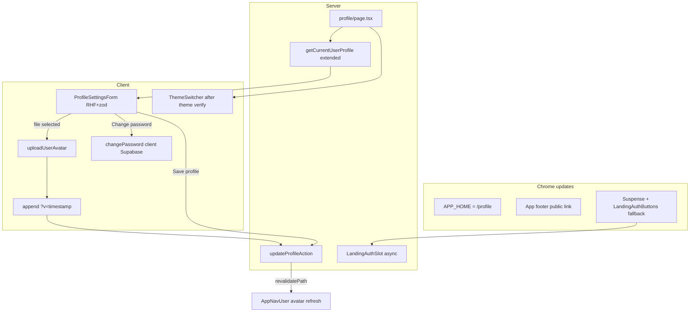

# Phase 6 Epic 5 — Profile Page

## Goal

Replace the `/profile` stub with a real combined settings surface, make it the non-admin post-login landing, retire `/protected`, establish the template's first **react-hook-form + zod** form stack, and complete the deferred public-site round-trip from Epic 3.

## Scope boundary

| In scope | Out of scope |
| -------- | ------------ |
| Full `/profile` UI (display name, avatar, bio, password, theme) | Retrofitting auth forms to RHF (they stay `useState`) |
| `updateProfileAction` server action + zod validation | New migrations (Epics 1 + 4 already ship `profiles` + `avatars`) |
| Client avatar upload via [`avatar-storage.ts`](src/utils/avatar-storage.ts) → persist versioned `avatar_url` | Admin profile editing |
| Repoint `APP_HOME` → `/profile`; delete [`protected/page.tsx`](src/app/(app)/protected/page.tsx) | Phase 7 auth-error code mapping |
| App footer "back to public site"; PPR-safe session-aware marketing header | Pattern reference page (Phase 9) |
| New `.cursor/rules/forms.mdc` coding standard | |

**Depends on (shipped):** Epic 1 (`profiles` + RLS), Epic 3 (`(app)` shell + `AppNavUser`), Epic 4 (`uploadUserAvatar` + bucket).

## Architecture



**Save flow (profile fields + avatar):** one **Save profile** submit — if a new file is pending, `uploadUserAvatar({ userId, file })` runs client-side first, then build a **cache-busted URL** before persist:

```typescript
const { publicUrl } = await uploadUserAvatar({ userId, file })
const versionedUrl = `${publicUrl}?v=${Date.now()}`
await updateProfileAction({ displayName, bio, avatarUrl: versionedUrl })
```

Storage path stays `{userId}/avatar.webp` (upsert, no orphans). Only the string in `profiles.avatar_url` changes per upload so CDN/browser caches invalidate. Success → `showSuccessToast` + `router.refresh()` so header avatar updates.

**Password flow:** separate section, separate submit — client-side `supabase.auth.updateUser({ password })` (same trust boundary as [`update-password-form.tsx`](src/components/update-password-form.tsx)); errors via `extractAuthFormError` + `InlineError`/`ErrorPanel`. No server action.

## Sequential implementation

### Step 1 — Form stack dependencies + shadcn primitives

Install packages (not yet in [`package.json`](package.json)):

```bash
pnpm add react-hook-form @hookform/resolvers
```

Add shadcn primitives (non-interactive CLI per locked rules):

```bash
pnpm dlx shadcn@latest add form textarea -y -o
```

`zod` (^4.4.3) is already installed but unused — Epic 5 is its first consumer.

### Step 2 — Shared profile form schema

Add [`src/app/(app)/profile/_lib/profile-form-schema.ts`](src/app/(app)/profile/_lib/profile-form-schema.ts):

- `profileFormSchema` — `displayName` (optional string, trimmed, max ~80), `bio` (optional string, max ~500), `avatarUrl` (optional `z.string().url()` when non-null — **must accept URLs with query params**, e.g. `https://…/avatar.webp?v=1719158400000`)
- Export inferred `ProfileFormValues` type
- Export `parseProfileFormInput(raw: unknown)` using `safeParse` for server action reuse
- Co-locate [`profile-form-schema.unit.test.ts`](src/app/(app)/profile/_lib/profile-form-schema.unit.test.ts) — invalid input, max-length boundary, **versioned avatar URL passes validation**

### Step 3 — Extend profile loader

Extend [`get-current-user-profile.ts`](src/app/(app)/_lib/get-current-user-profile.ts):

- Add `userId: string` and `bio: string | null` to `CurrentUserProfile`
- Widen `select` to `display_name, avatar_url, bio`
- `userId` from `user.id` (needed for avatar upload; RLS already scopes writes)

`cache()` keeps one DB read when both `AppShell` and `/profile` page call it in the same request. Pass `avatarUrl` through as stored (including `?v=` suffix) — `AppNavUser` already uses it as `AvatarImage` `src`.

### Step 4 — Profile server action

Add [`src/app/(app)/profile/actions.ts`](src/app/(app)/profile/actions.ts) following the envelope pattern in [`admin/users/actions.ts`](src/app/admin/users/actions.ts):

```typescript
// Success: { success: true, data: { displayName, avatarUrl, bio } }
// Error:   { success: false, error: { message, code, kind } }
```

`updateProfileAction(input: unknown)`:

1. `createClient()` → `getUser()` — 401 if missing
2. `parseProfileFormInput` — `VALIDATION_ERROR` / operational on failure (includes versioned `avatarUrl`)
3. `supabase.from('profiles').update({ display_name, bio, avatar_url }).eq('id', user.id)` — map Supabase codes per `error-handling.mdc`
4. `revalidatePath(PROFILE_PATH)` on success
5. Return updated row subset as DTO (no raw DB leak)

**Avatar URL contract:** action receives and persists the client-built versioned URL as-is. Do not strip or recompute the `?v=` param server-side unless validation fails.

### Step 5 — Profile page UI

Replace stub [`src/app/(app)/profile/page.tsx`](src/app/(app)/profile/page.tsx):

**Server Component** loads `getCurrentUserProfile()`, renders page title + passes defaults to client form.

#### Step 5a — Confirm theme provider config (checked step)

Before mounting [`ThemeSwitcher`](src/components/theme-switcher.tsx), **read and verify** [`src/app/layout.tsx`](src/app/layout.tsx) `ThemeProvider` props:

```43:47:src/app/layout.tsx
        <ThemeProvider
          attribute="class"
          defaultTheme="system"
          enableSystem
          disableTransitionOnChange
```

- [ ] `defaultTheme="system"` present
- [ ] `enableSystem` present
- [ ] No theme toggle mounted in marketing header/footer or root layout (only `/profile` gets `ThemeSwitcher`)

Only after confirmation, mount `<ThemeSwitcher />` in an "Appearance" section on `/profile`. Logged-out and marketing surfaces remain system-default with no exposed control.

#### Step 5b — Profile form + avatar field

Add [`src/app/(app)/profile/_components/profile-settings-form.tsx`](src/app/(app)/profile/_components/profile-settings-form.tsx) (`'use client'`, ≤150 lines — extract subcomponents if needed):

| Section | Implementation |
| ------- | -------------- |
| Avatar | Hidden `<input type="file" accept="image/*">`; **shadcn `Avatar` / `AvatarImage` / `AvatarFallback` only** (match [`app-nav-user.tsx`](src/app/(app)/_components/app-nav-user.tsx)) — **no `next/image`**. Saved URL → `AvatarImage src={avatarUrl}`; pending pick → `AvatarImage src={URL.createObjectURL(file)}` with `validateAvatarFile` on pick; fallback initials via `getProfileInitials` |
| Display name | `FormField` + `Input` |
| Bio | `FormField` + `Textarea` |
| Save | `useTransition` → optional upload → append `?v=${Date.now()}` → `updateProfileAction` → `showSuccessToast('Profile saved')` → `router.refresh()` |
| Errors | `InlineError` / `ErrorPanel` on `kind` (profile action errors) |
| Password | Separate `<form>`: new + confirm fields, min length check client-side before Supabase call, `extractAuthFormError` on failure |
| Appearance | `ThemeSwitcher` (after Step 5a verification) — no submit button |

Mobile-first layout: stacked cards/sections with semantic tokens; no hardcoded colors.

### Step 6 — Retire `/protected` and repoint app home

In [`app-paths.ts`](src/constants/app-paths.ts):

```typescript
export const PROFILE_PATH = '/profile' as const
export const APP_HOME = PROFILE_PATH  // authenticated app landing
```

**Delete** [`src/app/(app)/protected/page.tsx`](src/app/(app)/protected/page.tsx).

Update hardcoded `/protected` references:

| File | Change |
| ---- | ------ |
| [`proxy.ts`](src/supabase/proxy.ts) | Non-admin `/admin/**` redirect → `PROFILE_PATH` |
| [`admin-auth-gate.tsx`](src/app/admin/_components/admin-auth-gate.tsx) | Same |
| [`sign-up-form.tsx`](src/components/sign-up-form.tsx) | `emailRedirectTo` → `/profile` |
| [`admin.unit.test.ts`](src/utils/admin.unit.test.ts), [`proxy.unit.test.ts`](src/supabase/proxy.unit.test.ts), login/update-password integration tests, [`auth/confirm/route.integration.test.ts`](src/app/auth/confirm/route.integration.test.ts) | Assert `/profile` |

`getPostAuthRedirectPath` in [`admin.ts`](src/utils/admin.ts) already reads `APP_HOME` — no logic change once constant updates.

### Step 7 — Public-site round-trip (PPR-safe)

`/ ` is **Partial Prerender** (`cacheComponents: true` + [`SiteCopyright`](src/components/site-copyright.tsx) `connection()` pattern). Marketing auth must **not** pull the header/layout into request-time rendering.

#### App footer

Extend [`SiteFooter`](src/components/site-footer.tsx) with optional `publicSiteLink?: { href: string; label: string }`. Pass from [`app-shell.tsx`](src/app/(app)/_components/app-shell.tsx):

```typescript
publicSiteLink={{ href: '/', label: 'Back to website' }}
```

Render as a text link near copyright — not marketing section nav.

#### Marketing header auth slot (Suspense streamed segment)

**Do not** call `getUser()` in [`landing-header.tsx`](src/app/(marketing)/_components/landing-header.tsx) or [`(marketing)/layout.tsx`](src/app/(marketing)/layout.tsx). Keep both **sync** server components.

Add async server component [`landing-auth-slot.tsx`](src/app/(marketing)/_components/landing-auth-slot.tsx):

```tsx
// async server component — auth read isolated here only
export async function LandingAuthSlot({ layout = 'row' }: { layout?: 'row' | 'stack' }) {
  const supabase = await createClient()
  const { data: { user } } = await supabase.auth.getUser()
  if (user) {
    return <Button asChild size="sm"><Link href={APP_HOME}>Open app</Link></Button>
  }
  return <LandingAuthButtons layout={layout} />
}
```

In **sync** [`landing-header.tsx`](src/app/(marketing)/_components/landing-header.tsx), compose the slot inside its own Suspense boundary — mirror [`site-footer.tsx`](src/components/site-footer.tsx) lines 54–58:

```tsx
import { Suspense } from 'react'

// shared streamed segment — instantiated twice with layout-specific fallbacks
const desktopAuthSlot = (
  <Suspense fallback={<LandingAuthButtons />}>
    <LandingAuthSlot />
  </Suspense>
)
const mobileAuthSlot = (
  <Suspense fallback={<LandingAuthButtons layout="stack" />}>
    <LandingAuthSlot layout="stack" />
  </Suspense>
)

export const LandingHeader = () => (
  <SiteHeader
    logoHref="/"
    rightSlot={desktopAuthSlot}
    mobileNav={<LandingMobileNav authSlot={mobileAuthSlot} />}
  />
)
```

Update [`landing-mobile-nav.tsx`](src/app/(marketing)/_components/landing-mobile-nav.tsx): accept `authSlot: React.ReactNode` prop; replace hardcoded `<LandingAuthButtons layout="stack" />` with `{authSlot}`. Client component receives the pre-wrapped Suspense tree from the server parent — no auth read in the client file.

**PPR outcome:** static shell (hero, features, header chrome, anonymous CTA fallback) prerendered at build; auth slot streams per request — same model as copyright year in footer.

Update landing header/mobile-nav tests: assert Suspense fallback renders anonymous CTAs; mock or integration-test authenticated "Open app" path at `LandingAuthSlot` boundary.

### Step 8 — Form pattern rule (coding standard)

Add [`.cursor/rules/forms.mdc`](.cursor/rules/forms.mdc) documenting the canonical stack:

- **Client:** `react-hook-form` + `zodResolver` + shadcn `Form` primitives
- **Server:** shared zod schema `safeParse` at action boundary; never return raw `ZodError`
- **Mutations:** Server Actions (not route handlers) for profile-style CRUD; `useTransition` + toast on success; `InlineError`/`ErrorPanel` on failure
- **Reference implementation:** `/profile` files from this epic
- Cross-link `error-handling.mdc`, `notifications.mdc`, `security.mdc`

Patch `security.mdc` stale line ("template does not ship zod yet") to point at the new rule — minimal one-line fix.

### Step 9 — Tests

Target high-value coverage per `testing.mdc` (not exhaustive):

| File | Cases |
| ---- | ----- |
| `profile-form-schema.unit.test.ts` | Invalid input; max-length boundary; versioned avatar URL accepted |
| `profile/actions` or integration | Happy save; unauthenticated → operational error |
| `profile-settings-form.integration.test.tsx` | Submit valid fields → toast + action called (mock action at boundary) |
| Redirect tests (Step 6 files) | Non-admin login → `/profile` |
| `landing-header` / `landing-auth-slot` tests | Suspense fallback shows Sign in; authenticated slot renders Open app |

### Step 10 — Docs + quality gate

Run `/sync-repo-docs` — update [`AGENTS.md`](AGENTS.md) + [`README.md`](README.md):

- `/profile` is non-admin post-login landing; `/protected` removed
- `APP_HOME` = `/profile`
- Avatar URL versioning (`?v=` on `avatar_url`)
- Form stack rule reference
- Manual test note: human must have run `pnpm db:push` for avatars bucket (Epic 4) before avatar upload works

```bash
pnpm type-check && pnpm lint && pnpm format-check && pnpm test:ci
```

**Manual checklist:**

- [ ] Sign in as non-admin → lands on `/profile` (not `/protected`)
- [ ] Edit display name + bio → Save → toast; values persist on refresh
- [ ] Upload avatar → Save → image in form + header dropdown
- [ ] **Re-upload avatar → Save → new image visible immediately** (no stale CDN/browser cache)
- [ ] Change password → success (stays on profile); bad password → inline error
- [ ] Theme toggle on profile only; marketing `/` has no theme control; system default when logged out
- [ ] App footer "Back to website" → `/`; marketing header "Open app" when logged in (streams in; static shell unchanged)
- [ ] `/protected` returns 404
- [ ] Admin flows unchanged (`/admin`, non-admin blocked from `/admin/**`)
- [ ] `pnpm build` — `/` remains `◐` Partial Prerender (not fully `ƒ` Dynamic)

### Step 11 — Mark epic complete

When implementation and quality gate pass, run the **`mark-epic-complete`** skill to tag Epic 5 `Complete` in [`CONTEXT.md`](CONTEXT.md) and archive phase narrative as appropriate.

## Risk

| Risk | Mitigation |
| ---- | ---------- |
| Avatar upload fails if Epic 4 migration not pushed | Call out in manual checklist; action only runs after successful upload |
| Stale avatar after re-upload without `?v=` | Version query param on every new upload persist |
| Auth slot Suspense flash (anonymous fallback → Open app) | Acceptable PPR tradeoff; same pattern as copyright year |
| `getUser()` at layout level breaks PPR | Auth read only inside `LandingAuthSlot` behind Suspense |
| `ThemeSwitcher` hydration flash | Existing `mounted` guard is sufficient |
| Large profile form exceeds 150-line component rule | Extract `ProfileAvatarField`, `ProfilePasswordSection` subcomponents |
| Zod v4 resolver API | Use `@hookform/resolvers/zod` compatible with installed zod ^4 |

## Key files touched

- **New:** `profile/actions.ts`, `profile/_lib/profile-form-schema.ts`, `profile/_components/profile-settings-form.tsx`, `landing-auth-slot.tsx`, `.cursor/rules/forms.mdc`
- **Replace:** `profile/page.tsx`
- **Delete:** `(app)/protected/page.tsx`
- **Extend:** `get-current-user-profile.ts`, `site-footer.tsx`, `app-shell.tsx`, `landing-header.tsx`, `landing-mobile-nav.tsx`, `app-paths.ts`
- **Verify (no change expected):** `src/app/layout.tsx` ThemeProvider config
- **Deps:** `react-hook-form`, `@hookform/resolvers`, shadcn `form` + `textarea`
