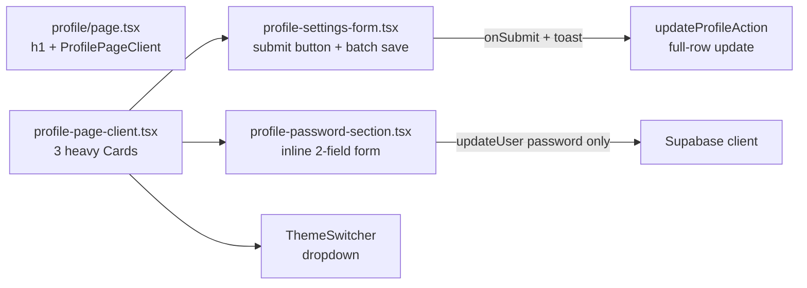
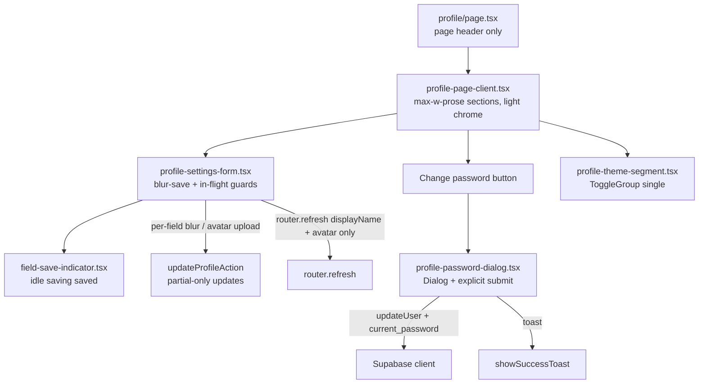

# Phase 6 Epic 6 — Profile Surface Redesign

## Goal

Rework the shipped Epic 5 profile page so it reads as finished template-quality UI: restrained layout/composition, blur-save for independent fields, upload-on-complete for avatar, segmented theme control, and explicit-submit password change in a modal. This epic **does not** add migrations or new routes — it refactors [`src/app/(app)/profile/`](src/app/(app)/profile/) and one Supabase auth config flag.

## Scope boundary

| In scope | Out of scope |
| -------- | ------------ |
| Layout/composition polish on `/profile` | Epic 7 admin nav-user profile link |
| Blur-save display name + bio; remove "Save profile" button | Epic 8 auth-form autofill retrofit |
| Avatar persist on upload completion (no batch save) | New DB migrations |
| Inline transient save indicators per `notifications.mdc` | Mapping raw Supabase auth error codes (Phase 7) |
| Password change → modal with current/new/confirm + `current_password` | Migrating auth forms to RHF |
| `ToggleGroup` theme segment replacing dropdown on profile | Marketing theme toggle (stays none) |
| `secure_password_change = true` in [`supabase/config.toml`](supabase/config.toml) | |

**Depends on (shipped):** Epic 5 profile page, [`forms.mdc`](.cursor/rules/forms.mdc), [`notifications.mdc`](.cursor/rules/notifications.mdc).

## Current state (Epic 5 baseline)



Pain points vs epic spec:
- Full-width cards with duplicate "Profile" heading ([`profile-page-client.tsx`](src/app/(app)/profile/_components/profile-page-client.tsx) lines 50–55)
- Batch submit + success toast ([`profile-page-client.tsx`](src/app/(app)/profile/_components/profile-page-client.tsx) lines 43–44, 264–266 in form)
- Password inline without current-password enforcement ([`profile-password-section.tsx`](src/app/(app)/profile/_components/profile-password-section.tsx))
- Theme dropdown instead of segmented control ([`theme-switcher.tsx`](src/components/theme-switcher.tsx))
- No inline save indicator component exists yet
- [`secure_password_change = false`](supabase/config.toml) (line 228)

## Target architecture



## Implementation plan (sequential)

### Step 1 — Add missing shadcn primitives

Install (non-interactive CLI per locked rules):

```bash
pnpm dlx shadcn@latest add dialog toggle-group -y -o
```

- **Dialog** — password change modal (form submission, not confirmation → not `alert-dialog`)
- **ToggleGroup** — Light / Dark / System segmented control

### Step 2 — Inline save indicator

Add a small client component, e.g. [`field-save-indicator.tsx`](src/app/(app)/profile/_components/field-save-indicator.tsx):

- **Three states only:** `idle` | `saving` | `saved` — no `error` state
- Field errors render separately via `FormMessage` / `InlineError`; the indicator never surfaces errors
- `saved`: brief checkmark + "Saved" text, `role="status"`, auto-clear to `idle` after ~2s
- Render adjacent to field label row (display name, bio) and avatar row
- First conformant implementation of the `notifications.mdc` blur-save indicator — keep profile-local unless a second consumer appears

### Step 3 — Partial-only server action

**Replace** the full-row update path in [`updateProfileAction`](src/app/(app)/profile/actions.ts) — partial is the **only** path:

- Add `profilePartialSchema` in [`profile-form-schema.ts`](src/app/(app)/profile/_lib/profile-form-schema.ts) — `profileFormSchema.partial()` with `.refine()` requiring at least one key
- `parseProfileFormInput` (or a renamed `parseProfilePartialInput`) validates via the partial schema only
- Server builds dynamic `.update({ ...only provided fields })` mapped to DB columns — still owner-scoped via RLS
- **Remove** the existing full-parse / full-row update path; do not keep both
- Update [`actions.unit.test.ts`](src/app/(app)/profile/actions.unit.test.ts) for single-field and multi-field partial updates; remove tests that assume full-row-only input

### Step 4 — Supabase secure password change (config)

In [`supabase/config.toml`](supabase/config.toml):

```toml
secure_password_change = true
```

**Human follow-up (not agent):** enable the same setting on the linked remote project (Supabase Dashboard → Auth → Settings) before manual password testing in staging/prod. Local `supabase start` picks up `config.toml`.

Verify client dep: `@supabase/supabase-js` is `^2.105.4` in [`package.json`](package.json) — satisfies `current_password` requirement (v2.102.0+).

### Step 5 — Layout and composition redesign

Touch [`profile-page-client.tsx`](src/app/(app)/profile/_components/profile-page-client.tsx) and [`page.tsx`](src/app/(app)/profile/page.tsx):

- Wrap content in `max-w-prose w-full` (readable measure, left-aligned) inside existing `SiteContainer`
- **Remove duplicate headings** — page-level `h1` in `page.tsx` stays; drop `CardTitle` "Profile" from the profile section
- **Lighter sections** — replace heavy bordered `Card` chrome with spaced sections (`flex flex-col gap-8` + optional `Separator` or subtle `border-b border-border/40`); match admin restraint (whitespace over boxes). Keep `CardDescription`-equivalent copy as muted `text-sm` section intros where helpful
- Password section becomes a row: description + **"Change password"** button (opens modal) — no inline password fields
- Appearance section hosts new theme segment directly (no card title duplication)

### Step 6 — Blur-save profile form

Refactor [`profile-settings-form.tsx`](src/app/(app)/profile/_components/profile-settings-form.tsx):

**Remove:** form `onSubmit`, "Save profile" button, `pendingFile` batching, `isSaving` global state, parent toast on save.

**Per-field in-flight guard (required behavior):**
- Track in-flight state per field: `displayName` | `bio` | `avatar` (e.g. `Record<FieldKey, boolean>` or three refs)
- Before persisting on blur or avatar upload, **skip the save** if that same field already has a save in flight
- Set in-flight `true` at save start, `false` in `finally` — prevents concurrent overlapping saves of the same field
- Different fields may save concurrently (display name blur while avatar uploads is fine)

**Display name + bio:**
- Track `lastSaved` ref (seed from `defaultValues`; update after each successful save)
- On `onBlur`: if field is in-flight → return early; run field-level validation (`form.trigger('displayName')`); if invalid → `FormMessage` only, no persist; if valid and dirty vs `lastSaved` → call `updateProfileAction({ displayName })` or `{ bio }`
- Show `FieldSaveIndicator` per field during `saving` / `saved`
- On success: update `lastSaved`, `form.resetField` to saved value
- **`router.refresh()` scoping:** call `router.refresh()` **only** after a successful **display name** save (syncs header `AppNavUser` display name). **Do not** call `router.refresh()` after a bio save
- Remove `showSuccessToast` from [`profile-page-client.tsx`](src/app/(app)/profile/_components/profile-page-client.tsx) — inline indicator only

**Avatar (upload-on-complete):**
- On valid file select in `ProfileAvatarField`: if avatar in-flight → return early; otherwise immediately `uploadUserAvatar` → `updateProfileAction({ avatarUrl: withAvatarCacheBust(url) })`
- Inline indicator on avatar row; preview on success
- On success: call `router.refresh()` (syncs header avatar)
- Keep validation errors on the avatar row via `InlineError`

**Error handling:** unchanged taxonomy — operational `InlineError`, fault `ErrorPanel` at section level when needed; errors never routed through `FieldSaveIndicator`

### Step 7 — Segmented theme control

Add [`profile-theme-segment.tsx`](src/app/(app)/profile/_components/profile-theme-segment.tsx):

- `ToggleGroup type="single"` with items Light / Dark / System (icons optional, labels required for a11y)
- Bind `value={theme}` from `useTheme()`; `onValueChange` → `setTheme` — **ignore empty value** to prevent deselect (exactly one always active)
- Same `mounted` guard pattern as current [`ThemeSwitcher`](src/components/theme-switcher.tsx) to avoid hydration mismatch
- Replace `<ThemeSwitcher />` in profile page; `ThemeSwitcher` becomes dead code → **delete** [`theme-switcher.tsx`](src/components/theme-switcher.tsx) if no remaining imports

### Step 8 — Password change modal

Replace [`profile-password-section.tsx`](src/app/(app)/profile/_components/profile-password-section.tsx) with [`profile-password-dialog.tsx`](src/app/(app)/profile/_components/profile-password-dialog.tsx):

- `Dialog` triggered by "Change password" button
- Real `<form>` with four fields:
  - Hidden `email` input (`autoComplete="username"`, `className="sr-only"`, `tabIndex={-1}`, `aria-hidden` where appropriate) — value from `email` prop
  - Current password → `autoComplete="current-password"`
  - New + confirm → `autoComplete="new-password"`
- Client validation: min length (6), new === confirm (before calling Supabase)
- Submit: `supabase.auth.updateUser({ password: newPassword, current_password: currentPassword })`
- Success: `showSuccessToast('Password updated')`, clear fields, close dialog
- Errors: `extractAuthFormError` → `InlineError` / `ErrorPanel` inside dialog
- Pass `email` from `ProfilePageClient`

### Step 9 — Tests

Update co-located tests; follow H/I/B minimalism:

| File | Changes |
| ---- | ------- |
| [`profile-settings-form.integration.test.tsx`](src/app/(app)/profile/_components/profile-settings-form.integration.test.tsx) | Blur-save triggers partial action; no submit button; invalid blur does not persist; in-flight guard skips duplicate blur; `router.refresh` called on display name + avatar success, not bio |
| [`profile-page-client.integration.test.tsx`](src/app/(app)/profile/_components/profile-page-client.integration.test.tsx) | Remove toast-on-profile-save assertion; mock new theme segment / password dialog trigger |
| [`profile-password-section.integration.test.tsx`](src/app/(app)/profile/_components/profile-password-section.integration.test.tsx) | Rename/rewrite for dialog: current password required, `current_password` in `updateUser`, toast on success |
| [`profile-form-schema.unit.test.ts`](src/app/(app)/profile/_lib/profile-form-schema.unit.test.ts) | Partial schema cases; reject empty partial payload |
| [`actions.unit.test.ts`](src/app/(app)/profile/actions.unit.test.ts) | Partial-only update paths; remove full-row assumptions |

Run quality bar:

```bash
pnpm type-check && pnpm lint && pnpm format-check && pnpm test:ci
```

### Step 10 — Docs sync

Run `/sync-repo-docs` — AGENTS.md profile bullet should reflect blur-save, password modal, theme segment, and removal of `ThemeSwitcher` if deleted.

### Step 11 — Mark epic complete

When implementation is fully finished and quality checks pass, run the **mark-epic-complete** skill to tag Epic 6 `Complete` in CONTEXT.md.

## Manual testing checklist

1. **Layout** — fields constrained to readable width; no duplicate "Profile" heading; sections feel lighter than Epic 5 cards
2. **Display name** — edit, tab away → inline "Saved"; header display name updates; invalid value (81 chars) → error, no persist
3. **Bio** — edit, tab away → inline "Saved"; header does **not** re-fetch (no unnecessary refresh)
4. **In-flight guard** — rapid double-blur on same field does not fire duplicate saves
5. **Avatar** — pick image → uploads immediately, indicator shows, header avatar updates after refresh
6. **Theme** — segmented control; one option always selected; persists across reload
7. **Password** — modal opens; wrong current password rejected by Supabase; valid change → toast; dialog closes
8. **Config** — after human enables `secure_password_change` on remote project, verify current-password enforcement works end-to-end
9. **Regression** — marketing header still has no theme toggle; admin surfaces unchanged

## Risk notes

| Risk | Mitigation |
| ---- | ---------- |
| Remote Supabase missing `secure_password_change` | Document human dashboard step; `config.toml` alone does not fix linked cloud project |
| ToggleGroup deselect | Guard `onValueChange` — only call `setTheme` when `value` is truthy |
| Component size >150 lines | Extract avatar field, blur-save hook, and modal into subcomponents as needed |
