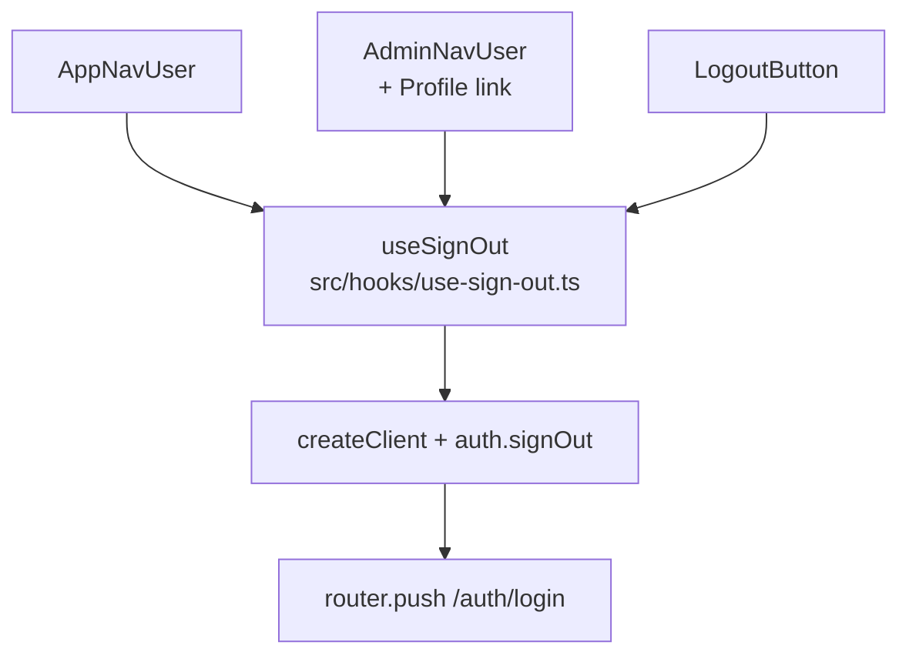

# Phase 6 Epic 7 — Admin Profile Link + Shared Sign-Out Hook

## Goal

Close the admin profile-link gap (Epic 7 spec) and deduplicate the identical inline sign-out logic that currently exists in three places. Admins get a **Profile** item in the sidebar user menu; all sign-out paths flow through one hook.

## Scope boundary

| In scope | Out of scope |
| -------- | ------------ |
| `useSignOut` hook + three consumer refactors | Epic 8 auth-form autofill retrofit |
| Profile link in `AdminNavUser` | Admin nav-user avatar/display-name upgrades |
| Unit tests: hook, admin-nav-user; verify logout-button test | Migrations, routing, proxy, profile page |
| Doc sync + mark epic complete | Extracting shared dropdown menu body |

**Depends on (shipped):** Epic 5 `/profile`, `PROFILE_PATH`, Epic 6 profile redesign.

**Routing unchanged:** [`src/supabase/proxy.ts`](src/supabase/proxy.ts) already allows authenticated admins on `/profile`.

## Architecture after change



Sign-out logic today is **byte-identical** in all three consumers:

```typescript
const supabase = createClient()
await supabase.auth.signOut()
router.push('/auth/login')
```

No shared hook or menu module exists yet.

---

## Step 1 — Create `useSignOut` hook

**New file:** [`src/hooks/use-sign-out.ts`](src/hooks/use-sign-out.ts)

- `'use client'` directive (uses `useRouter`).
- Import `useRouter` from `next/navigation`, `createClient` from `@/supabase/client`.
- Export named `useSignOut` returning an async sign-out handler (return the function directly so consumers can write `const handleSignOut = useSignOut()`).

```typescript
export const useSignOut = () => {
  const router = useRouter()

  return async () => {
    const supabase = createClient()
    await supabase.auth.signOut()
    router.push('/auth/login')
  }
}
```

No error branching — preserve current behavior (fire-and-forget redirect even if `signOut` rejects; same as today).

---

## Step 2 — Repoint three consumers

### [`src/app/(app)/_components/app-nav-user.tsx`](src/app/(app)/_components/app-nav-user.tsx)

- Replace inline `handleSignOut` with `const handleSignOut = useSignOut()`.
- **Remove imports:** `createClient`, `useRouter`.
- **Add import:** `useSignOut` from `@/hooks/use-sign-out`.
- Dropdown body unchanged (Profile → separator → Sign out).

### [`src/app/admin/_components/admin-nav-user.tsx`](src/app/admin/_components/admin-nav-user.tsx)

- Replace inline `handleSignOut` with `const handleSignOut = useSignOut()`.
- **Remove imports:** `createClient`, `useRouter`.
- **Add imports:** `User` from `lucide-react`, `Link` from `next/link`, `PROFILE_PATH` from `@/constants/app-paths`, `useSignOut` from `@/hooks/use-sign-out`.
- **Profile link** (after existing `DropdownMenuSeparator`, before Sign out):

```tsx
<DropdownMenuItem asChild>
  <Link href={PROFILE_PATH}>
    <User />
    Profile
  </Link>
</DropdownMenuItem>
```

- Do **not** change trigger, avatar source, `DropdownMenuLabel` block, or sidebar wrapper.
- **Menu order:** Label → Separator → **Profile** → Sign out.

### [`src/components/logout-button.tsx`](src/components/logout-button.tsx)

- Replace inline `logout` with `const logout = useSignOut()`.
- **Remove imports:** `createClient`, `useRouter`.
- **Add import:** `useSignOut` from `@/hooks/use-sign-out`.

---

## Step 3 — Tests

### New: [`src/hooks/use-sign-out.unit.test.ts`](src/hooks/use-sign-out.unit.test.ts)

Mock at system boundaries (same pattern as [`app-nav-user.unit.test.tsx`](src/app/(app)/_components/app-nav-user.unit.test.tsx)):

- Mock `@/supabase/client` (`createClient` → `auth.signOut`).
- Mock `next/navigation` (`useRouter` → `{ push }`).
- **One focused test:** `renderHook(() => useSignOut())`, invoke returned handler, assert `signOut` called then `push('/auth/login')`.

### New: [`src/app/admin/_components/admin-nav-user.unit.test.tsx`](src/app/admin/_components/admin-nav-user.unit.test.tsx)

Mirror [`app-nav-user.unit.test.tsx`](src/app/(app)/_components/app-nav-user.unit.test.tsx):

- Mock `@/supabase/client`, `next/navigation` (sign-out boundaries).
- Mock `useSidebar` from `@/components/ui/sidebar` → `{ isMobile: false }`.
- **One test:** open sidebar menu button → assert Profile menuitem `href={PROFILE_PATH}` → click Sign out → assert `signOut` + `push('/auth/login')`.

Note: [`admin-nav-user.tsx` is coverage-excluded](vitest.config.ts) — test is regression insurance.

### Existing: [`src/components/logout-button.integration.test.tsx`](src/components/logout-button.integration.test.tsx)

- **No structural change required** — mocks on `@/supabase/client` and `next/navigation` still intercept the hook's dependencies; click → sign-out → redirect assertion remains valid as a wiring smoke test.
- Re-run after refactor; only update if import order or handler naming causes a failure.

### Existing: [`app-nav-user.unit.test.tsx`](src/app/(app)/_components/app-nav-user.unit.test.tsx)

- Should pass unchanged (boundary mocks still apply through the hook).

---

## Step 4 — Quality bar

```bash
pnpm type-check && pnpm lint && pnpm format-check && pnpm test:ci
```

---

## Step 5 — Doc sync

Run `/sync-repo-docs` — update [AGENTS.md](AGENTS.md):

- Admin shell bullet: nav-user offers **profile link + sign-out** (not sign-out only).
- Optional one-liner under hooks / where-things-live for `use-sign-out.ts` if the sync skill surfaces the new shared auth helper.

---

## Step 6 — Mark epic complete

Run **mark-epic-complete** to tag `### Epic 7: Admin Profile Link` with `` `Complete` `` in [CONTEXT.md](CONTEXT.md).

---

## Manual testing checklist

1. **Admin:** sidebar user menu → Profile above Sign out → Profile opens `/profile` in `(app)` shell.
2. **Admin:** Sign out from sidebar → lands on `/auth/login`.
3. **Non-admin:** app header profile link + sign out still work.
4. **Auth button** ([`auth-button.tsx`](src/components/auth-button.tsx) uses `LogoutButton`): logout still redirects to login.

## Risk

**LOW** — Behavior-preserving refactor plus one dropdown item; no schema or auth-boundary changes.
