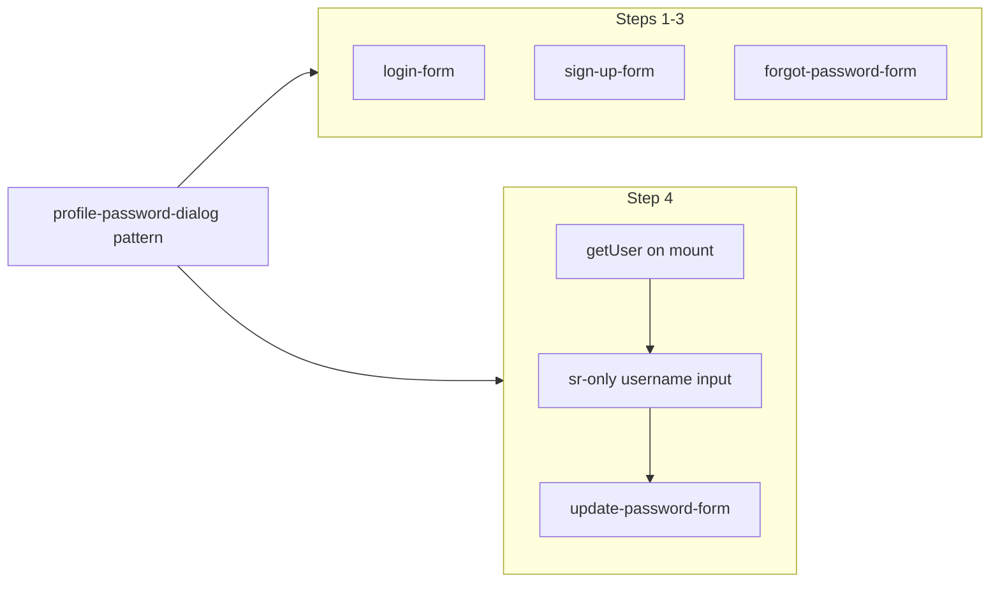

# Phase 6 Epic 8 — Auth Form Password-Manager Affordances

## Goal

Password managers and browsers need correct `autocomplete` signals on credential fields. All four auth forms currently omit them. This epic adds the attributes only — **no** migration off `useState`, no routing/auth-flow changes.

**Governing contract:** [`.cursor/rules/forms.mdc`](.cursor/rules/forms.mdc) § Password fields & autofill

**Reference implementation:** [`src/app/(app)/profile/_components/profile-password-dialog.tsx`](src/app/(app)/profile/_components/profile-password-dialog.tsx) — hidden paired username field + password tokens (lines 111–149)

## Scope boundary

| In scope | Out of scope |
| -------- | ------------ |
| `autocomplete` on four auth form components | Migrating auth forms to react-hook-form + zod |
| Hidden username field on update-password (recovery) | Renaming `handleForgotPassword` in update-password-form (pre-existing misname) |
| Attribute assertions in existing integration tests | New migrations, proxy, AGENTS.md feature bullets |
| Quality bar + mark-epic-complete | Phase 6 archive (`/sync-context-md`) — PM follow-up after last epic |

**Depends on (shipped):** Epic 6 profile password dialog already demonstrates the pattern.

## Attribute map (from CONTEXT + forms.mdc)

| Form | File | Fields |
| ---- | ---- | ------ |
| Login | [`src/components/login-form.tsx`](src/components/login-form.tsx) | email → `username`; password → `current-password` |
| Sign-up | [`src/components/sign-up-form.tsx`](src/components/sign-up-form.tsx) | email → `username`; password + repeat → `new-password` |
| Forgot password | [`src/components/forgot-password-form.tsx`](src/components/forgot-password-form.tsx) | email → `username` |
| Update password | [`src/components/update-password-form.tsx`](src/components/update-password-form.tsx) | new password → `new-password`; hidden email → `username` (from recovery session) |

Use React's `autoComplete` prop (camelCase) on shadcn `Input` — matches profile dialog and renders as `autocomplete` in the DOM.

All four forms already use real `<form>` elements — no structural change needed.



---

## Step 1 — Login form

In [`src/components/login-form.tsx`](src/components/login-form.tsx), add to the two `Input` components:

- Email `Input`: `autoComplete="username"`
- Password `Input`: `autoComplete="current-password"`

No other changes.

---

## Step 2 — Sign-up form

In [`src/components/sign-up-form.tsx`](src/components/sign-up-form.tsx):

- Email `Input`: `autoComplete="username"`
- Password `Input`: `autoComplete="new-password"`
- Repeat password `Input`: `autoComplete="new-password"`

Both password fields use `new-password` so managers offer generate-password and do not autofill the old credential.

---

## Step 3 — Forgot-password form

In [`src/components/forgot-password-form.tsx`](src/components/forgot-password-form.tsx):

- Email `Input`: `autoComplete="username"`

Only the pre-success form branch (the success card has no credential fields).

---

## Step 4 — Update-password form (recovery session + hidden username)

This is the only non-trivial form.

### 4a — Read account email from recovery session

On mount, call `createClient().auth.getUser()` and store `user?.email` in local state (e.g. `accountEmail`). Recovery links establish a session before the user lands on `/auth/update-password`; `getUser` is sufficient and keeps the page shell unchanged.

Use `useEffect` with an empty dependency array; no new dependencies.

### 4b — Hidden paired username field

Copy the pattern from profile password dialog:

```tsx
<input
  type="email"
  name="username"
  autoComplete="username"
  value={accountEmail}
  readOnly
  tabIndex={-1}
  aria-hidden
  className="sr-only"
/>
```

Place inside the `<form>`, before the visible password field. Render even when `accountEmail` is initially empty — it populates once `getUser` resolves.

### 4c — New-password token

On the visible password `Input`: `autoComplete="new-password"`.

**Do not** add `current-password` here — post-recovery is a new-credential flow, not re-auth with the old password.

---

## Step 5 — Tests (extend existing integration tests)

Per [`.cursor/rules/testing.mdc`](.cursor/rules/testing.mdc) minimalism: assert user-facing DOM attributes in existing files — no new test files.

| Test file | Add |
| --------- | --- |
| [`src/components/login-form.integration.test.tsx`](src/components/login-form.integration.test.tsx) | One test (or assertions in happy-path): email has `autocomplete="username"`, password has `autocomplete="current-password"` |
| [`src/components/sign-up-form.integration.test.tsx`](src/components/sign-up-form.integration.test.tsx) | Assert email `username`; both password fields `new-password` |
| [`src/components/forgot-password-form.integration.test.tsx`](src/components/forgot-password-form.integration.test.tsx) | Assert email `username` |
| [`src/components/update-password-form.integration.test.tsx`](src/components/update-password-form.integration.test.tsx) | Mock `getUser` returning `{ user: { email: 'recover@example.com' } }`; assert hidden username input value + `autocomplete`; visible password `new-password` |

Query inputs via `getByLabelText` / `document.querySelector('input[name="username"]')` for the hidden field. Use `.toHaveAttribute('autocomplete', '...')` (DOM lowercases the attribute name).

Update the Supabase client mock in update-password tests to include `auth.getUser`.

---

## Step 6 — Quality bar

```bash
pnpm type-check && pnpm lint && pnpm format-check && pnpm test:ci
```

**Manual checklist (password manager):**

- Login: manager offers saved credential for the site
- Sign-up: manager offers generate-password on password fields
- Forgot password: manager autofills email
- Update password (after recovery link): manager saves new password against the correct account (hidden email pairs the entry)

No `sync-repo-docs` required — behavior aligns with existing `forms.mdc`; no new routes or schema.

---

## Step 7 — Mark epic complete

This is the **last epic in Phase 6**. When implementation and the quality bar pass, run the **mark-epic-complete** skill ([`.cursor/skills/mark-epic-complete/SKILL.md`](.cursor/skills/mark-epic-complete/SKILL.md)) to append `` `Complete` `` to `### Epic 8: Auth Form Password-Manager Affordances` in [CONTEXT.md](CONTEXT.md).

After that, PM may run **`/sync-context-md`** in a follow-up session to archive Phase 6 and advance the roadmap — mark-epic-complete does not ship phases.
