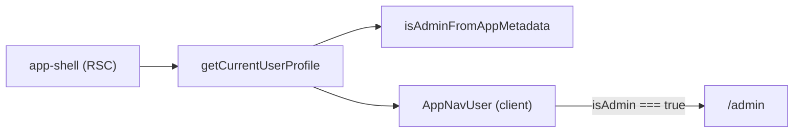

# Phase 6 Epic 9 — App-to-Admin Console Switch

## Goal

Admins using the authenticated app (`/profile`, etc.) need a one-click path back to the admin console — the reverse of Epic 7's `AdminNavUser` → Profile link. Non-admins must see no change.

**Governing contract:** locked admin gate on `app_metadata.role` via [`isAdmin()`](src/utils/admin.ts) / [`isAdminFromAppMetadata()`](src/utils/admin.ts) — not a `profiles` column.

**Mirror reference:** [`src/app/admin/_components/admin-nav-user.tsx`](src/app/admin/_components/admin-nav-user.tsx) — Profile `DropdownMenuItem` + `Link` pattern (lines 76–81).

## Scope boundary

| In scope | Out of scope |
| -------- | ------------ |
| Conditional admin menu item in [`AppNavUser`](src/app/(app)/_components/app-nav-user.tsx) | Rebuilding `AdminNavUser` or admin sidebar nav |
| `isAdmin` boolean from server layout into client dropdown | Client-side role probing (no `useEffect` + `getUser` in the dropdown) |
| Link to [`ADMIN_HOME`](src/constants/admin-paths.ts) (`/admin`) | Landing "Open app" changes, proxy changes, migrations |
| Extend [`app-nav-user.unit.test.tsx`](src/app/(app)/_components/app-nav-user.unit.test.tsx) | New integration test file |
| Quality bar + `/sync-repo-docs` + mark-epic-complete | Phase 6 archive (`/sync-context-md`) — PM follow-up after this epic |

**Security note:** UI visibility is server-derived; [`src/supabase/proxy.ts`](src/supabase/proxy.ts) already blocks non-admins from `/admin/**`. Hiding the link is UX, not the auth boundary.

**Depends on (shipped):** Epic 2 (`ADMIN_HOME`, `/admin` dashboard), Epic 3 (`AppNavUser`, `getCurrentUserProfile`, `app-shell`).



---

## Step 1 — Derive `isAdmin` server-side

In [`src/app/(app)/_lib/get-current-user-profile.ts`](src/app/(app)/_lib/get-current-user-profile.ts):

- Import `isAdminFromAppMetadata` from `@/utils/admin`.
- Add `isAdmin: boolean` to `CurrentUserProfile`.
- Set `isAdmin: isAdminFromAppMetadata(user.app_metadata)` on the happy path (when `user` exists).
- Default `isAdmin: false` on the unauthenticated / error fallback branches (same as empty email today).

This reuses the existing `getUser()` call — no extra round trip.

---

## Step 2 — Pass `isAdmin` through the shell

In [`src/app/(app)/_components/app-shell.tsx`](src/app/(app)/_components/app-shell.tsx):

- Pass `isAdmin={profile.isAdmin}` to both `AppNavUser` instances (`rightSlot` and `mobileNav`).

---

## Step 3 — Conditional admin menu item

In [`src/app/(app)/_components/app-nav-user.tsx`](src/app/(app)/_components/app-nav-user.tsx):

- Add `isAdmin: boolean` to `AppNavUserProps`.
- Import `ADMIN_HOME` from `@/constants/admin-paths`.
- Import `LayoutDashboard` from `lucide-react` (console-home affordance; matches admin dashboard semantics).
- After the Profile `DropdownMenuItem`, conditionally render:

```tsx
{isAdmin ? (
  <DropdownMenuItem asChild>
    <Link href={ADMIN_HOME}>
      <LayoutDashboard />
      Admin console
    </Link>
  </DropdownMenuItem>
) : null}
```

- Keep existing separator + Sign out unchanged.
- **Menu order (admin):** Profile → Admin console → separator → Sign out.
- **Menu order (non-admin):** unchanged (Profile → separator → Sign out).

Label **"Admin console"** matches CONTEXT epic wording and the dashboard page copy ("Console home").

---

## Step 4 — Tests

Extend [`src/app/(app)/_components/app-nav-user.unit.test.tsx`](src/app/(app)/_components/app-nav-user.unit.test.tsx) per [`.cursor/rules/testing.mdc`](.cursor/rules/testing.mdc) minimalism — two focused cases in the existing file:

| Case | `isAdmin` | Assert |
| ---- | --------- | ------ |
| Non-admin (update existing test) | `false` (default) | No menuitem matching `/admin console/i` |
| Admin | `true` | Menuitem "Admin console" has `href` = `ADMIN_HOME` (`/admin`) |

Follow the Epic 7 admin-nav-user test pattern: open menu via account button, query `getByRole('menuitem', ...)`.

No dedicated `getCurrentUserProfile` unit test — the derivation is one line atop an existing server helper; behavior is covered at the component boundary.

---

## Step 5 — Quality bar

```bash
pnpm type-check && pnpm lint && pnpm format-check && pnpm test:ci
```

**Manual checklist:**

- Sign in as **non-admin** → open account menu on `/profile` → Profile + Sign out only; no admin link.
- Sign in as **admin** → same menu → Profile + **Admin console** + Sign out; link lands on `/admin` dashboard.
- Confirm non-admin cannot reach `/admin` via URL (existing proxy redirect to `/profile`) — regression sanity check only.

---

## Step 6 — Doc sync

Run **`/sync-repo-docs`** to update [AGENTS.md](AGENTS.md) — the `AppNavUser` bullet should note the conditional admin-console link (mirror of Epic 7's admin → profile leg). No README or schema changes expected.

---

## Step 7 — Mark epic complete

This is the **last epic in Phase 6**. When implementation, quality bar, and doc sync pass, run the **mark-epic-complete** skill ([`.cursor/skills/mark-epic-complete/SKILL.md`](.cursor/skills/mark-epic-complete/SKILL.md)) to append `` `Complete` `` to `### Epic 9: App-to-Admin Console Switch` in [CONTEXT.md](CONTEXT.md).

After that, PM may run **`/sync-context-md`** in a follow-up session to mark Phase 6 `Shipped` and advance the roadmap — mark-epic-complete does not ship phases.
