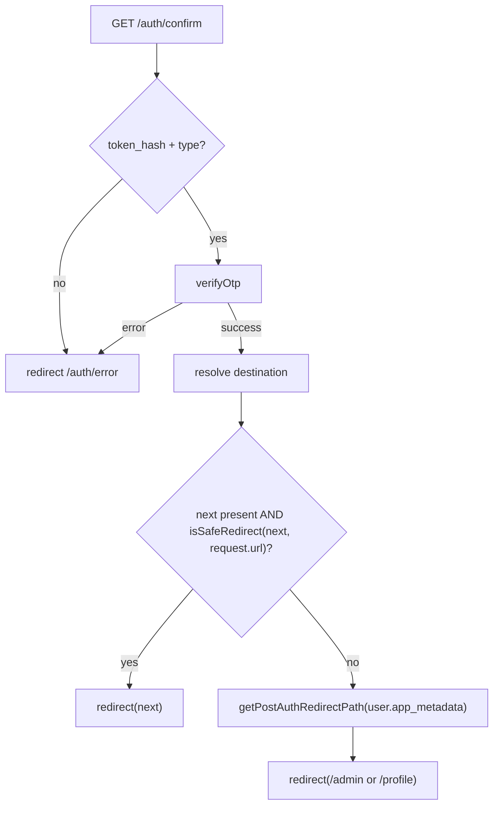

# Phase 7 Epic 1 — Open-redirect fix on /auth/confirm

## Goal

Prevent attackers from crafting email-confirmation links that redirect authenticated users off-site after OTP verification. This is the **Medium** finding in [SECURITY_AUDIT.md](SECURITY_AUDIT.md) (lines 145–148).

## Scope boundary

| In scope | Out of scope |
| -------- | ------------ |
| Same-origin validation on `next` in [`src/app/auth/confirm/route.ts`](src/app/auth/confirm/route.ts) | Other Phase 7 epics (avatar URL scoping, CSP headers, AuthError taxonomy) |
| Shared `isSafeRedirect` util extracted from [`.cursor/rules/security.mdc`](.cursor/rules/security.mdc) pattern | Changing login/password redirect flows (already fixed via `getPostAuthRedirectPath`) |
| Role-aware fallback via existing [`getPostAuthRedirectPath`](src/utils/admin.ts) | AGENTS.md / SECURITY_AUDIT.md checkbox updates (phase-level hygiene) |
| Regression test for off-origin `next` | Broader redirect audit beyond `/auth/confirm` |

**Audit reference:** attacker link `/auth/confirm?token_hash=…&type=email&next=https://attacker.example/phish` currently calls `redirect(next)` unvalidated (line 21).

## Current vs target behavior



| `next` param | Today | After fix |
| ------------ | ----- | --------- |
| `/profile` (same-origin relative) | Honored | Honored |
| `https://evil.com` | **Honored (vuln)** | Rejected → post-auth fallback |
| Missing / empty | Defaults to `/` | Post-auth fallback (`/profile` or `/admin`) |
| `//evil.com` (protocol-relative) | **Honored (vuln)** | Rejected → post-auth fallback |

## Implementation (sequential)

### Step 1 — Extract `isSafeRedirect` util

Create [`src/utils/is-safe-redirect.ts`](src/utils/is-safe-redirect.ts) with the exact logic from `security.mdc` (lines 182–188):

```typescript
export const isSafeRedirect = (url: string, baseUrl: string): boolean => {
  try {
    const parsed = new URL(url, baseUrl)
    return parsed.origin === new URL(baseUrl).origin
  } catch {
    return false
  }
}
```

Add co-located [`src/utils/is-safe-redirect.unit.test.ts`](src/utils/is-safe-redirect.unit.test.ts) — minimal H/I/B:

- **Happy:** `/profile` against `http://localhost/auth/confirm` → `true`
- **Invalid:** `https://evil.com` → `false`
- **Boundary:** malformed string → `false`

No new dependency; pure function.

### Step 2 — Harden the confirm route

Edit [`src/app/auth/confirm/route.ts`](src/app/auth/confirm/route.ts):

1. Remove the `?? '/'` default on `next` — read raw `searchParams.get('next')`.
2. After successful `verifyOtp`, call `supabase.auth.getUser()` to read `app_metadata` for role-aware fallback.
3. Compute destination:

```typescript
const next = searchParams.get('next')
const { data: { user } } = await supabase.auth.getUser()
const fallback = getPostAuthRedirectPath(user?.app_metadata as AppMetadata)
const destination =
  next && isSafeRedirect(next, request.url) ? next : fallback
redirect(destination)
```

Imports: `isSafeRedirect` from `@/utils/is-safe-redirect`, `getPostAuthRedirectPath` + `AppMetadata` from `@/utils/admin`.

**Note:** Error paths (`verifyOtp` failure, missing token) stay unchanged — they redirect to `/auth/error`, not user-controlled URLs.

### Step 3 — Extend integration tests

Update [`src/app/auth/confirm/route.integration.test.ts`](src/app/auth/confirm/route.integration.test.ts):

1. **Keep** existing happy-path test (`next=/profile`).
2. **Add regression test (required by CONTEXT 7.1):** `next=https://evil.com` after successful OTP → assert `redirectMock` called with `APP_HOME` (`/profile`), not the external URL. Mock `getUser` to return a non-admin user.
3. **Add** missing-`next` test → assert fallback to `APP_HOME` (not `/`).
4. **Optional high-value:** admin user + off-origin `next` → fallback to `ADMIN_HOME` (`/admin`).

Extend the Supabase mock to include `auth.getUser` alongside `verifyOtp`.

### Step 4 — Quality gate

```bash
pnpm type-check && pnpm lint && pnpm format-check && pnpm test:ci
```

No migrations, env vars, or package changes.

## Files touched

| File | Change |
| ---- | ------ |
| [`src/utils/is-safe-redirect.ts`](src/utils/is-safe-redirect.ts) | **New** — shared validator |
| [`src/utils/is-safe-redirect.unit.test.ts`](src/utils/is-safe-redirect.unit.test.ts) | **New** — unit tests |
| [`src/app/auth/confirm/route.ts`](src/app/auth/confirm/route.ts) | Validate `next`, role-aware fallback |
| [`src/app/auth/confirm/route.integration.test.ts`](src/app/auth/confirm/route.integration.test.ts) | Off-origin regression + missing-`next` cases |

## Manual test checklist

1. Trigger a real email-confirmation flow with a safe `next=/profile` — lands on profile after confirm.
2. Manually craft `/auth/confirm?token_hash=…&type=email&next=https://example.com` (valid token) — should land on `/profile` (or `/admin` if admin), not example.com.
3. Confirm without `next` param — lands on post-auth path, not `/` or public landing.

## Risk

**LOW** — Narrow, server-side guard on one route handler. Existing safe relative redirects unchanged. Fallback reuses the same path logic as login/password flows.

## Close-out

When implementation is fully finished and quality checks pass, run the **mark-epic-complete** skill (`.cursor/skills/mark-epic-complete/SKILL.md`) to tag `### Epic 1 — Open-redirect fix on /auth/confirm` with `` `Complete` `` in [CONTEXT.md](CONTEXT.md).
