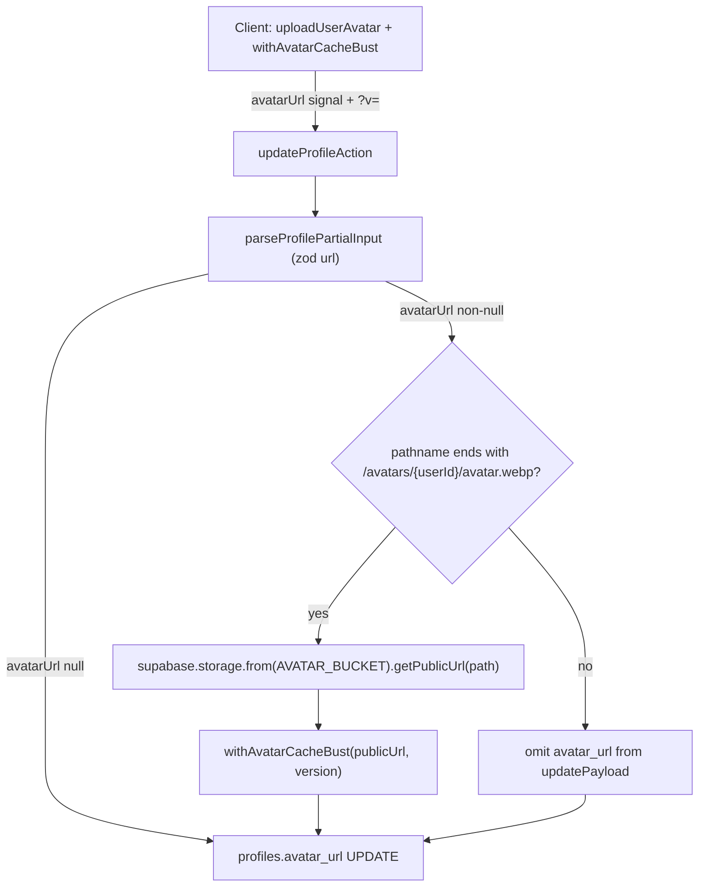

# Phase 7 Epic 2 — Server-side avatar URL scoping

## Goal

Prevent signed-in users from storing arbitrary external URLs (or another user's public avatar URL) in `profiles.avatar_url` by bypassing the upload UI. This is the **Low** finding in [SECURITY_AUDIT.md](SECURITY_AUDIT.md) (lines 152–155).

## Scope boundary

| In scope | Out of scope |
| -------- | ------------ |
| Ownership pathname check + server-side URL build in [`src/app/(app)/profile/actions.ts`](src/app/(app)/profile/actions.ts) via Supabase `getPublicUrl` | Epic 3 (CSP headers), Epic 4 (AuthError taxonomy) |
| Shared helpers in `src/utils/` (`extractAvatarCacheBust`, `withAvatarCacheBust`, `isOwnedAvatarStorageUrl`) | Hand-rolled `{base}/storage/v1/object/public/…` URL strings |
| Preserve `?v=` cache-bust behavior on owned URLs | Avatar removal UI (not shipped today) |
| Unit tests for helpers + action regression | AGENTS.md / SECURITY_AUDIT.md checkbox updates |
| Minimal import change in [`avatar-storage.ts`](src/utils/avatar-storage.ts) | Changing `getAvatarPublicUrl`'s existing `getPublicUrl`-based path |

**Audit reference:** today `updateProfileAction` trusts any Zod-valid HTTP(S) URL:

```87:89:src/app/(app)/profile/actions.ts
  if (parsed.data.avatarUrl !== undefined) {
    updatePayload.avatar_url = parsed.data.avatarUrl
  }
```

A crafted call with `avatarUrl: 'https://evil.com/track.png'` is stored and rendered in [`AppNavUser`](src/app/(app)/_components/app-nav-user.tsx).

## Current vs target behavior



| Client `avatarUrl` input | Today | After fix |
| ------------------------ | ----- | --------- |
| Canonical owned URL after upload | Stored as-is | Ownership check passes → rebuilt via `getPublicUrl` + same `?v=` |
| External URL (`https://evil.com/pixel`) | **Stored (vuln)** | Ownership fails → **no `avatar_url` write** (silent no-op for avatar) |
| Another user's public avatar URL | **Stored (vuln)** | Ownership fails → **no `avatar_url` write** |
| Unparseable URL (passes zod but fails `new URL`) | N/A | Ownership fails → **no `avatar_url` write** |
| `null` (clear) | Stored as `null` | Unchanged — `avatar_url: null` written |

**Approach (per CONTEXT 7.2):** two-layer guard on non-null `avatarUrl`:

1. **Ownership check** — client URL pathname must end with `/${AVATAR_BUCKET}/${buildAvatarStoragePath(user.id)}` (query string / `?v=` ignored).
2. **Server rebuild** — only when ownership passes: build via `getPublicUrl` + `withAvatarCacheBust`; never persist the client URL string.

Rejected URLs do **not** throw — `avatar_url` is simply omitted from `updatePayload`.

**URL format source of truth:** `supabase.storage.from(AVATAR_BUCKET).getPublicUrl(buildAvatarStoragePath(user.id))` — same SDK call pattern as [`getAvatarPublicUrl`](src/utils/avatar-storage.ts) on the client. No hand-rolled path strings.

## Implementation (sequential)

### Step 1 — Shared cache-bust + ownership helpers

Create [`src/utils/avatar-cache-bust.ts`](src/utils/avatar-cache-bust.ts) (server-safe, no `'use client'`):

- **`extractAvatarCacheBust(url: string): number | null`** — parse `?v=` from a URL string; return finite number or `null`.
- **`withAvatarCacheBust(publicUrl: string, version?: number): string`** — append `?v={version ?? Date.now()}`.
- **`isOwnedAvatarStorageUrl(url: string, userId: string): boolean`** — parse `url` with `new URL()`; return `true` when `pathname.endsWith(\`/${AVATAR_BUCKET}/${buildAvatarStoragePath(userId)}\`)`. Return `false` on parse failure. Uses [`AVATAR_BUCKET`](src/constants/storage-paths.ts) + [`buildAvatarStoragePath`](src/constants/storage-paths.ts).

Move [`withAvatarCacheBust`](src/utils/avatar-storage.ts) implementation here. Update [`avatar-storage.ts`](src/utils/avatar-storage.ts) to **import** `withAvatarCacheBust` from the shared util — do not change `getAvatarPublicUrl`'s existing `getPublicUrl`-based path beyond that import.

Add co-located [`src/utils/avatar-cache-bust.unit.test.ts`](src/utils/avatar-cache-bust.unit.test.ts):

- **Happy:** `withAvatarCacheBust('https://example.test/avatar.webp', 123)` → `…?v=123`
- **Happy:** `isOwnedAvatarStorageUrl` on Supabase-format owned path (with/without `?v=`) → `true`
- **Invalid:** `extractAvatarCacheBust` on malformed URL → `null`; `isOwnedAvatarStorageUrl` on external host → `false`
- **Boundary:** another user's path (`…/avatars/other-user/avatar.webp`) → `false`

**Do NOT** create `src/utils/avatar-public-url.ts` or any helper that hardcodes `{base}/storage/v1/object/public/{bucket}/{path}`.

### Step 2 — Harden `updateProfileAction`

Edit [`src/app/(app)/profile/actions.ts`](src/app/(app)/profile/actions.ts).

`updateProfileAction` already creates a Supabase server client via [`createClient`](src/supabase/server.ts) — **reuse it**; do not add a new client factory or dependency.

Import `AVATAR_BUCKET` + `buildAvatarStoragePath` from [`storage-paths.ts`](src/constants/storage-paths.ts) and helpers from `@/utils/avatar-cache-bust`.

When `parsed.data.avatarUrl !== undefined`:

```typescript
if (parsed.data.avatarUrl === null) {
  updatePayload.avatar_url = null
} else if (isOwnedAvatarStorageUrl(parsed.data.avatarUrl, user.id)) {
  const { data } = supabase.storage
    .from(AVATAR_BUCKET)
    .getPublicUrl(buildAvatarStoragePath(user.id))

  const version = extractAvatarCacheBust(parsed.data.avatarUrl) ?? Date.now()
  updatePayload.avatar_url = withAvatarCacheBust(data.publicUrl, version)
}
// else: ownership failed — omit avatar_url (no throw, no write)
```

- Do **not** write `parsed.data.avatarUrl` directly to the database.
- Do **not** rebuild into the user's path when ownership fails — simply skip the avatar field.
- Zod URL validation in [`profile-form-schema.ts`](src/app/(app)/profile/_lib/profile-form-schema.ts) stays — the client still sends a valid URL after upload; no schema change required.
- No client changes required in [`profile-settings-form.tsx`](src/app/(app)/profile/_components/profile-settings-form.tsx) — upload → cache-bust → persist flow unchanged.

**Note:** if a malicious call sends only a rejected `avatarUrl` and no other fields, `updatePayload` may be empty after processing. Let the existing DB update proceed as a no-op (or match current empty-payload behavior) — do not throw or surface an error for the rejected avatar alone.

### Step 3 — Action regression tests

Update [`src/app/(app)/profile/actions.unit.test.ts`](src/app/(app)/profile/actions.unit.test.ts):

1. Extend the existing `@/supabase/server` mock to include `storage.from().getPublicUrl()` returning a realistic Supabase-format URL, e.g. `https://example.supabase.co/storage/v1/object/public/avatars/user-1/avatar.webp`.
2. **Revise** existing "should update avatar URL only" — expect `mockUpdate` called with the `getPublicUrl`-format URL ending in `/avatars/user-1/avatar.webp?v=…`, not the raw client string.
3. **Revise external-URL regression (required):** `avatarUrl: 'https://evil.com/track.png'` → `mockUpdate` is called **without** an `avatar_url` key (no avatar write), **not** rebuilt into the user's path.
4. **Add:** `avatarUrl` pointing at another user's path (`…/avatars/other-user/avatar.webp`) → `mockUpdate` called **without** `avatar_url`.
5. **Keep:** owned canonical URL with `?v=123` → persisted URL preserves `?v=123`.
6. **Keep:** `avatarUrl: null` → `avatar_url` written as `null`.
7. **Keep** existing invalid-URL / unauthenticated / partial-field tests.

### Step 4 — Quality gate

```bash
pnpm type-check && pnpm lint && pnpm format-check && pnpm test:ci
```

No migrations, env var additions, or package changes.

## Files touched

| File | Change |
| ---- | ------ |
| [`src/utils/avatar-cache-bust.ts`](src/utils/avatar-cache-bust.ts) | **New** — `extractAvatarCacheBust`, `withAvatarCacheBust`, `isOwnedAvatarStorageUrl` |
| [`src/utils/avatar-cache-bust.unit.test.ts`](src/utils/avatar-cache-bust.unit.test.ts) | **New** — unit tests for helpers |
| [`src/utils/avatar-storage.ts`](src/utils/avatar-storage.ts) | Import `withAvatarCacheBust` from shared util (no other path changes) |
| [`src/app/(app)/profile/actions.ts`](src/app/(app)/profile/actions.ts) | Ownership check + `getPublicUrl` + cache-bust; omit on mismatch |
| [`src/app/(app)/profile/actions.unit.test.ts`](src/app/(app)/profile/actions.unit.test.ts) | Mock `storage.getPublicUrl`; revised external/other-user regressions |

## Manual test checklist

1. Upload a new avatar on `/profile` — image appears in header and profile field; URL matches Supabase `getPublicUrl` format + `{yourUserId}/avatar.webp?v=…`.
2. (DevTools) Call `updateProfileAction` with an external `avatarUrl` — existing avatar unchanged; no external host stored.
3. (DevTools) Call with another user's avatar URL — existing avatar unchanged.
4. Confirm existing blur-save for display name / bio still works (unaffected fields).

## Risk

**LOW** — Narrow server-action guard. Happy-path upload UX unchanged. Rejected avatar URLs are silently ignored rather than rewritten, which avoids granting a "free" avatar update signal to attackers who haven't uploaded to their own storage path.

## Close-out

When implementation is fully finished and quality checks pass, run the **mark-epic-complete** skill ([`.cursor/skills/mark-epic-complete/SKILL.md`](.cursor/skills/mark-epic-complete/SKILL.md)) to tag `### Epic 2 — Server-side avatar URL scoping` with `` `Complete` `` in [CONTEXT.md](CONTEXT.md).
