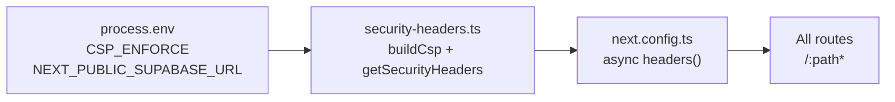

# Phase 7 Epic 3 — Security headers

## Goal

Close audit finding **"No security headers in `next.config.ts`"** ([SECURITY_AUDIT.md](SECURITY_AUDIT.md) lines 163, 194) by shipping a template-default security-headers layer. CSP starts in **report-only** mode so spinoff products can observe violations before enforcing; flip to enforcing via a single env flag.

## Scope boundary

| In scope | Out of scope |
| -------- | ------------ |
| New [`src/utils/security-headers.ts`](src/utils/security-headers.ts) + unit tests | Epic 4 (AuthError taxonomy) |
| Wire into [`next.config.ts`](next.config.ts) via `headers()` | `security.mdc` rule rewrite |
| Env flag + `.env.example` entry | Dev/prod branching inside the module |
| `// debt:` marker for tech-debt harvester | SECURITY_AUDIT.md checkbox updates |
| One-line note in [AGENTS.md](AGENTS.md) | Vercel dashboard / platform-level hardening |
| | Nonce-based strict CSP (future product tightening — see debt marker) |

**Audit reference:** app ships with zero CSP, `X-Frame-Options`, or HSTS at the Next config layer today ([`next.config.ts`](next.config.ts) is only `{ cacheComponents: true }`).

## Architecture



**Module contract** — export a pure builder consumed by Next config:

- `getSecurityHeaders(): { key: string; value: string }[]` — flat array for the `headers` config entry
- Internal `buildCspDirectives()` — assembles directive string from known app surfaces (no dev/prod switches)

**CSP enforcement switch** (logic lives entirely in the module):

| `CSP_ENFORCE` env | Header emitted |
| ----------------- | -------------- |
| unset / not `"true"` | `Content-Security-Policy-Report-Only` |
| `"true"` | `Content-Security-Policy` |

No `NODE_ENV` checks — same behavior in dev and prod; only the env flag toggles report-only vs enforcing.

**Important:** Setting `CSP_ENFORCE=true` only changes the header name to enforcing mode. The shipped `script-src 'self'` directive will **block** Next.js inline bootstrap/streaming scripts under enforcement. Full enforcing mode requires a per-request nonce strategy (middleware-generated nonce threaded into both CSP `script-src` and Next.js inline scripts) — documented in the debt marker, not implemented in this epic.

**`// debt:` marker** (required by epic — first adoption in `src/`):

```typescript
// debt: template-default CSP ships report-only. Enforcing it (CSP_ENFORCE=true) requires nonce-based script handling — a per-request nonce generated in middleware and threaded into both the CSP script-src and Next.js's inline scripts. `script-src 'self'` alone will block Next.js inline bootstrap/streaming scripts under enforcement. Tighten directives AND add the nonce strategy per product surface before setting CSP_ENFORCE=true.
```

## CSP directives — tuned to this codebase

Build directives from actual external surfaces (read [`src/app/layout.tsx`](src/app/layout.tsx), Supabase client usage, avatar pipeline):

| Directive | Allowlist rationale |
| --------- | ------------------- |
| `default-src` | `'self'` |
| `script-src` | `'self'` — Next.js bundles; `@vercel/analytics` loads from `https://va.vercel-scripts.com` (add explicitly) |
| `style-src` | `'self' 'unsafe-inline'` — Tailwind / Radix runtime styles |
| `img-src` | `'self' data: blob:` + Supabase project origin parsed from `NEXT_PUBLIC_SUPABASE_URL` (avatars via `getPublicUrl`) |
| `font-src` | `'self'` — `next/font/google` self-hosts Inter + JetBrains Mono |
| `connect-src` | `'self'` + Supabase REST/auth origin + `wss://*.supabase.co` (realtime-safe) + `https://va.vercel-scripts.com` |
| `frame-ancestors` | `'none'` |
| `object-src` | `'none'` |
| `base-uri` | `'self'` |
| `form-action` | `'self'` |

Parse Supabase origin once from env; if `NEXT_PUBLIC_SUPABASE_URL` is missing at build time, omit the Supabase entries (headers still ship — template clones always have the var set).

**Non-CSP headers** (always emitted, not gated by report-only):

- `X-Frame-Options: DENY` (redundant with `frame-ancestors 'none'` — belt-and-suspenders, audit explicitly asked for it)
- `Strict-Transport-Security: max-age=31536000; includeSubDomains` — meaningful on HTTPS (Vercel prod); harmless on localhost

## Implementation steps

### 1. Create `src/utils/security-headers.ts`

- Export `getSecurityHeaders()` returning the header array
- Export `buildCspDirectives()` (or equivalent) for testability
- Read `process.env.CSP_ENFORCE === 'true'` for header name selection
- Read `process.env.NEXT_PUBLIC_SUPABASE_URL` to derive `https://<project>.supabase.co` origin for `img-src` / `connect-src`
- Place `// debt:` comment at top of file (exact text in **debt marker** section above)

### 2. Wire `next.config.ts`

```typescript
import { getSecurityHeaders } from './src/utils/security-headers'

const nextConfig: NextConfig = {
  cacheComponents: true,
  async headers() {
    return [{ source: '/:path*', headers: getSecurityHeaders() }]
  },
}
```

Import path uses relative `./src/...` (Next config sits at repo root; `@/` alias may not resolve here).

### 3. Env documentation

Add to [`.env.example`](.env.example):

```
# Set to "true" to emit enforcing Content-Security-Policy instead of report-only (default: report-only)
# CSP_ENFORCE=true
```

### 4. Unit tests — `src/utils/security-headers.unit.test.ts`

Minimal H/I/B per [testing.mdc](.cursor/rules/testing.mdc):

| Case | Assert |
| ---- | ------ |
| **Happy** — default env | CSP header key is `Content-Security-Policy-Report-Only`; value includes `default-src 'self'`; `X-Frame-Options` and `Strict-Transport-Security` present |
| **Invalid/boundary** — `CSP_ENFORCE=true` | Header key switches to `Content-Security-Policy` |
| **Boundary** — Supabase URL set | `img-src` / `connect-src` include parsed project origin |

Use `vi.stubEnv` / restore in `beforeEach`/`afterEach`; test the pure builder, not Next.js internals.

### 5. AGENTS.md one-liner

Add under **Implemented now** (or **Where things live** table): security headers live in `src/utils/security-headers.ts`, wired via `next.config.ts`; CSP is report-only by default, and flipping to enforcing (`CSP_ENFORCE=true`) requires nonce-based script handling — not just directive tightening — per the `// debt:` marker in that file.

Run `/sync-repo-docs` or apply the minimal edit directly — epic asks for one line, not a full doc pass.

### 6. Quality gate

```bash
pnpm type-check && pnpm lint && pnpm format-check && pnpm test:ci
```

No migrations, no new dependencies.

## Files touched

| File | Change |
| ---- | ------ |
| [`src/utils/security-headers.ts`](src/utils/security-headers.ts) | **New** — header builder + debt marker |
| [`src/utils/security-headers.unit.test.ts`](src/utils/security-headers.unit.test.ts) | **New** — unit tests |
| [`next.config.ts`](next.config.ts) | Import module; add `headers()` |
| [`.env.example`](.env.example) | Document `CSP_ENFORCE` |
| [`AGENTS.md`](AGENTS.md) | One-line convention note |

## Manual test checklist

1. `pnpm dev` — app loads normally (no CSP console errors blocking render).
2. DevTools → Network → any document response → confirm `Content-Security-Policy-Report-Only` header present with expected directives.
3. Set `CSP_ENFORCE=true` in `.env.local`, restart dev server → header name becomes `Content-Security-Policy`. **Note:** this step only verifies the header name switches; it does **not** validate that the app functions under enforcement. Enforcing mode is not expected to render correctly until nonce-based script handling is added (see debt marker).
4. `pnpm build && pnpm start` — smoke-test `/`, `/auth/login`, `/profile` (avatar images load from Supabase origin).
5. Optional: DevTools Console reports CSP violations in report-only mode without blocking — confirms observability path works.

## Risk

**LOW–MEDIUM** — Report-only default means zero user-facing breakage on merge. Risk concentrates on **enforcing mode**: `CSP_ENFORCE=true` with the shipped `script-src 'self'` will block Next.js inline scripts — enforcing is an explicit opt-in and is **not** production-ready without the nonce strategy described in the debt marker. The report-only default + debt marker mitigate accidental breakage for template spinoffs.

## Close-out

When implementation is fully finished and quality checks pass, run the **mark-epic-complete** skill ([`.cursor/skills/mark-epic-complete/SKILL.md`](.cursor/skills/mark-epic-complete/SKILL.md)) to tag `### Epic 3 — Security headers` with `` `Complete` `` in [CONTEXT.md](CONTEXT.md).
