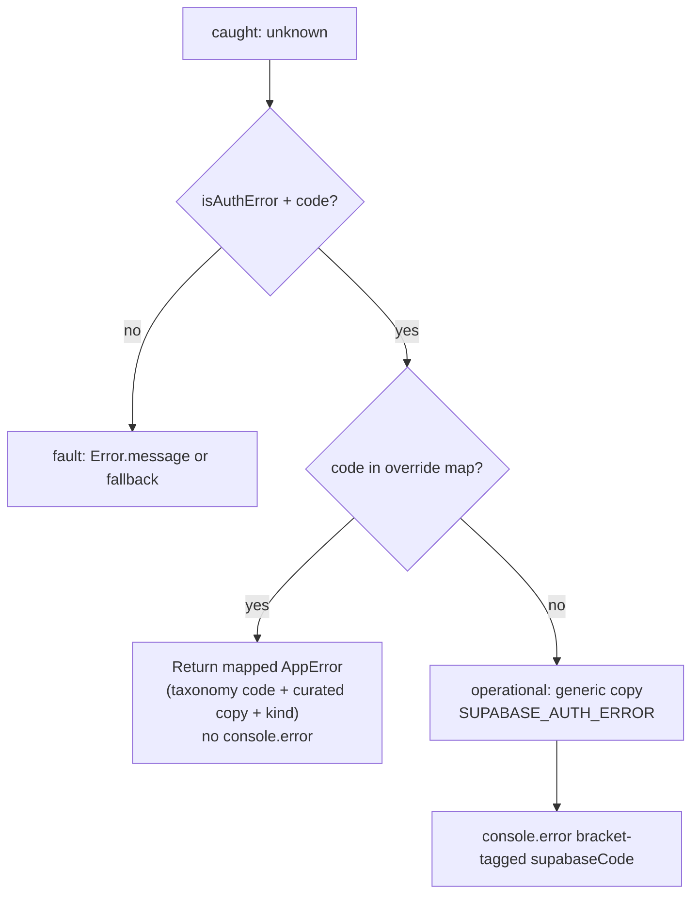

# Phase 7 Epic 4 — AuthError taxonomy mapping

## Goal

Close the Phase 5 deferral and complete Phase 7 by sanitizing Supabase auth errors before they reach users. Today [`extractAuthFormError`](src/utils/extract-auth-form-error.ts) passes through Supabase's raw `message` and uses the raw Supabase `code` as the envelope `code`. After this epic, users see only curated copy; developers see bracket-tagged `supabaseCode` in the console **only when an unmapped code hits the fallback path** (expected operational errors like bad credentials stay silent).

## Scope boundary

| In scope | Out of scope |
| -------- | ------------ |
| Rework [`src/utils/extract-auth-form-error.ts`](src/utils/extract-auth-form-error.ts) | Other Phase 7 epics (already `Complete`) |
| Update co-located unit tests | Changing auth form component logic (forms already call the shared util) |
| Fix [`login-form.integration.test.tsx`](src/components/login-form.integration.test.tsx) assertion for new copy | Migrating auth forms to react-hook-form |
| Canonize fallback-first convention in [`.cursor/rules/error-handling.mdc`](.cursor/rules/error-handling.mdc) | Duplicating the override table into the rule file |
| Quality gate (`pnpm type-check && pnpm lint && pnpm format-check && pnpm test:ci`) | AGENTS.md update (not required by CONTEXT; optional via `/sync-repo-docs` at phase end) |

**Consumers (no edits expected):** [`login-form.tsx`](src/components/login-form.tsx), [`sign-up-form.tsx`](src/components/sign-up-form.tsx), [`forgot-password-form.tsx`](src/components/forgot-password-form.tsx), [`update-password-form.tsx`](src/components/update-password-form.tsx), and [`profile-password-dialog.tsx`](src/app/(app)/profile/_components/profile-password-dialog.tsx) — all already call `extractAuthFormError(caught)` in their catch blocks.

## Current vs target behavior



| Scenario | Today | After |
| -------- | ----- | ----- |
| `invalid_credentials` | Raw message `"Invalid login credentials"`, `code: 'invalid_credentials'` | `"Invalid email or password."`, `code: 'SUPABASE_AUTH_ERROR'`, `kind: 'operational'` — **no log** |
| `email_not_confirmed` | Raw Supabase message | Same copy as `invalid_credentials` (option B — no user-enumeration) — **no log** |
| `user_already_exists` / `email_exists` | Raw Supabase message | Generic fallback (option B — left to fallback) — **logs** `supabaseCode` |
| Unmapped `AuthError` (e.g. `otp_expired`) | Raw Supabase message | Generic fallback + log `supabaseCode` |
| `unexpected_failure` | Raw message, `kind: 'operational'` | Fault copy, `code: 'INTERNAL_ERROR'`, `kind: 'fault'` → `ErrorPanel` — **no log** |
| Plain `Error` (non-auth) | `kind: 'fault'`, raw message | Unchanged — fault path for genuine throws |

**Generic fallback copy (CONTEXT-locked):**
> We couldn't complete that request. Please try again, or contact support if the problem continues.

## Implementation (sequential)

### Step 1 — Rework `extractAuthFormError`

Refactor [`src/utils/extract-auth-form-error.ts`](src/utils/extract-auth-form-error.ts):

1. Add module-level constants:
   - `AUTH_ERROR_FALLBACK_MESSAGE` — generic copy above
   - `AUTH_ERROR_OVERRIDES` — `Record<string, AppError>` keyed by **Supabase** `caught.code`

2. Explicit override set (taxonomy `code` on `AppError`, not Supabase code):

| Supabase `code` | `AppError.code` | `kind` | User copy |
| --------------- | --------------- | ------ | --------- |
| `invalid_credentials` | `SUPABASE_AUTH_ERROR` | operational | Invalid email or password. |
| `email_not_confirmed` | `SUPABASE_AUTH_ERROR` | operational | Invalid email or password. |
| `weak_password` | `VALIDATION_ERROR` | operational | Your password doesn't meet the strength requirements. Please choose a stronger one. |
| `same_password` | `VALIDATION_ERROR` | operational | Your new password must be different from your current one. |
| `over_email_send_rate_limit` | `RATE_LIMITED` | operational | Too many emails sent. Please wait a few minutes and try again. |
| `over_request_rate_limit` | `RATE_LIMITED` | operational | Too many attempts. Please wait a few minutes before trying again. |
| `session_expired` | `SESSION_EXPIRED` | operational | Your session has expired. Please sign in again. |
| `email_address_invalid` | `VALIDATION_ERROR` | operational | Please enter a valid email address. |
| `unexpected_failure` | `INTERNAL_ERROR` | fault | Something went wrong on our end. Please try again, or contact support if it continues. |

3. Handler logic:
   - `isAuthError(caught) && typeof caught.code === 'string'` → look up override; on hit return a **copy** of the mapped `AppError` (avoid shared object mutation) — **do not log**
   - On miss (fallback path only) → `console.error('[extract-auth-form-error] Supabase auth error', { supabaseCode: caught.code })` then return fallback `{ message: AUTH_ERROR_FALLBACK_MESSAGE, code: 'SUPABASE_AUTH_ERROR', kind: 'operational' }`
   - Non-auth: preserve existing fault behavior (`Error.message` or `'An error occurred'`)

Keep the file under ~80 lines — a flat override map, no factory abstractions.

### Step 2 — Unit tests

Rewrite [`src/utils/extract-auth-form-error.unit.test.ts`](src/utils/extract-auth-form-error.unit.test.ts) per `testing.mdc` H/I/B:

- **Happy:** 2–3 representative overrides — e.g. `invalid_credentials` (credentials copy + `SUPABASE_AUTH_ERROR`; assert `console.error` was **not** called), `weak_password` (`VALIDATION_ERROR`), `unexpected_failure` (`INTERNAL_ERROR` + `kind: 'fault'`)
- **Invalid:** unmapped `AuthApiError` (`otp_expired`) → generic fallback, `SUPABASE_AUTH_ERROR`, operational; assert message does **not** contain raw Supabase text; `vi.spyOn(console, 'error')` asserts bracket-tagged log with `supabaseCode` — **fallback path only**
- **Boundary:** `email_not_confirmed` matches `invalid_credentials` copy; `user_already_exists` hits fallback **and logs**; non-auth `Error` → fault with raw message; `null` → fault fallback

Do not add one test per override row — the map is data; 5–8 total tests is sufficient.

### Step 3 — Integration test fix

Update [`src/components/login-form.integration.test.tsx`](src/components/login-form.integration.test.tsx) line 97–99:

- Change assertion from `/invalid login credentials/i` to `/invalid email or password/i`
- Keep asserting no copy button (operational → `InlineError`)

No new integration tests required for other forms unless a test currently asserts raw Supabase copy (grep shows only login-form does).

### Step 4 — Update `error-handling.mdc`

In [`.cursor/rules/error-handling.mdc`](.cursor/rules/error-handling.mdc):

1. **Remove** the deferred line: "Per-code taxonomy mapping and copy sanitization for raw Supabase codes deferred to Phase 7 Security Audit." (line 166)
2. **Add** a short "Auth form errors (fallback-first)" subsection under Supabase Error Handling:
   - Convention: unmapped Supabase `AuthError` codes → generic operational copy + `SUPABASE_AUTH_ERROR`; never show Supabase raw `message` to users
   - Enumerated overrides live in [`src/utils/extract-auth-form-error.ts`](src/utils/extract-auth-form-error.ts) — **do not duplicate the table here**
   - How to add a code: add an entry to `AUTH_ERROR_OVERRIDES`, add a unit test if the mapping is non-obvious, run `pnpm test:ci`
   - Log `supabaseCode` via `[extract-auth-form-error]` tag **on the fallback path only** (unmapped codes) per `logging.mdc`

### Step 5 — Quality gate

```bash
pnpm type-check && pnpm lint && pnpm format-check && pnpm test:ci
```

### Step 6 — Mark epic complete

Run the **mark-epic-complete** skill to append `` `Complete` `` to `### Epic 4 — AuthError taxonomy mapping` in [`CONTEXT.md`](CONTEXT.md) and update the file's **Last updated** date. This is the only CONTEXT.md edit for this epic.

## Manual smoke checklist

- Login with wrong password → "Invalid email or password." (inline, no copy button)
- Sign up with existing email → generic fallback (not "User already registered")
- Forgot password rate-limited → rate-limit copy
- Update password with weak password → strength-requirements copy
- Force a non-auth throw (dev: mock a plain `Error`) → `ErrorPanel` with copy button still works

## Risk

**LOW** — Single shared util change; auth forms unchanged. Main regression surface is test assertions that matched old raw Supabase strings.
