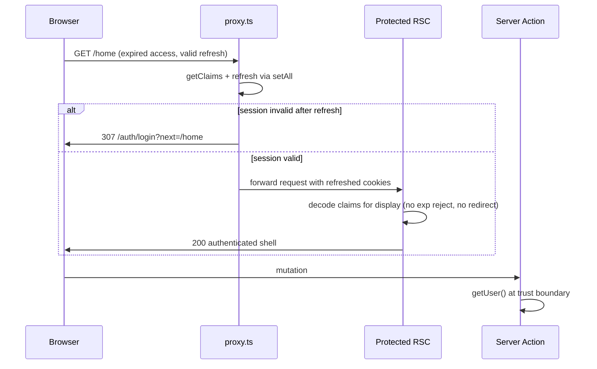

# Proxy as sole session authority

## Context

Today [`src/supabase/proxy.ts`](src/supabase/proxy.ts) refreshes sessions and redirects unauthenticated users on protected routes, but [`requireAuthClaims`](src/supabase/require-auth.ts) independently calls `getClaims(accessToken)`, which validates `exp` and throws `JWT has expired` — causing login redirects during [`AppShell`](src/app/(app)/_components/app-shell.tsx) render even when the proxy already refreshed the session on the same request ([ADR-0003](docs/adr/ADR-0003-no-refresh-in-rsc-auth-reads.md) explicitly accepted this trade-off).

The approved design inverts that trade-off: **proxy gates and refreshes; RSC reads are display-only.**

---

## 1. Claims for display

### Viable options

| Option | Mechanism | Pros | Cons |
|--------|-----------|------|------|
| **A — Cookie payload decode (recommended)** | [`readAccessTokenFromCookies`](src/supabase/read-auth-cookie.ts) → base64url-decode JWT payload → existing [`parseAuthenticatedClaims`](src/supabase/require-auth.ts) / [`parseJwtClaims`](src/utils/admin.ts) for shape only | Minimal diff; reuses cookie chunking; no Next header plumbing; easy to unit-test | Does **not** re-verify JWT signature on the RSC path — acceptable only because proxy already validated on the same request |
| **B — Proxy injects request headers** | After proxy `getClaims`, serialize claims into internal request headers; RSC reads via `headers()` | Claims on RSC path are exactly what proxy validated | More moving parts (serialize/parse, header forwarding, spoofing hygiene); harder tests; still need cookie for Supabase server client DB calls |
| **C — Keep `getClaims(accessToken)` on RSC** | Status quo | Signature + exp validated | **Rejected** — this is the bug; throws on expired access token even post-proxy refresh |

### Recommendation: **Option A**

Add a small display-only decoder (either extend [`read-auth-cookie.ts`](src/supabase/read-auth-cookie.ts) or a thin `src/utils/decode-access-token-claims.ts`) that:

- Reads the access token string from cookies (no Supabase client call).
- Decodes the JWT payload segment only (no `exp` check, no signature verify).
- Runs through `parseAuthenticatedClaims` for typed shape validation.

Replace gated reads with a new export, e.g. **`getDisplayAuthClaims()`**:

- **Protected-route semantics:** returns `AuthenticatedClaims` for UI (email, sub, admin role).
- **Does not redirect** and does not call `getClaims()`.
- **Missing/malformed token on a protected route:** treat as an invariant violation (proxy should have redirected). Throw a fault-style error (surfaces via route error boundary) rather than `redirect(LOGIN_PATH)` — avoids a second auth authority.

**`hasServerAuthSession()`** (public marketing only — [`LandingAuthSlot`](src/app/(marketing)/_components/landing-auth-slot.tsx)):

- Switch to the same display decode path (boolean: `sub` present and parseable).
- Still **no redirect**, no refresh.
- After proxy runs on public routes, cookies are already refreshed via bare `getClaims()` in proxy; display decode avoids exp throw if cookie sync is briefly stale.

### File disposition

| File | Action |
|------|--------|
| [`read-auth-cookie.ts`](src/supabase/read-auth-cookie.ts) | **Keep** — still the canonical cookie reader; optionally add `readDisplayAuthClaimsFromCookies()` |
| [`require-auth.ts`](src/supabase/require-auth.ts) | **Change heavily** — rename/replace `requireAuthClaims` → `getDisplayAuthClaims`; remove `clearSessionAndRedirect`; keep `parseAuthenticatedClaims`, `isSessionAuthFailure` (still useful for server actions / tests) |
| [`server.ts`](src/supabase/server.ts) | **Comment update** — document display reads vs `getUser()` mutation boundary |

### Call-site updates

- [`get-current-user-profile.ts`](src/app/(app)/_lib/get-current-user-profile.ts) — drop `createClient` param from claims read; call `getDisplayAuthClaims()`.
- [`admin-auth-gate.tsx`](src/app/admin/_components/admin-auth-gate.tsx) — display claims only; keep **non-admin → `/home` redirect** as defense-in-depth (proxy already does this).
- [`admin/users/page.tsx`](src/app/admin/users/page.tsx) — same display read for `currentAdminUserId`.

**Safety flag (needs your acknowledgment):** Display reads trust the proxy gate and decode JWT payload without signature verification. Mutations remain protected by `getUser()` / `assertAdminCaller` + RLS. This is intentional under the design — confirm you accept it.

---

## 2. Dev-without-env fallback

**Today:** When `hasPublicSupabaseEnv` is false and `NODE_ENV !== 'production'`, [`proxy.ts` lines 37–42](src/supabase/proxy.ts) returns `NextResponse.next()` for **all** routes — including `/home` and `/admin/**`. With RSC no longer gating, protected routes become **fully open** in dev-without-env.

**Guard (recommended):** In the `!hasPublicSupabaseEnv` branch:

- **Production:** unchanged — 503 for all routes.
- **Development:**
  - **Public routes** (`/`, `/auth/**`, `/terms`, `/privacy`, `/reference`, `/workflow`): continue pass-through (200) so marketing/auth shells render without Supabase.
  - **Protected routes:** **fail closed** — return **503** with the same setup message as production (simplest; no fake login redirect that cannot work anyway).

Reuse the existing `isPublicRoute` logic already in proxy; do not reintroduce RSC redirects for this case.

**Tests:** Update [`proxy.no-env.unit.test.ts`](src/supabase/proxy.no-env.unit.test.ts) — `/home` and `/admin` must return 503 in dev-without-env; `/` and `/auth/login` stay 200.

**Safety flag (decision):** 503 on protected dev routes vs a dedicated “configure Supabase” page — recommend 503 for minimalism; say if you prefer a friendlier dev page.

---

## 3. Truly-logged-out redirect (`next` preservation)

**Current behavior — does NOT preserve destination:**

- Proxy redirect ([`proxy.ts` ~88–96](src/supabase/proxy.ts)): sets `url.pathname = LOGIN_PATH` only — **no `next` query param**.
- [`LoginForm`](src/components/login-form.tsx): after sign-in always `router.push(getPostAuthRedirectPath(...))` — **ignores `next`**.
- [`/auth/confirm`](src/app/auth/confirm/route.ts): already honors safe `next` via [`isSafeRedirect`](src/utils/is-safe-redirect.ts) — email/magic-link flows only.

**Changes:**

1. **Proxy (sole redirect authority):** On unauthenticated protected-route redirect, set `next` to the original path + search string (e.g. `/admin/users?email=foo`). Validate with `isSafeRedirect(next, request.url)` before attaching; omit param if unsafe.
2. **Login surface:** Pass `searchParams.next` from [`login/page.tsx`](src/app/auth/login/page.tsx) into `LoginForm`.
3. **LoginForm:** After successful sign-in: if `next` is present and passes `isSafeRedirect(next, window.location.origin)`, navigate there; else fall back to `getPostAuthRedirectPath`. Keep existing `router.refresh()` before navigation.
4. **Helper (optional, recommended):** Small util e.g. `buildLoginRedirectUrl(intendedPath, baseUrl)` in `src/utils/` to keep proxy and tests DRY.

**Out of scope unless you want it:** Same `next` handling on sign-up form — not required for this fix.

**Docs:** Update [LEXICON.md § Post-auth redirect](LEXICON.md) to note login form now honors `next`, not only `/auth/confirm`.

---

## 4. Avatar upload (browser → Supabase)

**Current path:** [`uploadUserAvatar`](src/utils/avatar-storage.ts) uses browser [`createClient()`](src/supabase/client.ts) with **`stopAutoRefresh()`** → `getUser()` → `storage.upload()`. This is the only direct browser→Supabase auth path.

**After idle access-token expiry (no server navigation):**

- User may still see the last-rendered authenticated UI (see §6).
- `getUser()` will fail (no client-side refresh authority).
- User sees existing copy: “You must be signed in to upload an image.”

**Recommended change (no second refresh authority):**

- In [`use-profile-avatar-upload.ts`](src/app/(app)/_lib/profile/use-profile-avatar-upload.ts) (or inside `uploadUserAvatar` with an injected `onSessionStale` callback): on auth failure from `getUser()`, call **`router.refresh()` once**, then **retry upload once**. `router.refresh()` triggers a server round-trip; proxy refreshes cookies; retry reads fresh session.
- If retry still fails → keep current user-facing error (session truly dead).

Do **not** re-enable browser `autoRefresh` — that reintroduces refresh-token races per ADR-0003.

**Safety flag:** One silent retry is acceptable UX; document in ADR that idle-tab uploads require one server touch.

---

## 5. PPR / `cacheComponents` verification

**From code (confident):**

- [`next.config.ts`](next.config.ts): `cacheComponents: true` (Partial Prerender enabled).
- Protected shells read **dynamic APIs**:
  - [`getDisplayAuthClaims`](src/supabase/require-auth.ts) → `cookies()` via read-auth-cookie.
  - [`AdminAuthGate`](src/app/admin/_components/admin-auth-gate.tsx) also reads sidebar cookie.
- Both [`(app)/layout.tsx`](src/app/(app)/layout.tsx) and [`admin/layout.tsx`](src/app/admin/layout.tsx) wrap auth shells in **`<Suspense>`**, isolating dynamic auth UI from static shell — same pattern called out for marketing auth in archived plans.
- All protected routes match [`proxy.ts`](proxy.ts) matcher (confirmed by [`proxy.unit.test.ts`](src/supabase/proxy.unit.test.ts) discovered-route matrix).

**Conclusion:** Auth-gated shells are **per-request dynamic** (cookie reads inside Suspense), not served as a static authenticated segment without proxy re-execution.

**Cannot fully confirm without build output:** Whether Next marks `/home` outer layout segments as fully static vs partial — propose verification step during implementation:

- Run `pnpm build` and inspect route output for `/home`, `/admin/users` (look for `ƒ` / dynamic markers in build log).
- Optional: temporary dev-only log in proxy counting invocations per navigation to confirm soft vs full navigations hit proxy.

No code change required for PPR unless build inspection shows unexpected static auth caching — then add explicit `connection()` to auth shells as escalation (unlikely given existing `cookies()` usage).

---

## 6. Stale-cache window (accepted behavior)

**Behavior:** On client soft navigation, Next.js router cache may show the **last server-rendered authenticated UI** for a session whose access token just expired but refresh token remains valid — until a server touch (hard navigation, `router.refresh()`, mutation, focus-triggered refresh).

**Recommendation:** **Accept for v1.** The window closes on the next protected-route server request (proxy refreshes or redirects). Optional **`router.refresh()` on `visibilitychange` / `focus`** in the app shell would narrow the window but adds request churn and is easy to get wrong (refresh storms). **Defer** unless you explicitly want polish in this epic.

Document the accepted window in the new/superseding ADR so future debugging does not re-litigate it.

---

## 7. File list + protocol

### Files to touch

**Core auth**

- [`src/supabase/proxy.ts`](src/supabase/proxy.ts) — `next` on redirect; dev-no-env protected 503
- [`src/supabase/require-auth.ts`](src/supabase/require-auth.ts) — display claims API; remove RSC redirect gate
- [`src/supabase/read-auth-cookie.ts`](src/supabase/read-auth-cookie.ts) and/or new `src/utils/decode-access-token-claims.ts`
- [`src/supabase/server.ts`](src/supabase/server.ts) — comments only

**Consumers**

- [`src/app/(app)/_lib/get-current-user-profile.ts`](src/app/(app)/_lib/get-current-user-profile.ts)
- [`src/app/admin/_components/admin-auth-gate.tsx`](src/app/admin/_components/admin-auth-gate.tsx)
- [`src/app/admin/users/page.tsx`](src/app/admin/users/page.tsx)

**Login redirect**

- [`src/app/auth/login/page.tsx`](src/app/auth/login/page.tsx)
- [`src/components/login-form.tsx`](src/components/login-form.tsx)
- Optional: `src/utils/build-login-redirect-url.ts`

**Avatar**

- [`src/app/(app)/_lib/profile/use-profile-avatar-upload.ts`](src/app/(app)/_lib/profile/use-profile-avatar-upload.ts) (preferred) and/or [`src/utils/avatar-storage.ts`](src/utils/avatar-storage.ts)

**Tests**

- [`src/supabase/require-auth.unit.test.ts`](src/supabase/require-auth.unit.test.ts)
- [`src/supabase/proxy.unit.test.ts`](src/supabase/proxy.unit.test.ts)
- [`src/supabase/proxy.no-env.unit.test.ts`](src/supabase/proxy.no-env.unit.test.ts)
- [`src/supabase/read-auth-cookie.unit.test.ts`](src/supabase/read-auth-cookie.unit.test.ts) (if decoder added)
- [`src/app/(app)/_lib/get-current-user-profile.unit.test.ts`](src/app/(app)/_lib/get-current-user-profile.unit.test.ts)
- [`src/app/admin/_components/admin-auth-gate.integration.test.tsx`](src/app/admin/_components/admin-auth-gate.integration.test.tsx)
- [`src/components/login-form.integration.test.tsx`](src/components/login-form.integration.test.tsx) (if exists; else add targeted test)
- **New regression test file** (see §8)

**Docs / ADR**

- Supersede or append [ADR-0003](docs/adr/ADR-0003-no-refresh-in-rsc-auth-reads.md) (new ADR preferred: “Proxy as sole session authority”)
- [`AGENTS.md`](AGENTS.md) — Auth & session prose via `/sync-repo-docs`
- [`LEXICON.md`](LEXICON.md) — post-auth redirect note
- [`.cursor/rules/security.mdc`](.cursor/rules/security.mdc) and [`.cursor/rules/supabase.mdc`](.cursor/rules/supabase.mdc) — RSC read vs proxy gate wording

### Auth-boundary change protocol ([AGENTS.md § Change protocol](AGENTS.md))

**Does this trigger the hard-constraint auth-boundary protocol?** **No.**

- Public-route **allowlist is unchanged** (`/`, `/auth/**`, `/terms`, `/privacy`, `/reference`, `/workflow`).
- `check:auth-boundary` ([`proxy.unit.test.ts`](src/supabase/proxy.unit.test.ts) discovered-route matrix) stays valid; extend with new cases, do not change allowlist constants.

**Required protocol steps for this change:**

1. Implement behavior + tests (including updated `proxy.no-env` and `next` redirect tests).
2. Run quality bar: `pnpm type-check && pnpm lint && pnpm format-check && pnpm test:ci`.
3. Supersede ADR-0003 with new ADR documenting proxy-only gate + display reads + stale-cache acceptance.
4. `/sync-repo-docs` — update AGENTS.md Auth & session section (remove “RSC validates exp via getClaims”; document display-only reads and dev-no-env protected 503).
5. Update LEXICON post-auth redirect if login honors `next`.
6. **Not required:** AGENTS hard-constraints list edit, `isPublicRoute` constant changes, or PM approval for allowlist change.

---

## 8. Tests

### Update existing

- **`require-auth.unit.test.ts`:** Remove redirect expectations; assert `getDisplayAuthClaims` returns claims from expired JWT payload; assert missing token throws fault (not redirect). Update `hasServerAuthSession` for decode path.
- **`proxy.unit.test.ts`:** Redirect includes safe `next`; admin/home unauthenticated cases; malformed claims unchanged.
- **`proxy.no-env.unit.test.ts`:** Protected routes 503 in dev-without-env.
- **Integration tests** mocking `requireAuthClaims` → rename mock to `getDisplayAuthClaims`; drop “unauthenticated redirects from AdminAuthGate” case (proxy owns that) — gate tests focus on admin vs non-admin display path only.

### New regression test (does not exist today)

**Scenario:** Expired access token + valid refresh token + navigate to protected route → **200, no login redirect, display claims available.**

Suggested implementation in **`src/supabase/auth-session-flow.integration.test.ts`** (node env):

1. Mock `@supabase/ssr` `createServerClient` so `auth.getClaims()` simulates refresh: accepts stale session, invokes `setAll` with a new access-token cookie, returns valid claims.
2. Call `updateSession(createRequest('/home'))` with initial request cookies containing an **expired** JWT — assert **200**, not 307.
3. Call `getDisplayAuthClaims()` (or read helper) with cookie store seeded from the **post-proxy** request cookies — assert claims returned, **no redirect throw**.
4. Negative control: expired access + **invalid/missing** refresh → proxy returns 307 to `/auth/login?next=%2Fhome`.

This test encodes the production bug fix and prevents ADR-0003’s old “RSC redirect on exp” behavior from returning.

### Login `next` tests

- Proxy sets `next=/home` on redirect; unsafe external URL omitted.
- LoginForm navigates to safe `next` after sign-in.

---

## Decisions flagged for PM

1. **Accept display-only JWT decode without signature verify** on protected RSC reads (§1).
2. **Dev-without-env protected routes:** 503 (recommended) vs custom setup page (§2).
3. **Optional focus/visibility `router.refresh`:** defer (recommended) vs include in this epic (§6).
4. **Sign-up form `next` parity:** optional follow-up (§3).

## Manual testing checklist (post-implementation)

- Idle on `/home` past access-token expiry → hard refresh or navigate → stays on `/home`, no console `JWT has expired`, shell renders.
- Sign out → visit `/admin/users` → lands on `/auth/login?next=...` → sign in → returns to `/admin/users` (if admin) or role fallback.
- Dev clone without `.env` Supabase vars: `/` loads; `/home` returns 503 (not open shell).
- Avatar upload after long idle on profile modal: upload succeeds after brief pause (one retry) or shows sign-in message if session fully dead.
- Landing page while signed in: “Open app” CTA still correct after token expiry + page refresh.
