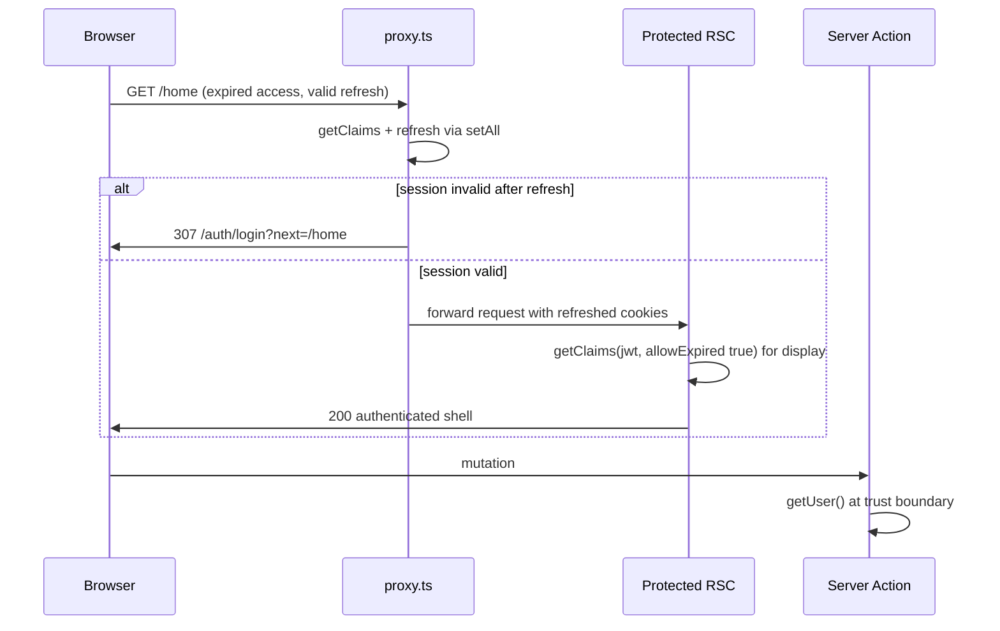

# Proxy as sole session authority

## Context

Today [`src/supabase/proxy.ts`](src/supabase/proxy.ts) refreshes sessions and redirects unauthenticated users on protected routes, but [`requireAuthClaims`](src/supabase/require-auth.ts) independently calls `getClaims(accessToken)` **without** `allowExpired`, which validates `exp` and throws `JWT has expired` — causing login redirects during [`AppShell`](src/app/(app)/_components/app-shell.tsx) render even when the proxy already refreshed the session on the same request ([ADR-0003](docs/adr/ADR-0003-no-refresh-in-rsc-auth-reads.md) explicitly accepted this trade-off).

The approved design inverts that trade-off: **proxy gates and refreshes; RSC reads are display-only.**

---

## 1. Claims for display

### Viable options

| Option | Mechanism | Pros | Cons |
|--------|-----------|------|------|
| **A — `getClaims(accessToken, { allowExpired: true })` (recommended)** | [`readAccessTokenFromCookies`](src/supabase/read-auth-cookie.ts) → `supabase.auth.getClaims(accessToken, { allowExpired: true })` → [`parseAuthenticatedClaims`](src/supabase/require-auth.ts) | Library-native; **signature still verified**; exp tolerated; explicit token → no `getSession()` / refresh | Requires Supabase server client in read path (already true today) |
| **B — Proxy injects request headers** | After proxy `getClaims`, serialize claims into internal request headers; RSC reads via `headers()` | Claims on RSC path are exactly what proxy validated | More moving parts (serialize/parse, header forwarding, spoofing hygiene); harder tests; still need cookie for Supabase server client DB calls |
| **C — Hand-rolled JWT payload decode** | Cookie → base64url-decode payload → shape parse only | Minimal deps | **Rejected** — skips signature verification; hand-rolls what auth-js already provides |
| **D — Keep `getClaims(accessToken)` without `allowExpired`** | Status quo | Signature + exp validated | **Rejected** — this is the bug; throws on expired access token even post-proxy refresh |

### Recommendation: **Option A**

**Mechanism:**

1. Read the access-token string from cookies via [`readAccessTokenFromCookies`](src/supabase/read-auth-cookie.ts) (unchanged).
2. Validate with **`getClaims(accessToken, { allowExpired: true })`** — supported on `@supabase/auth-js`. Passing an explicit token means **no `getSession()` / refresh** occurs; `allowExpired: true` skips the exp rejection that currently throws `JWT has expired`; **the signature is still verified**.
3. Run returned claims through `parseAuthenticatedClaims` for typed shape validation.
4. **`getDisplayAuthClaims()`** wraps that call and returns `AuthenticatedClaims` for display.

**No hand-rolled payload decoder.** Do **not** add `src/utils/decode-access-token-claims.ts`.

Replace gated reads with **`getDisplayAuthClaims()`**:

- **Protected-route semantics:** returns `AuthenticatedClaims` for UI (email, sub, admin role). **AdminAuthGate** reads the admin role from these **signature-verified** claims.
- **Does not redirect** and does not call bare `getClaims()` or `getSession()`.
- **Missing / malformed / signature-invalid token on a protected route:** invariant violation (proxy should have gated). Throw a fault-style error (surfaces via route error boundary). **Do not** `redirect(LOGIN_PATH)` from the RSC.

**`hasServerAuthSession()`** (public marketing only — [`LandingAuthSlot`](src/app/(marketing)/_components/landing-auth-slot.tsx)):

- Switch to the same `getClaims(accessToken, { allowExpired: true })` path (boolean: call succeeds and `sub` is present).
- Still **no redirect**, no refresh.
- After proxy runs on public routes, cookies are already refreshed via bare `getClaims()` in proxy; `allowExpired` avoids exp throw if cookie sync is briefly stale.

**Server client cookie-write swallow (load-bearing):** `getDisplayAuthClaims()` uses `createClient()` from [`server.ts`](src/supabase/server.ts). That client's `setAll` intentionally swallows cookie writes when invoked from a Server Component (the empty `catch` on `cookieStore.set`). This is **required** under this design — RSC reads must **not** write cookies; refresh stays proxy-only. The build must **not** “fix,” remove, or rethrow from that catch. Leave it exactly as-is.

### File disposition

| File | Action |
|------|--------|
| [`read-auth-cookie.ts`](src/supabase/read-auth-cookie.ts) | **Keep** — canonical cookie reader; no decoder additions |
| [`require-auth.ts`](src/supabase/require-auth.ts) | **Change heavily** — rename `requireAuthClaims` → `getDisplayAuthClaims`; implement via `getClaims(accessToken, { allowExpired: true })`; remove `clearSessionAndRedirect`; keep `parseAuthenticatedClaims`, `isSessionAuthFailure` (still useful for server actions / tests) |
| [`server.ts`](src/supabase/server.ts) | **Comment update only** — document display reads vs `getUser()` mutation boundary. **Do not change** the `setAll` swallow catch — it is intentional and load-bearing (see note above); agents must not remove, rethrow, or “fix” it |

### Call-site updates

- [`get-current-user-profile.ts`](src/app/(app)/_lib/get-current-user-profile.ts) — call `getDisplayAuthClaims()` (claims read no longer needs a supabase param passed in solely for auth).
- [`admin-auth-gate.tsx`](src/app/admin/_components/admin-auth-gate.tsx) — display claims only; **admin role from signature-verified claims**; keep **non-admin → `/home` redirect** as defense-in-depth (proxy already does this).
- [`admin/users/page.tsx`](src/app/admin/users/page.tsx) — same display read for `currentAdminUserId`.

---

## 2. Dev-without-env fallback

**Today:** When `hasPublicSupabaseEnv` is false and `NODE_ENV !== 'production'`, [`proxy.ts` lines 37–42](src/supabase/proxy.ts) returns `NextResponse.next()` for **all** routes — including `/home` and `/admin/**`. With RSC no longer gating, protected routes become **fully open** in dev-without-env.

**Guard (recommended):** In the `!hasPublicSupabaseEnv` branch:

- **Production:** unchanged — 503 for all routes.
- **Development:**
  - **Public routes** (`/`, `/auth/**`, `/terms`, `/privacy`, `/reference`, `/workflow`): continue pass-through (200) so marketing/auth shells render without Supabase.
  - **Protected routes:** **fail closed** — return **503** with the same setup message as production (simplest; no fake login redirect that cannot work anyway).

Reuse the existing `isPublicRoute` logic already in proxy; do not reintroduce RSC redirects for this case.

**Tests:** Update [`proxy.no-env.unit.test.ts`](src/supabase/proxy.no-env.unit.test.ts) — `/home` and `/admin` must return 503 in dev-without-env; `/` and `/auth/login` stay 200.

**Safety flag (decision):** 503 on protected dev routes vs a dedicated “configure Supabase” page — recommend 503 for minimalism; say if you prefer a friendlier dev page.

---

## 3. Truly-logged-out redirect (`next` preservation)

**Current behavior — does NOT preserve destination:**

- Proxy redirect ([`proxy.ts` ~88–96](src/supabase/proxy.ts)): sets `url.pathname = LOGIN_PATH` only — **no `next` query param**.
- [`LoginForm`](src/components/login-form.tsx): after sign-in always `router.push(getPostAuthRedirectPath(...))` — **ignores `next`**.
- [`/auth/confirm`](src/app/auth/confirm/route.ts): already honors safe `next` via [`isSafeRedirect`](src/utils/is-safe-redirect.ts) — email/magic-link flows only.

**Changes:**

1. **Proxy (sole redirect authority):** On unauthenticated protected-route redirect, set `next` to the original path + search string (e.g. `/admin/users?email=foo`). Validate with `isSafeRedirect(next, request.url)` before attaching; omit param if unsafe.
2. **Login surface:** Pass `searchParams.next` from [`login/page.tsx`](src/app/auth/login/page.tsx) into `LoginForm`.
3. **LoginForm:** After successful sign-in: if `next` is present and passes `isSafeRedirect(next, window.location.origin)`, navigate there; else fall back to `getPostAuthRedirectPath`. Keep existing `router.refresh()` before navigation.
4. **Helper (optional, recommended):** Small util e.g. `buildLoginRedirectUrl(intendedPath, baseUrl)` in `src/utils/` to keep proxy and tests DRY.

**Out of scope unless you want it:** Same `next` handling on sign-up form — not required for this fix.

**Docs:** Update [LEXICON.md § Post-auth redirect](LEXICON.md) to note login form now honors `next`, not only `/auth/confirm`.

---

## 4. Avatar upload (browser → Supabase)

**Current path:** [`uploadUserAvatar`](src/utils/avatar-storage.ts) uses browser [`createClient()`](src/supabase/client.ts) with **`stopAutoRefresh()`** → `getUser()` → `storage.upload()`. This is the only direct browser→Supabase auth path.

**After idle access-token expiry (no server navigation):**

- User may still see the last-rendered authenticated UI (see §6).
- `getUser()` will fail (no client-side refresh authority).
- User sees existing copy: “You must be signed in to upload an image.”

**Recommended change (no second refresh authority):**

On auth failure from `getUser()` during upload, run a **three-step retry sequence** in [`use-profile-avatar-upload.ts`](src/app/(app)/_lib/profile/use-profile-avatar-upload.ts) — **do not** retry immediately after `router.refresh()` alone:

1. **`router.refresh()`** — invalidate client router cache and trigger a server re-render (proxy runs on that request and may refresh cookies). Note: this call does **not** provide an awaitable guarantee that refreshed cookies are visible to the browser client before the next line runs.
2. **`await probeSessionAction()`** (new minimal server action, e.g. in profile `_lib/`) — on a **distinct server request**, proxy executes first and refreshes cookies; the action then calls **`getUser()`** at the mutation trust boundary and returns `{ success: true }` or failure. This is the **awaitable re-read path** that confirms the post-refresh session before retry. Named **probe**, not “ensure fresh” — it only calls `getUser()` to confirm the proxy-refreshed session on a fresh server request; it is **not** a refresh authority (ADR-0003 keeps refresh proxy-only).
3. **Only if step 2 succeeds:** retry `uploadUserAvatar` **once**. If step 2 or the retry fails → keep current user-facing error (session truly dead).

Do **not** re-enable browser `autoRefresh` — that reintroduces refresh-token races per ADR-0003.

**Implementation detail to get right (not a race to leave open):** The retry must never assume cookie propagation timing between `router.refresh()` and client `getUser()`. `probeSessionAction` in step 2 is the synchronization point; unit/integration tests should assert the probe is awaited before retry.

Document in ADR that idle-tab uploads require one server touch.

---

## 5. PPR / `cacheComponents` verification

**From code (confident):**

- [`next.config.ts`](next.config.ts): `cacheComponents: true` (Partial Prerender enabled).
- Protected shells read **dynamic APIs**:
  - `getDisplayAuthClaims()` → `cookies()` via read-auth-cookie.
  - [`AdminAuthGate`](src/app/admin/_components/admin-auth-gate.tsx) also reads sidebar cookie.
- Both [`(app)/layout.tsx`](src/app/(app)/layout.tsx) and [`admin/layout.tsx`](src/app/admin/layout.tsx) wrap auth shells in **`<Suspense>`**, isolating dynamic auth UI from static shell — same pattern called out for marketing auth in archived plans.
- All protected routes match [`proxy.ts`](proxy.ts) matcher (confirmed by [`proxy.unit.test.ts`](src/supabase/proxy.unit.test.ts) discovered-route matrix).

**Conclusion (code-level):** Auth-gated shells are **per-request dynamic** (cookie reads inside Suspense), not served as a static authenticated segment without proxy re-execution.

**Required pre-merge check (merge gate):**

- Run **`pnpm build`** and inspect build output for **`/home`** and **`/admin/users`** — confirm routes render **dynamic** (e.g. `ƒ` marker / not fully static), not as a static authenticated shell that could bypass per-request proxy + cookie reads.
- If build output shows unexpected static auth caching, escalate by adding explicit `connection()` to auth shells before merge — unlikely given existing `cookies()` usage, but the build inspection is **mandatory**, not optional.

No code change required for PPR unless this merge gate fails.

---

## 6. Stale-cache window (accepted behavior)

**Behavior:** On client soft navigation, Next.js router cache may show the **last server-rendered authenticated UI** for a session whose access token just expired but refresh token remains valid — until a server touch (hard navigation, `router.refresh()`, mutation, focus-triggered refresh).

**Recommendation:** **Accept for v1.** The window closes on the next protected-route server request (proxy refreshes or redirects). Optional **`router.refresh()` on `visibilitychange` / `focus`** in the app shell would narrow the window but adds request churn and is easy to get wrong (refresh storms). **Defer** unless you explicitly want polish in this epic.

Document the accepted window in the new/superseding ADR so future debugging does not re-litigate it.

---

## 7. File list + protocol

### Files to touch

**Core auth**

- [`src/supabase/proxy.ts`](src/supabase/proxy.ts) — `next` on redirect; dev-no-env protected 503
- [`src/supabase/require-auth.ts`](src/supabase/require-auth.ts) — `getDisplayAuthClaims` via `getClaims(accessToken, { allowExpired: true })`; remove RSC redirect gate
- [`src/supabase/read-auth-cookie.ts`](src/supabase/read-auth-cookie.ts) — unchanged (no decoder)
- [`src/supabase/server.ts`](src/supabase/server.ts) — comments only; **leave `setAll` swallow catch unchanged** (§1)

**Consumers**

- [`src/app/(app)/_lib/get-current-user-profile.ts`](src/app/(app)/_lib/get-current-user-profile.ts)
- [`src/app/admin/_components/admin-auth-gate.tsx`](src/app/admin/_components/admin-auth-gate.tsx)
- [`src/app/admin/users/page.tsx`](src/app/admin/users/page.tsx)

**Login redirect**

- [`src/app/auth/login/page.tsx`](src/app/auth/login/page.tsx)
- [`src/components/login-form.tsx`](src/components/login-form.tsx)
- Optional: `src/utils/build-login-redirect-url.ts`

**Avatar**

- [`src/app/(app)/_lib/profile/use-profile-avatar-upload.ts`](src/app/(app)/_lib/profile/use-profile-avatar-upload.ts)
- New: `src/app/(app)/_lib/profile/probe-session-action.ts` (minimal server action — `getUser()` probe only; not a refresh authority)

**Tests**

- [`src/supabase/require-auth.unit.test.ts`](src/supabase/require-auth.unit.test.ts)
- [`src/supabase/proxy.unit.test.ts`](src/supabase/proxy.unit.test.ts)
- [`src/supabase/proxy.no-env.unit.test.ts`](src/supabase/proxy.no-env.unit.test.ts)
- [`src/app/(app)/_lib/get-current-user-profile.unit.test.ts`](src/app/(app)/_lib/get-current-user-profile.unit.test.ts)
- [`src/app/admin/_components/admin-auth-gate.integration.test.tsx`](src/app/admin/_components/admin-auth-gate.integration.test.tsx)
- [`src/components/login-form.integration.test.tsx`](src/components/login-form.integration.test.tsx) (if exists; else add targeted test)
- **New regression test file** (see §8)

**Docs / ADR**

- New ADR superseding [ADR-0003](docs/adr/ADR-0003-no-refresh-in-rsc-auth-reads.md) (“Proxy as sole session authority”)
- [`AGENTS.md`](AGENTS.md) — **rewrite** Auth & session section (see doc-sync scope below)
- [`LEXICON.md`](LEXICON.md) — post-auth redirect note
- [`.cursor/rules/security.mdc`](.cursor/rules/security.mdc) and [`.cursor/rules/supabase.mdc`](.cursor/rules/supabase.mdc) — RSC read wording (see doc-sync scope below)
- [`ROADMAP.md`](ROADMAP.md) — update JWT expiration backlog item when epic ships (reference new ADR / resolution)

### Rename blast radius (`requireAuthClaims` → `getDisplayAuthClaims`)

Repo-wide search before merge. **Active files that reference the old name** (must update):

| Area | File |
|------|------|
| **Source** | [`src/supabase/require-auth.ts`](src/supabase/require-auth.ts), [`src/supabase/server.ts`](src/supabase/server.ts), [`src/app/(app)/_lib/get-current-user-profile.ts`](src/app/(app)/_lib/get-current-user-profile.ts), [`src/app/admin/_components/admin-auth-gate.tsx`](src/app/admin/_components/admin-auth-gate.tsx), [`src/app/admin/users/page.tsx`](src/app/admin/users/page.tsx) |
| **Tests** | [`src/supabase/require-auth.unit.test.ts`](src/supabase/require-auth.unit.test.ts), [`src/app/(app)/_lib/get-current-user-profile.unit.test.ts`](src/app/(app)/_lib/get-current-user-profile.unit.test.ts), [`src/app/admin/_components/admin-auth-gate.integration.test.tsx`](src/app/admin/_components/admin-auth-gate.integration.test.tsx) |
| **Docs** | [`AGENTS.md`](AGENTS.md), [`docs/adr/ADR-0003-no-refresh-in-rsc-auth-reads.md`](docs/adr/ADR-0003-no-refresh-in-rsc-auth-reads.md) (superseded — cross-link new ADR), [`ROADMAP.md`](ROADMAP.md), [`TECH_DEBT_AUDIT.md`](TECH_DEBT_AUDIT.md) |
| **Rules** | [`.cursor/rules/security.mdc`](.cursor/rules/security.mdc), [`.cursor/rules/supabase.mdc`](.cursor/rules/supabase.mdc) — review/update if RSC read paths are mentioned |

**No matches in `.cursor/skills/`** (confirmed). Archived plans under `.cursor/plans/archive/` reference the old name historically — **leave frozen**; do not edit archive plans.

Implementation step: run `rg requireAuthClaims` across the repo before merge and confirm zero hits outside archive/historical docs (or update any stragglers found).

### Auth-boundary change protocol ([AGENTS.md § Change protocol](AGENTS.md))

**Does this trigger the hard-constraint auth-boundary protocol?** **No.**

- Public-route **allowlist is unchanged** (`/`, `/auth/**`, `/terms`, `/privacy`, `/reference`, `/workflow`).
- `check:auth-boundary` ([`proxy.unit.test.ts`](src/supabase/proxy.unit.test.ts) discovered-route matrix) stays valid; extend with new cases, do not change allowlist constants.

**Required protocol steps for this change:**

1. Implement behavior + tests (including updated `proxy.no-env`, `next` redirect, and `allowExpired` regression tests).
2. Run quality bar: `pnpm type-check && pnpm lint && pnpm format-check && pnpm test:ci`.
3. **PPR merge gate:** `pnpm build` — confirm `/home` and `/admin/users` are dynamic, not static (§5).
4. Supersede ADR-0003 with new ADR documenting proxy-only gate + `allowExpired` display reads + stale-cache acceptance.
5. **Documentation sync** (explicit scope — not a vague “run `/sync-repo-docs`”):
   - **`/sync-repo-docs` must REWRITE the [`AGENTS.md`](AGENTS.md) “Auth & session” section**, specifically:
     - **Read-vs-mutation split:** gates read via **`getDisplayAuthClaims`** (renamed from `requireAuthClaims`), which validate the cookie-read access token via **`getClaims(accessToken, { allowExpired: true })`** — signature-verified, exp-tolerated, never refresh.
     - **Keep** existing guidance: “Do not call bare `getClaims()` or `getSession()` on RSC read paths” — remains true because an explicit token is always passed.
     - **Dev-without-env:** update to state protected routes return **503 in development** when Supabase env is unset (RSC no longer gates; see §2).
     - **ADR reference:** point to the **new superseding ADR**, not ADR-0003 alone.
   - **[`.cursor/rules/security.mdc`](.cursor/rules/security.mdc) and [`.cursor/rules/supabase.mdc`](.cursor/rules/supabase.mdc):** same wording review — retain “no bare getClaims/getSession on RSC read paths”; **correct any wording implying RSC always validates exp** — RSC now tolerates expiry via `allowExpired` while still verifying signature.
   - **[`LEXICON.md`](LEXICON.md):** post-auth redirect — login form honors `next`.
   - **[`ROADMAP.md`](ROADMAP.md) / [`TECH_DEBT_AUDIT.md`](TECH_DEBT_AUDIT.md):** update stale `requireAuthClaims` references per rename blast-radius table.
6. **Not required:** AGENTS hard-constraints list edit, `isPublicRoute` constant changes, or PM approval for allowlist change.

---

## 8. Tests

### Update existing

- **`require-auth.unit.test.ts`:** Remove redirect expectations; assert `getDisplayAuthClaims` calls `getClaims(accessToken, { allowExpired: true })` and returns claims for an expired-but-signed token fixture; assert missing token throws fault (not redirect); assert **signature-invalid** token throws fault (not redirect, no claims returned). Update `hasServerAuthSession` to use the same `allowExpired` path.
- **`proxy.unit.test.ts`:** Redirect includes safe `next`; admin/home unauthenticated cases; malformed claims unchanged.
- **`proxy.no-env.unit.test.ts`:** Protected routes 503 in dev-without-env.
- **Integration tests** mocking `requireAuthClaims` → rename mock to `getDisplayAuthClaims`; drop “unauthenticated redirects from AdminAuthGate” case (proxy owns that) — gate tests focus on admin vs non-admin display path only.

### New regression test (does not exist today)

**Scenario:** Expired access token + valid refresh token + navigate to protected route → **200, no login redirect, display claims available.**

Suggested implementation in **`src/supabase/auth-session-flow.integration.test.ts`** (node env):

1. Mock `@supabase/ssr` `createServerClient` so proxy `auth.getClaims()` simulates refresh: accepts stale session, invokes `setAll` with a new access-token cookie, returns valid claims.
2. Call `updateSession(createRequest('/home'))` with initial request cookies containing an **expired** JWT — assert **200**, not 307.
3. Mock `getClaims(accessToken, { allowExpired: true })` to succeed on the expired token (signature valid, exp past) — call `getDisplayAuthClaims()` with cookie store seeded from post-proxy request cookies — assert claims returned, **no redirect throw**.
4. Negative control: expired access + **invalid/missing** refresh → proxy returns 307 to `/auth/login?next=%2Fhome`.
5. **Signature-invalid negative control:** On a protected route, a token whose signature does **not** verify causes `getDisplayAuthClaims()` to throw a fault-style error (surfaced via the route error boundary) — it must **not** return claims and must **not** render authenticated UI. This is the specific reason `allowExpired` was chosen over a hand-rolled payload decoder (which would skip signature verification); pin it so a future change cannot silently drop signature verification.

This test encodes the production bug fix and prevents ADR-0003’s old “RSC redirect on exp” behavior from returning.

### Login `next` tests

- Proxy sets `next=/home` on redirect; unsafe external URL omitted.
- LoginForm navigates to safe `next` after sign-in.

### Avatar retry tests

- Assert `probeSessionAction` is awaited before upload retry (probe-then-retry ordering).

---

## Decisions flagged for PM

1. **Dev-without-env protected routes:** 503 (recommended) vs custom setup page (§2).
2. **Optional focus/visibility `router.refresh`:** defer (recommended) vs include in this epic (§6).
3. **Sign-up form `next` parity:** optional follow-up (§3).

## Manual testing checklist (post-implementation)

- [ ] **`pnpm build`** — `/home` and `/admin/users` show as **dynamic** in build output (PPR merge gate, §5).
- Idle on `/home` past access-token expiry → hard refresh or navigate → stays on `/home`, no console `JWT has expired`, shell renders.
- Sign out → visit `/admin/users` → lands on `/auth/login?next=...` → sign in → returns to `/admin/users` (if admin) or role fallback.
- Dev clone without `.env` Supabase vars: `/` loads; `/home` returns 503 (not open shell).
- Avatar upload after long idle on profile modal: upload succeeds after session probe + retry, or shows sign-in message if session fully dead.
- Landing page while signed in: “Open app” CTA still correct after token expiry + page refresh.
