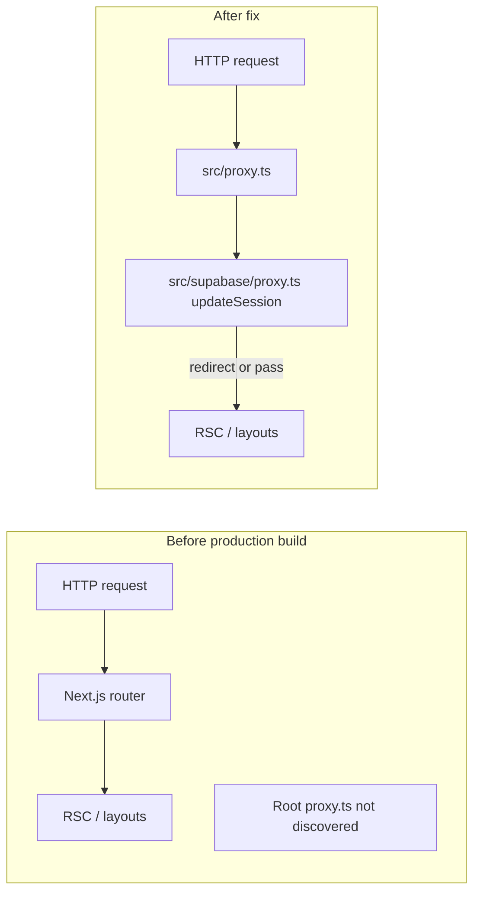

# Relocate proxy to src/proxy.ts

## Problem

The app uses a `src/app/` layout. Next.js 16.2.x discovers convention files (`proxy.ts`, `middleware.ts`, etc.) under `src/` — the parent of `app/` — not at the repo root. Root `[proxy.ts](proxy.ts)` runs under `pnpm dev` (dev bundler watches the repo root) but is **never registered** in `pnpm build` production output.

**Symptom:** logged-out `curl -sI http://localhost:3000/admin/logs` returns **HTTP 200** in production instead of **307 → /auth/login**.

**Fix:** move the thin convention delegate to `[src/proxy.ts](src/proxy.ts)` (canonical location). Keep all session/auth logic in `[src/supabase/proxy.ts](src/supabase/proxy.ts)` unchanged.




---

## Step 0 — Pre-merge / pre-deploy environment gate (blocking)

Moving the proxy into `src/` turns on **production proxy execution for the first time**. When required public Supabase env vars are absent, `[updateSession](src/supabase/proxy.ts)` returns **503 on every route** in production (`hasPublicSupabaseEnv` check at lines 67–69) — a code path that has never run at the edge in deployed environments.

**Before merging or deploying to any target environment**, confirm both of these are present and non-empty in that environment's configuration (Vercel/hosting dashboard, `.env.production`, etc.):


| Env var                                | Role                                            | Where checked                                                                                                                                                             |
| -------------------------------------- | ----------------------------------------------- | ------------------------------------------------------------------------------------------------------------------------------------------------------------------------- |
| `NEXT_PUBLIC_SUPABASE_URL`             | Supabase project URL for session client         | `[hasPublicSupabaseEnv](src/utils/env.ts)` (lines 11–14); consumed via `[getPublicSupabaseEnv()](src/utils/env.ts)` in `[updateSession](src/supabase/proxy.ts)` (line 83) |
| `NEXT_PUBLIC_SUPABASE_PUBLISHABLE_KEY` | Anon/publishable key for `@supabase/ssr` client | Same                                                                                                                                                                      |


**Not required for proxy session gating** (but still needed elsewhere): `SUPABASE_SECRET_KEY` is service/CLI-only — the proxy does not read it.

**Gate criteria:** if either public var is missing in the deploy target, **do not ship** this change until they are configured. A deploy without them will surface as site-wide 503, not a graceful auth redirect.

---

## Step 1 — File move (logic unchanged)

**Import check (confirmed):** root `[proxy.ts](proxy.ts)` delegates via the `@/` path alias — `import { updateSession } from '@/supabase/proxy'` — **not** a relative path. The `@/` alias resolves to `src/` (`[vitest.config.ts](vitest.config.ts)` / tsconfig), so the file contents are **safely byte-identical** at `src/proxy.ts`; no import correction needed.

1. **Create** `[src/proxy.ts](src/proxy.ts)` with the exact contents of root `[proxy.ts](proxy.ts)`:
  - `proxy()` export delegating to `updateSession` from `@/supabase/proxy` (alias import — unchanged)
  - `config.matcher` string literal (unchanged)
  - Comments referencing `src/utils/proxy-matcher.ts` (unchanged)
2. **Delete** root `[proxy.ts](proxy.ts)`.

No edits to `[src/supabase/proxy.ts](src/supabase/proxy.ts)`, `[src/utils/proxy-matcher.ts](src/utils/proxy-matcher.ts)`, or matcher regex.

---

## Step 2 — Code / test / config references (must update)

These are the **active** repo files that hardcode the root path or treat root `proxy.ts` as special:


| File                                                                           | Change                                                                                                                                                                                                             |
| ------------------------------------------------------------------------------ | ------------------------------------------------------------------------------------------------------------------------------------------------------------------------------------------------------------------ |
| `[src/utils/proxy-matcher.unit.test.ts](src/utils/proxy-matcher.unit.test.ts)` | `readFileSync(join(process.cwd(), 'proxy.ts'))` → `'src/proxy.ts'`; update error/comments mentioning root location                                                                                                 |
| `[vitest.config.ts](vitest.config.ts)`                                         | Coverage `include`: remove redundant `'proxy.ts'` entry (covered by `src/**/*.{ts,tsx}`). Coverage `exclude`: `'proxy.ts'` → `'src/proxy.ts'` (keep thin delegate excluded from denominator, same intent as today) |
| `[src/utils/proxy-matcher.ts](src/utils/proxy-matcher.ts)`                     | Comment-only: sync source is now `src/proxy.ts`                                                                                                                                                                    |


**Confirmed no change needed** (already target `src/supabase/proxy.ts` or test logic only):

- `[src/supabase/proxy.unit.test.ts](src/supabase/proxy.unit.test.ts)` — tests `updateSession`, not convention file location
- `[package.json](package.json)` `check:auth-boundary` — runs `proxy.unit.test.ts`
- `[eslint.config.mjs](eslint.config.mjs)` / `[eslint.config.unit.test.ts](eslint.config.unit.test.ts)`
- `[next.config.ts](next.config.ts)`, `[tsconfig.json](tsconfig.json)`

---

## Step 3 — Docs and rules (must update)

Grep found these **active** non-archive references to root `proxy.ts` that describe repo truth:


| File                                                                                                                                                 | What to update                                                                                                                                                                                                                                |
| ---------------------------------------------------------------------------------------------------------------------------------------------------- | --------------------------------------------------------------------------------------------------------------------------------------------------------------------------------------------------------------------------------------------- |
| `[AGENTS.md](AGENTS.md)`                                                                                                                             | Hard-constraints bullet, Auth & session prose (`proxy.ts → src/supabase/proxy.ts`), Admin console gate prose, **Where things live** table (replace `proxy.ts` root row with `src/proxy.ts`; keep `src/supabase/proxy.ts` in the supabase row) |
| `[LEXICON.md](LEXICON.md)`                                                                                                                           | Auth-boundary, admin gate, and defense-in-depth entries linking to `(proxy.ts)` → `(src/proxy.ts)`                                                                                                                                            |
| `[docs/adr/ADR-0005-proxy-as-sole-session-authority.md](docs/adr/ADR-0005-proxy-as-sole-session-authority.md)`                                       | Opening line: `proxy.ts` → `src/proxy.ts` (convention entry); keep `src/supabase/proxy.ts` as implementation detail                                                                                                                           |
| `[docs/adr/ADR-0003-no-refresh-in-rsc-auth-reads.md](docs/adr/ADR-0003-no-refresh-in-rsc-auth-reads.md)`                                             | Historical reference to refresh authority location (superseded ADR; one-line path fix for accuracy)                                                                                                                                           |
| `[.cursor/rules/security.mdc](.cursor/rules/security.mdc)`                                                                                           | Remove stale glob `'proxy.ts'` (root); `src/proxy.ts` already covered by `src/**/*.ts`. Update Auth Proxy prose and Reference line                                                                                                            |
| `[.cursor/rules/supabase.mdc](.cursor/rules/supabase.mdc)`                                                                                           | Same glob cleanup; replace "Root proxy.ts delegates…" comment with `src/proxy.ts`; update Reference lines                                                                                                                                     |
| `[.cursor/rules/testing.mdc](.cursor/rules/testing.mdc)`                                                                                             | Coverage prose: "root `proxy.ts` delegate" → "`src/proxy.ts` delegate"                                                                                                                                                                        |
| `[.cursor/rules/seo.mdc](.cursor/rules/seo.mdc)`                                                                                                     | Two "keep in sync with `proxy.ts`" links → `src/proxy.ts`                                                                                                                                                                                     |
| `[.cursor/rules/README.md](.cursor/rules/README.md)`                                                                                                 | Stack-accuracy line and Applies-to tables mentioning root `proxy.ts`                                                                                                                                                                          |
| `[.cursor/skills/audit-seo/SKILL.md](.cursor/skills/audit-seo/SKILL.md)`                                                                             | Social-previews table + D6 drift check: `proxy.ts` → `src/proxy.ts`                                                                                                                                                                           |
| `[TECH_DEBT_AUDIT.md](TECH_DEBT_AUDIT.md)`                                                                                                           | Architecture summary + hot paths                                                                                                                                                                                                              |
| `[TEST_AUDIT.md](TEST_AUDIT.md)`                                                                                                                     | Coverage scope note (`src/**` and `proxy.ts`)                                                                                                                                                                                                 |
| `[SECURITY_AUDIT.md](SECURITY_AUDIT.md)`                                                                                                             | Routes table + W1 auth routing bullet                                                                                                                                                                                                         |
| `[docs/research/RESEARCH-0004-supabase-realtime-session-refresh-nextjs.md](docs/research/RESEARCH-0004-supabase-realtime-session-refresh-nextjs.md)` | Two convention-path mentions (research doc; keep accurate)                                                                                                                                                                                    |


**Optional / lower priority:** `[README.md](README.md)` describes dev auth bypass behavior but does not name root `proxy.ts` — no change required unless syncing prose about where the proxy lives.

**Do not edit:** `.cursor/plans/archive/`**, shipped PRD archives, and other frozen history — grep hits there are expected stale references.

---

## Step 4 — Regression surface (production proxy turns on for the first time)

This is a **location fix**, not a behavior change — but production has never executed the proxy, so the following enforcement **starts working in prod** (already works in dev):

### Newly enforced in production

1. **Unauthenticated protected routes → 307 `/auth/login`** with safe `next` preservation (`[buildLoginRedirectUrl](src/utils/build-login-redirect-url.ts)`) — e.g. `/home`, `/admin/**`, any future protected route matched by the matcher.
2. **Authenticated non-admin on `/admin` or `/admin/*` → redirect to `/home`** (`[APP_HOME](src/constants/app-paths.ts)`).
3. **Public allowlist pass-through (no redirect):** `/`, `/auth/`**, `/terms`, `/privacy`, `/reference`, `/workflow`, `/api/client-logs`.
4. **Stray auth `code` on protected route → `/auth/error?source=stray_code`** (not silent login redirect).
5. **Session refresh on matched requests** via `getClaims()` + cookie propagation (debug log at threshold).
6. **Stale/invalid session cleared on public routes** (signOut local scope).
7. **Missing Supabase public env in production → 503 all routes** (already intended; now actually at the edge).

### Matcher exclusions (must remain working)

Static assets, `_next/static`, `_next/image`, `favicon.ico`, image extensions, and metadata image paths (`/icon`, `*/icon`, `/opengraph-image`, etc.) must **not** hit the proxy — verified by `[proxy-matcher.unit.test.ts](src/utils/proxy-matcher.unit.test.ts)` and `[PROXY_MATCHER_PATTERN](src/utils/proxy-matcher.ts)`.

### What could behave differently (watch items)


| Risk                                                         | Mitigation                                                                                                                                                                                                                |
| ------------------------------------------------------------ | ------------------------------------------------------------------------------------------------------------------------------------------------------------------------------------------------------------------------- |
| **Redirect loops**                                           | Login lives under `/auth/`** (public). Post-login `next` uses `[isSafeRedirect](src/utils/is-safe-redirect.ts)`. No loop expected — verify `/auth/login` curl stays 200.                                                  |
| **Double redirect / status change on admin**                 | Today logged-out `/admin/`* may return **200** then hit `[AdminAuthGate](src/app/admin/_components/admin-auth-gate.tsx)` → `getDisplayAuthClaims` throw → error boundary. After fix: **307 at edge** (correct, intended). |
| **Route accidentally public in matcher but should be gated** | Unlikely — `[check:auth-boundary](package.json)` discovered-route matrix already covers app routes. Re-run after move.                                                                                                    |
| **Route accidentally gated but should be public**            | Would cause new 307 on a marketing/legal/metadata path. Verify `/`, `/terms`, `/reference`, `/workflow`, OG/icon paths.                                                                                                   |
| `**/administrative` false positive**                         | Boundary-safe check (`/admin` or `/admin/` prefix only) — covered by existing unit tests.                                                                                                                                 |
| **Session cookie sync on redirects**                         | `[redirectWithAuthCookies](src/supabase/proxy.ts)` copies refreshed cookies — existing dev behavior; prod now matches.                                                                                                    |
| **Crawlers / health checks on protected paths**              | Will receive 307 instead of 200 — expected for auth-gated app.                                                                                                                                                            |


No hard-constraint list change — public route allowlist and enforcement mechanism are unchanged; only **registration** of the existing proxy fixes prod.

---

## Step 5 — Verification

### Pre-deploy gate (repeat Step 0)

Confirm `NEXT_PUBLIC_SUPABASE_URL` and `NEXT_PUBLIC_SUPABASE_PUBLISHABLE_KEY` are set locally for production smoke tests (otherwise `pnpm start` will 503 all routes).

### Production hard pass (non-negotiable)

After implementation:

```bash
pnpm build && pnpm start
```

In a separate terminal (no session cookies):

```bash
curl -sI http://localhost:3000/admin/logs
```

**Must return:** `HTTP/1.1 307` (or `308`) with `Location:` containing `/auth/login` and a safe `next` param for `/admin/logs`.

### Dev smoke test (non-negotiable)

Confirms `src/proxy.ts` is discovered in dev the same way root `proxy.ts` was today.

After implementation (separate from or after production checks):

```bash
pnpm dev
```

In a separate terminal (no session cookies):

```bash
curl -sI http://localhost:3000/home
curl -sI http://localhost:3000/
```


| Scenario                                         | Expected                                |
| ------------------------------------------------ | --------------------------------------- |
| Logged-out `curl -sI http://localhost:3000/home` | **307 → /auth/login** (proxy executing) |
| Logged-out `curl -sI http://localhost:3000/`     | **200** (public route, no redirect)     |


### Production additional checks


| Scenario                                                                     | Expected                                                                                   |
| ---------------------------------------------------------------------------- | ------------------------------------------------------------------------------------------ |
| Logged-out `curl -sI http://localhost:3000/`                                 | **200** (no redirect)                                                                      |
| Logged-out `curl -sI http://localhost:3000/auth/login`                       | **200**                                                                                    |
| Logged-out `curl -sI http://localhost:3000/home`                             | **307 → /auth/login**                                                                      |
| Logged-in admin (session cookie) `curl -sI http://localhost:3000/admin/logs` | **200**                                                                                    |
| Logged-in non-admin `curl -sI http://localhost:3000/admin/logs`              | **307/redirect → /home**                                                                   |
| Metadata bypass                                                              | `curl -sI http://localhost:3000/opengraph-image` and `/icon` — **200**, not login redirect |


### CI / quality bar

```bash
pnpm type-check && pnpm lint && pnpm format-check && pnpm test:ci
```

Confirm `[proxy-matcher.unit.test.ts](src/utils/proxy-matcher.unit.test.ts)` and `[check:auth-boundary](package.json)` pass.

### Supporting evidence (optional)

Inspect production build output for proxy registration, e.g. `.next/server/functions-config-manifest.json` (or equivalent Next 16 manifest) showing the proxy function — **supporting only**; the 307 curl test is the proof.

---

## Implementation checklist

- [x] **Pre-deploy gate:** confirm `NEXT_PUBLIC_SUPABASE_URL` + `NEXT_PUBLIC_SUPABASE_PUBLISHABLE_KEY` in target deploy environment (Step 0)
- [x] Move `proxy.ts` → `src/proxy.ts` (byte-identical; alias import `@/supabase/proxy` confirmed safe)
- [x] Update matcher-sync test path + vitest coverage config
- [x] Update active docs/rules/ADRs listed in Step 3
- [x] Run full quality bar
- [x] **Dev smoke test:** `pnpm dev` — logged-out `/home` → 307, `/` → 200 (Step 5)
- [x] **Production verification:** `pnpm build && pnpm start` — logged-out `/admin/logs` → 307 (Step 5 hard pass) + remaining curl matrix
- [x] `/sync-repo-docs` if any doc drift remains after manual edits