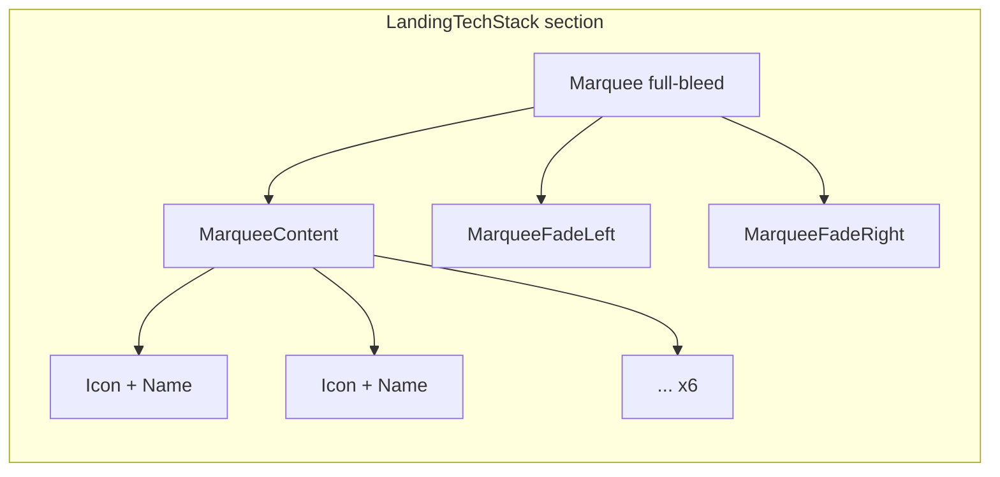

# Tech-Stack Marquee

## Current state

[`landing-tech-stack.tsx`](src/app/(marketing)/_components/landing-tech-stack.tsx) renders five 24×24 logos in a static `flex-wrap` row inside [`LandingContainer`](src/app/(marketing)/_components/landing-container.tsx). Names are `sr-only`; marks are small (`h-5`).

Config lives in [`landing-content.ts`](src/config/landing-content.ts) — five logos, no TanStack Query.

## Target behavior



- Continuous horizontal scroll with left/right edge fades (`from-background` gradients)
- **Pause on hover** — use `MarqueeContent` default (`pauseOnHover = true`); no custom hover logic
- Larger, recognizable marks with **visible name label** beside each icon
- Six logos: Next.js, Supabase, Vercel, Tailwind CSS, shadcn/ui, **TanStack Query**
- Monochrome `currentColor` SVGs that inherit `text-muted-foreground` in light/dark

---

## Gate 0 — CONTEXT.md container exception (PM-approved)

Add a one-line note to **Epic 1** in [`CONTEXT.md`](CONTEXT.md) (bullet under the shared-container rule, ~line 134) so the tech-stack marquee does not read as an unflagged deviation:

> **Exception:** the tech-stack strip is full-bleed (no `LandingContainer`) so marquee edge fades can span the viewport; header, hero, features, and footer remain container-aligned.

Also run `/sync-context-md` only if other planning bullets change — this single-line add can land directly.

---

## Gate 1 — Install marquee primitive

**Dry-run verified (2026-06-19)** — run before every install:

```bash
pnpm dlx shadcn@latest add @shadcnblocks/marquee/marquee-fade-1 --dry-run
```

Result: **2 files, both `create`** — no overwrites. `src/components/kibo-ui/` does not exist yet; install adds only:

| Path | Action |
|------|--------|
| `src/components/kibo-ui/marquee/index.tsx` | **create** |
| `src/components/marquee-fade-1.tsx` | **create** (demo — delete after) |

Plus dependency: `react-fast-marquee`. Safe to proceed with:

```bash
pnpm dlx shadcn@latest add @shadcnblocks/marquee/marquee-fade-1 -y -o
```

**Creates:**
- [`src/components/kibo-ui/marquee/index.tsx`](src/components/kibo-ui/marquee/index.tsx) — `Marquee`, `MarqueeContent`, `MarqueeFade`, `MarqueeItem` (wraps `react-fast-marquee`)
- `src/components/marquee-fade-1.tsx` — demo example only

**Post-install cleanup:**
- **Delete** `src/components/marquee-fade-1.tsx` — port pattern into landing component; do not ship a root-level demo block
- Keep `kibo-ui/marquee` as the owned primitive (already maps `cn` to `@/utils/tailwind`)

**Do not install** `@shadcnblocks/logos18` — reference its layout patterns only (would also try to overwrite `src/lib/utils.ts`).

---

## Gate 2 — SVG assets

| Logo | File | Action |
|------|------|--------|
| Next.js | `public/tech/nextjs.svg` | Keep — already `fill="currentColor"` |
| Supabase | `public/tech/supabase.svg` | Keep |
| Vercel | `public/tech/vercel.svg` | Keep |
| Tailwind CSS | `public/tech/tailwind.svg` | Keep |
| shadcn/ui | `public/tech/shadcn.svg` | **Replace** — current file is a `<text>` placeholder, not a mark. Source path from Simple Icons `shadcnui` slug, convert to `fill="currentColor"`, `viewBox="0 0 24 24"` |
| TanStack Query | `public/tech/tanstack-query.svg` | **Add** — source Simple Icons `reactquery` slug (MIT). Clean monochrome path mark (interconnected nodes). Convert to `currentColor` |

### TanStack mark verification (pre-commit gate)

**Status: sourceable.** Simple Icons lists **React Query** (`reactquery` slug) with a single-path monochrome SVG suitable for `currentColor` theming. Display name in config: **"TanStack Query"** (product name); icon file can stay `tanstack-query.svg`.

If the sourced path looks too busy at small sizes during implementation, fall back to TanStack's official brand assets — but Simple Icons should be sufficient at the planned `max-h-8`/`max-h-9` size.

**SVG conventions** (match existing files):

```xml
<svg xmlns="http://www.w3.org/2000/svg" viewBox="0 0 24 24" fill="currentColor" role="img" aria-hidden="true">
  <path d="..." />
</svg>
```

Strip `<title>` from committed files (decorative beside visible name label).

---

## Track A — Config update

Update [`src/config/landing-content.ts`](src/config/landing-content.ts):

- Add sixth logo: `{ name: 'TanStack Query', src: '/tech/tanstack-query.svg', width: 32, height: 32 }`
- Bump all logo dimensions from 24 → **32** (larger marks; `next/image` still gets explicit width/height per locked rules)
- Keep `shadcn/ui` width proportional if wordmark aspect differs (currently 96×24 in config — revisit after replacing SVG; icon mark is now 24×24 square like others)

---

## Track B — Logo cell subcomponent (logos18-inspired)

**New file:** [`landing-tech-stack-item.tsx`](src/app/(marketing)/_components/landing-tech-stack-item.tsx)

Port logos18 framing patterns (from `--view` output), adapted for icon + visible name:

| logos18 pattern | Our adaptation |
|-----------------|----------------|
| `flex aspect-3/1 w-28 sm:w-32 items-center justify-center` | Fixed aspect frame for the **icon only** — scale up to `w-36 sm:w-40` for larger marquee marks |
| `h-auto max-h-7 w-auto object-contain` | Use `max-h-8` or `max-h-9` (32–36px) — visibly larger than current `h-5` |
| `gap-x-8 lg:gap-12` | Apply via `MarqueeItem` className + inner `gap-3` between icon frame and name |
| `dark:invert` on images | **Do not use** — violates semantic-token rule; `currentColor` SVGs + `text-muted-foreground` parent handle theming |

Cell layout per item:

```
[MarqueeItem]
  └── flex items-center gap-3
        ├── div.aspect-3/1.w-36 (icon frame)
        │     └── next/image (currentColor SVG)
        └── span.text-sm.font-medium.text-muted-foreground (visible name)
```

Props: `logo: LandingTechLogo` from config.

---

## Track C — Marquee section refactor

**Refactor:** [`landing-tech-stack.tsx`](src/app/(marketing)/_components/landing-tech-stack.tsx)

| Concern | Approach |
|---------|----------|
| Client boundary | Add `'use client'` — `MarqueeContent` depends on `react-fast-marquee` |
| Width | **Full-bleed marquee** outside `LandingContainer` — edge fades need viewport-width track; section keeps `py-7 bg-background` vertical rhythm |
| Structure | `section[aria-label]` → `Marquee` → `MarqueeContent` + `MarqueeFade side="left/right"` |
| Pause on hover | Rely on `MarqueeContent` default `pauseOnHover={true}` — do not pass `false`, do not build custom CSS |
| Speed | Tune via `speed` prop on `MarqueeContent` if default feels too fast (start with default ~50) |
| Reduced motion | Respect `prefers-reduced-motion`: set `play={false}` on `MarqueeContent` when `(prefers-reduced-motion: reduce)` — static row fallback, no animation |
| Theming | Wrapper `text-muted-foreground` so SVGs inherit color |
| Line budget | Extract `LandingTechStackItem`; parent targets ≤150 lines |

**Remove** `LandingContainer` from this section — marquee is intentionally edge-to-edge while header/features stay container-aligned.

---

## Track D — Tests

Update [`landing-tech-stack.unit.test.tsx`](src/app/(marketing)/_components/landing-tech-stack.unit.test.tsx):

- Assert all **6** configured names render (visible text, not `sr-only`)
- Because `autoFill` duplicates items, use `getAllByText(logo.name).length >= 1` instead of exact image count
- Assert at least one image per unique `src` via `queryAllByRole('presentation')` filtered by src
- Skip CSS/marquee animation assertions

Optional: mock `window.matchMedia` for reduced-motion path if we add `play={false}` branch (one representative test only if logic is non-trivial).

---

## Docs and quality gate

- **CONTEXT.md Epic 1** — add sanctioned full-bleed exception note (see Gate 0)
- Run `/sync-repo-docs` — note tech-stack is now a marquee strip with six logos
- Full gate:

```bash
pnpm type-check && pnpm lint && pnpm format-check && pnpm test:ci
```

---

## Manual testing checklist

1. Visit `/` — tech strip scrolls continuously below features
2. Hover marquee — animation pauses (native `react-fast-marquee` behavior)
3. Light + dark — logos and names use semantic muted foreground (no hardcoded brand hex, no `dark:invert`)
4. Resize mobile → desktop — marks stay readable; fades blend into background
5. Enable **Reduce motion** in OS — strip shows static logos (if implemented)
6. Confirm six stacks visible over a scroll cycle: Next.js, Supabase, Vercel, Tailwind CSS, shadcn/ui, TanStack Query

---

## Risks

| Risk | Mitigation |
|------|------------|
| Demo file `marquee-fade-1.tsx` pollutes `src/components/` | Delete after install |
| Marquee `autoFill` breaks exact-count tests | Update tests to `>= 1` per name |
| shadcn.svg placeholder not a real mark | Replace with Simple Icons path |
| Motion sensitivity | `prefers-reduced-motion` static fallback |
| Full-bleed vs container alignment | Sanctioned exception documented in CONTEXT.md Epic 1; only horizontal track breaks out; vertical padding matches mockup `py-7` |

**Risk level:** LOW — presentation-only on public `/`; one new dependency (`react-fast-marquee`).
