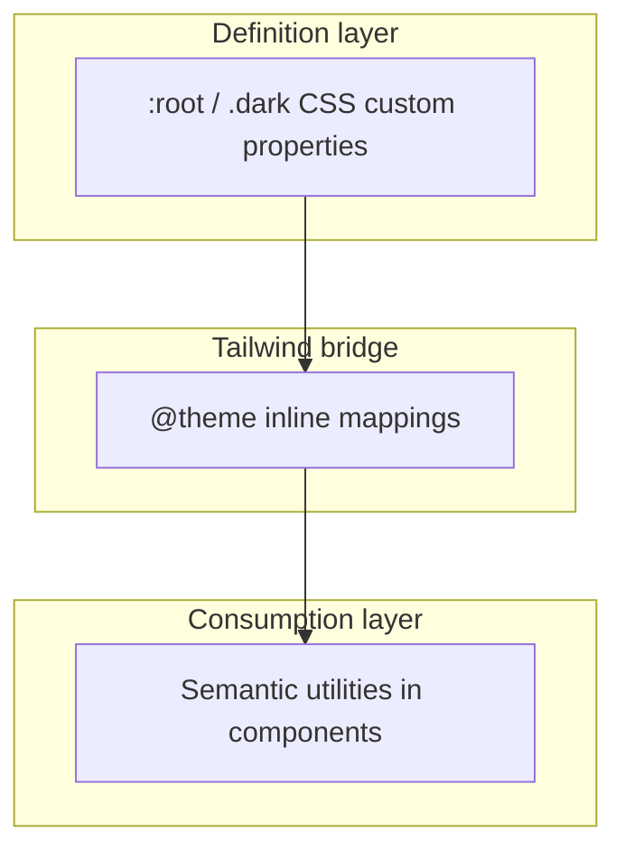

# Seminova — Design System

**Purpose:** Document the token architecture, the structure-vs-theme split, and how to re-skin the template for a new product. For agents: read this for design-system conventions; token **values** live only in [`src/app/globals.css`](src/app/globals.css). For repo truth and locked rules, see [AGENTS.md](AGENTS.md). For roadmap, see [CONTEXT.md](CONTEXT.md).

**Last updated:** 2026-06-18

---

## What this document is

| Document                                     | Role                                                                   |
| -------------------------------------------- | ---------------------------------------------------------------------- |
| **DESIGN.md** (this file)                    | Token architecture, usage conventions, re-skin workflow                |
| [`src/app/globals.css`](src/app/globals.css) | **Authoritative source** of all token values                           |
| [AGENTS.md](AGENTS.md)                       | Locked rules (semantic tokens only, structure fixed / theme swappable) |
| [CONTEXT.md](CONTEXT.md)                     | Planning and phase history                                             |

This file names tokens and explains the system. It does **not** duplicate oklch/hsl values from `globals.css` — that file is the single source of truth for values.

---

## Structure vs theme

Seminova separates **inherited structure** from **re-skinnable theme**. Products forking this template keep the structure; they replace theme values to match their brand.

### Inherited structure (do not remove when re-skinning)

- Token **names** and groupings (`primary`, `muted-foreground`, `sidebar-border`, etc.)
- `@theme inline` mappings in `globals.css` (Tailwind bridge)
- Semantic utility convention (`bg-background`, `text-destructive`, `shadow-md`, `font-sans`)
- Dark-mode class strategy (`next-themes` + `.dark` selector)
- Font wiring pattern: `next/font` CSS variables on `<html>`, `--font-*` chain in globals
- Seminova-only radius extensions (`radius-2xl` through `radius-4xl`)

### Re-skinnable theme (replace per product)

- oklch/hsl **values** inside `:root` and `.dark`
- Default font families (Inter, Merriweather, JetBrains Mono today)
- Base `--radius`, shadow recipes, `--spacing` base unit

---

## Token architecture

Three layers connect definitions to UI:



1. **Definition layer** — `:root` and `.dark` in [`src/app/globals.css`](src/app/globals.css) hold all token values (colors, fonts, shadows, radius base, spacing).
2. **Tailwind bridge** — `@theme inline` maps `--color-*`, `--font-*`, `--shadow-*`, `--radius-*`, and `--spacing` to those CSS variables so Tailwind v4 utilities resolve correctly.
3. **Consumption layer** — Components use semantic classes (`bg-card`, `text-muted-foreground`, `ring-ring`) or `var(--token)` for third-party props. shadcn primitives in `src/components/ui/` are already token-aware.

---

## Token groups

Token **names** below. Values: see `globals.css` only.

### Semantic colors

| Token                                   | Typical utility                                                     |
| --------------------------------------- | ------------------------------------------------------------------- |
| `background`                            | `bg-background`                                                     |
| `foreground`                            | `text-foreground`                                                   |
| `card`, `card-foreground`               | `bg-card`, `text-card-foreground`                                   |
| `popover`, `popover-foreground`         | `bg-popover`, `text-popover-foreground`                             |
| `primary`, `primary-foreground`         | `bg-primary`, `text-primary-foreground`                             |
| `secondary`, `secondary-foreground`     | `bg-secondary`, `text-secondary-foreground`                         |
| `muted`, `muted-foreground`             | `bg-muted`, `text-muted-foreground`                                 |
| `accent`, `accent-foreground`           | `bg-accent`, `text-accent-foreground`                               |
| `destructive`, `destructive-foreground` | `bg-destructive`, `text-destructive`, `text-destructive-foreground` |
| `border`                                | `border-border`                                                     |
| `input`                                 | `border-input`                                                      |
| `ring`                                  | `ring-ring`                                                         |

### Chart colors

| Token                 |
| --------------------- |
| `chart-1` … `chart-5` |

### Sidebar (Phase 3 shell)

| Token                                           |
| ----------------------------------------------- |
| `sidebar`, `sidebar-foreground`                 |
| `sidebar-primary`, `sidebar-primary-foreground` |
| `sidebar-accent`, `sidebar-accent-foreground`   |
| `sidebar-border`, `sidebar-ring`                |

### Typography

| CSS variable   | Tailwind utility | Loaded via                                                        |
| -------------- | ---------------- | ----------------------------------------------------------------- |
| `--font-sans`  | `font-sans`      | Inter — `next/font` in [`src/app/layout.tsx`](src/app/layout.tsx) |
| `--font-serif` | `font-serif`     | Merriweather — CSS fallback only (not `next/font` today)          |
| `--font-mono`  | `font-mono`      | JetBrains Mono — `next/font` in `layout.tsx`                      |

Body uses `font-sans antialiased`. Mono stacks apply to code blocks and `font-mono` utilities.

### Radius

| Token                                    | Notes                                                 |
| ---------------------------------------- | ----------------------------------------------------- |
| `radius`                                 | Base value; drives computed scale                     |
| `radius-sm` … `radius-xl`                | Derived from base                                     |
| `radius-2xl`, `radius-3xl`, `radius-4xl` | Seminova extensions (preserved beyond tweakcn export) |

### Shadow

| Token                                                                                                 |
| ----------------------------------------------------------------------------------------------------- |
| `shadow-2xs`, `shadow-xs`, `shadow-sm`, `shadow`, `shadow-md`, `shadow-lg`, `shadow-xl`, `shadow-2xl` |

### Spacing

| Token       | Role                                   |
| ----------- | -------------------------------------- |
| `--spacing` | Base spacing unit for the design scale |

---

## Dark mode

- [`next-themes`](https://github.com/pacocoursey/next-themes) `ThemeProvider` in `layout.tsx` uses `attribute="class"` and `defaultTheme="system"`.
- Toggling theme adds/removes `.dark` on the document; the `.dark` block in `globals.css` swaps token values.
- Prefer semantic utilities over manual `dark:` color classes — shadcn components inherit automatically.

---

## Using tokens in code

### Do

- Use semantic Tailwind utilities for themeable color: `bg-background`, `text-primary`, `border-border`, `text-destructive`.
- Use `role="alert"` with `text-destructive` for inline form errors (see auth forms under `src/components/`).
- Pass CSS variables to third-party color props: `color="var(--primary)"` (see `NextTopLoader` in `layout.tsx`).
- Use `focus-visible:ring-ring` and token-based rings for keyboard focus.

### Don't

- Hardcode hex/rgb/oklch in components.
- Use Tailwind palette scales for themeable UI (`text-red-500`, `bg-gray-100`, etc.).
- Copy token values from `globals.css` into component files or this document.

For full locked-rule wording, see [AGENTS.md › Locked rules](AGENTS.md). Consumption detail: [`.cursor/rules/ui-styling.mdc`](.cursor/rules/ui-styling.mdc).

---

## Default theme: tweakcn Clean Slate

Seminova ships **tweakcn Clean Slate** as the default theme:

- **Provenance:** [https://tweakcn.com/r/themes/clean-slate.json](https://tweakcn.com/r/themes/clean-slate.json)
- **Character:** Indigo primary; cool slate-tinted neutrals; Inter / Merriweather / JetBrains Mono type stack.
- **shadcn CLI metadata:** `components.json` uses `"baseColor": "slate"` to align CLI defaults with the cool-hue neutrals (CSS tokens remain authoritative).

---

## Re-skinning a product

When forking Seminova for a new product, change **theme values only** — preserve structure.

1. **Generate or pick a theme** in [tweakcn](https://tweakcn.com).
2. **Export CSS** from tweakcn.
3. **Diff-apply values** into `:root` and `.dark` in `src/app/globals.css`:
   - Replace color, font, shadow, radius, and spacing **values**.
   - **Preserve** the `@theme inline` block structure and Seminova-only tokens (`radius-2xl`–`radius-4xl`).
   - Do not duplicate `@import`, `@custom-variant`, or `@layer base` from the export.
4. **Update fonts** in `src/app/layout.tsx` if families change — wire new `next/font` loaders and update `--font-*` references in globals.
5. **Update `components.json`** `baseColor` if the neutral hue family changes (slate vs neutral vs zinc, etc.).
6. **Audit `src/`** for hardcoded colors:

   ```bash
   rg '#[0-9a-fA-F]{3,8}' src/
   rg 'text-(red|green|blue|gray|slate|zinc)-\d+' src/
   ```

   Fix violations to semantic tokens.

7. **Smoke test** light and dark modes: primary actions, destructive states, borders, focus rings, typography.

Phase 7 will add a dedicated theme-regeneration skill; until then, this manual workflow is canonical.

---

## Authoritative source

All token **values** live in [`src/app/globals.css`](src/app/globals.css). When documentation and CSS disagree, trust the CSS. Update this file when architecture or workflow changes — not when tweaking individual oklch values.

---

## Related documentation

- [AGENTS.md](AGENTS.md) — locked rules, implemented features, agent workflow
- [`.cursor/rules/ui-styling.mdc`](.cursor/rules/ui-styling.mdc) — Tailwind and theming conventions
- [`.cursor/rules/ui-shadcn.mdc`](.cursor/rules/ui-shadcn.mdc) — shadcn primitive patterns
- [`.cursor/rules/ui-accessibility.mdc`](.cursor/rules/ui-accessibility.mdc) — contrast, focus, form errors
