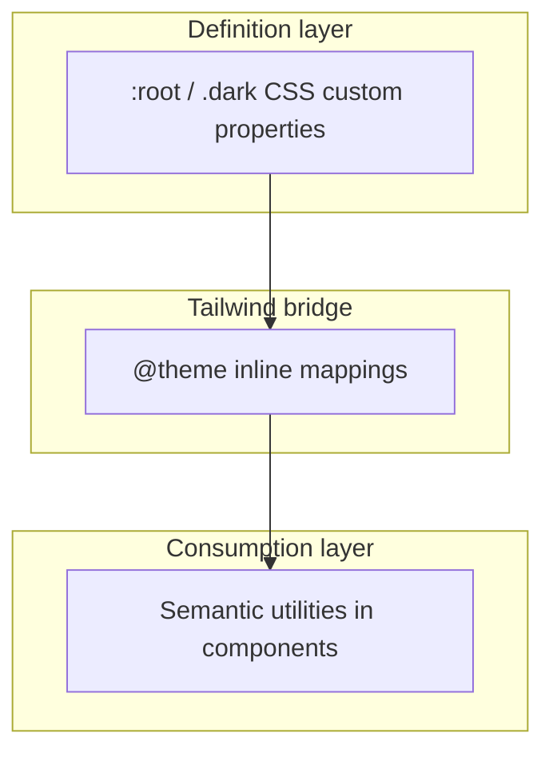

# Seminova — Design System

**Purpose:** Document the token architecture, the structure-vs-theme split, and how to re-skin the template for a new product. For agents: read this for design-system conventions. For hard constraints, see [AGENTS.md](AGENTS.md). For roadmap, see [ROADMAP.md](ROADMAP.md); for active-phase design scope, see [docs/prds/](docs/prds/).

**Last updated:** 2026-08-23

---

## What this document is

| Document                                                           | Role                                                                       |
| ------------------------------------------------------------------ | -------------------------------------------------------------------------- |
| **DESIGN.md** (this file)                                          | Token architecture, usage conventions, re-skin workflow                    |
| [`src/app/globals.css`](src/app/globals.css)                       | **Authoritative source** of all token values                               |
| [AGENTS.md](AGENTS.md)                                             | Hard constraints (semantic tokens only, structure fixed / theme swappable) |
| [ROADMAP.md](ROADMAP.md)                                           | Planning horizon and phase status                                          |
| [docs/prds/](docs/prds/)                                           | Active-phase forward intent (design work in flight)                        |
| [docs/archive/CONTEXT_ARCHIVE.md](docs/archive/CONTEXT_ARCHIVE.md) | Frozen pre-restructure phase history                                       |

This file names tokens and explains the system — not individual oklch/hsl values (see [Authoritative source](#authoritative-source)).

---

## Structure vs theme

Seminova separates **inherited structure** from **re-skinnable theme**. Products forking this template keep the structure; they replace theme values to match their brand.

### Inherited structure (do not remove when re-skinning)

- Token **names** and groupings (`primary`, `muted-foreground`, `sidebar-border`, etc.)
- `@theme inline` mappings in `globals.css` (Tailwind bridge)
- Semantic utility convention (`bg-background`, `text-destructive`, `shadow-md`, `font-sans`, `duration-swept`, `duration-dwell`)
- Dark-mode class strategy (`next-themes` + `.dark` selector)
- Font wiring pattern: `next/font` CSS variables on `<html>`, `--font-*` chain in globals
- Seminova-only radius extensions (`radius-2xl` through `radius-4xl`)
- Alpha channel on `--border`, `--input`, `--sidebar-border`, and `--border-muted` (compositing borders — hue and lightness on those tokens remain re-skinnable theme)

### Re-skinnable theme (replace per product)

- oklch/hsl **values** inside `:root` and `.dark`
- Default font families (Inter, Merriweather, JetBrains Mono today)
- Base `--radius`, shadow recipes, `--spacing` base unit

---

## Token architecture

Three layers connect definitions to UI:


```mermaid
flowchart TB
  subgraph definition [Definition layer]
    Root[":root / .dark CSS custom properties"]
  end
  subgraph bridge [Tailwind bridge]
    Theme["@theme inline mappings"]
  end
  subgraph consumption [Consumption layer]
    Utils["Semantic utilities in components"]
  end
  Root --> Theme --> Utils
```

1. **Definition layer** — `:root` and `.dark` in [`src/app/globals.css`](src/app/globals.css) hold all token values (colors, fonts, shadows, radius base, spacing). Duration tokens are declared once as literals in `@theme inline` (no light/dark variance).
2. **Tailwind bridge** — `@theme inline` maps `--color-*`, `--font-*`, `--shadow-*`, `--radius-*`, `--spacing`, and `--duration-*` to those CSS variables so Tailwind v4 utilities resolve correctly.
3. **Consumption layer** — Components use semantic classes (`bg-card`, `text-muted-foreground`, `ring-ring`) or `var(--token)` for third-party props. shadcn primitives in `src/components/ui/` are already token-aware.

---

## Token groups

Token **names** below. Values: see `globals.css` only.

### Semantic colors

| Token                                   | Typical utility                                                     |
| --------------------------------------- | ------------------------------------------------------------------- |
| `background`                            | `bg-background`                                                     |
| `foreground`                            | `text-foreground`                                                   |
| `card`, `card-foreground`               | `bg-card`, `text-card-foreground`                                   |
| `popover`, `popover-foreground`         | `bg-popover`, `text-popover-foreground`                             |
| `primary`, `primary-foreground`         | `bg-primary`, `text-primary-foreground`                             |
| `secondary`, `secondary-foreground`     | `bg-secondary`, `text-secondary-foreground`                         |
| `muted`, `muted-foreground`             | `bg-muted`, `text-muted-foreground`                                 |
| `accent`, `accent-foreground`           | `bg-accent`, `text-accent-foreground`                               |
| `destructive`, `destructive-foreground` | `bg-destructive`, `text-destructive`, `text-destructive-foreground` |
| `success`, `success-foreground`         | `bg-success`, `text-success`, `text-success-foreground`             |
| `warning`, `warning-foreground`         | `bg-warning`, `text-warning`, `text-warning-foreground`             |
| `info`, `info-foreground`               | `bg-info`, `text-info`, `text-info-foreground`                      |
| `border`                                | `border-border`                                                     |
| `border-muted`                          | `bg-border-muted`, `border-border-muted` (dividers)                 |
| `input`                                 | `border-input`                                                      |
| `ring`                                  | `ring-ring`                                                         |

### Chart colors

| Token                 |
| --------------------- |
| `chart-1` … `chart-5` |

### Sidebar (Phase 3 shell)

| Token                                           |
| ----------------------------------------------- |
| `sidebar`, `sidebar-foreground`                 |
| `sidebar-primary`, `sidebar-primary-foreground` |
| `sidebar-accent`, `sidebar-accent-foreground`   |
| `sidebar-border`, `sidebar-ring`                |

### Typography

| CSS variable   | Tailwind utility | Loaded via                                                                                            |
| -------------- | ---------------- | ----------------------------------------------------------------------------------------------------- |
| `--font-sans`  | `font-sans`      | Inter — `next/font` in [`src/app/layout.tsx`](src/app/layout.tsx)                                     |
| `--font-serif` | `font-serif`     | Merriweather — `next/font` in [`src/app/layout.tsx`](src/app/layout.tsx); terms and privacy body copy |
| `--font-mono`  | `font-mono`      | JetBrains Mono — `next/font` in [`src/app/layout.tsx`](src/app/layout.tsx)                            |

Body uses `font-sans antialiased`. Mono stacks apply to code blocks and `font-mono` utilities.

### Radius

| Token                                    | Notes                                                 |
| ---------------------------------------- | ----------------------------------------------------- |
| `radius`                                 | Base value; drives computed scale                     |
| `radius-sm` … `radius-xl`                | Derived from base                                     |
| `radius-2xl`, `radius-3xl`, `radius-4xl` | Seminova extensions (preserved beyond tweakcn export) |

### Shadow

| Token                                                                                                 |
| ----------------------------------------------------------------------------------------------------- |
| `shadow-2xs`, `shadow-xs`, `shadow-sm`, `shadow`, `shadow-md`, `shadow-lg`, `shadow-xl`, `shadow-2xl` |

### Spacing

| Token       | Role                                   |
| ----------- | -------------------------------------- |
| `--spacing` | Base spacing unit for the design scale |

### Motion

Duration follows **traversal rate** — how many elements the user sweeps across in a single gesture. See [Motion tier](LEXICON.md#motion-tier) in the lexicon.

| Utility          | Tier  | Coverage                                                                 |
| ---------------- | ----- | ------------------------------------------------------------------------ |
| `duration-swept` | Swept | Bulk-swept surfaces — nav links, table rows, stat tiles, marketing links |
| `duration-dwell` | Dwell | One-at-a-time surfaces — `MarketingDisplayCard` today                    |

**Scope boundary:** motion tiers apply to **state transitions on persistent elements** (color, opacity, shadow) — not enter/exit animation, not layout animation (width, height, position). Layout transitions take an inline ESLint exemption rather than a tier; see `.cursor/rules/ui-styling.mdc`.

**Focus indicators:** must appear instantly. Never put the focus ring (or outline) on an animated property list — drop `box-shadow` / `outline-color` from the transition, or use `transition-colors` when the ring is the only shadow. Exception: tabs keep `transition-all` for active elevation on the same `box-shadow` channel and use `focus-visible:transition-none` so the ring still snaps on; blur may still animate (accepted trade-off).

**Enforcement:** `local/motion-tier` ESLint on `src/**` excluding `src/components/ui/` — vendored primitives are not continuously linted; `table.tsx` and `tabs.tsx` were hand-edited once for row and tab-indicator parity. The focus carve-out above is advisory for `src/components/ui/` (not linted by `local/motion-tier`).

Utility names only here; values live in `globals.css`.

---

## Dark mode

- [`next-themes`](https://github.com/pacocoursey/next-themes) `ThemeProvider` in [`src/app/layout.tsx`](src/app/layout.tsx) uses `attribute="class"` and `defaultTheme="system"`.
- Toggling theme adds/removes `.dark` on the document; the `.dark` block in `globals.css` swaps token values.
- Prefer semantic utilities over manual `dark:` color classes — shadcn components inherit automatically.

---

## Using tokens in code

### Do

- Use semantic Tailwind utilities for themeable color: `bg-background`, `text-primary`, `border-border`, `text-destructive`.
- Use `role="alert"` with `text-destructive` for inline form errors (see auth forms under `src/components/`).
- Pass CSS variables to third-party color props: `color="var(--primary)"` (see `NextTopLoader` in [`src/app/layout.tsx`](src/app/layout.tsx)).
- Use `focus-visible:ring-ring` and token-based rings for keyboard focus.

### Don't

- Hardcode hex/rgb/oklch in components.
- Use Tailwind palette scales for themeable UI (`text-red-500`, `bg-gray-100`, etc.).
- Copy token values from `globals.css` into component files or this document.

For full hard-constraint wording, see [AGENTS.md › Hard constraints](AGENTS.md#hard-constraints). Consumption detail: [`.cursor/rules/ui-styling.mdc`](.cursor/rules/ui-styling.mdc).

### Status color consumption

Status tokens (`destructive`, `warning`, `success`, `info`) each ship with a `-foreground` partner for solid fills. **`primary`** is brand/actions and also drives unread log triage tint (row background and dot); **`accent`** is hover/highlight chrome — neither is a log-level or toast status color.

| Pattern                     | When                                                                                   | Utilities                                                                                                  |
| --------------------------- | -------------------------------------------------------------------------------------- | ---------------------------------------------------------------------------------------------------------- |
| Tinted chip / outline badge | Stat tiles, warn/info log badges, unread triage tint, status icons on neutral surfaces | `bg-{status}/15`, `text-{status}`, `border-{status}`; selected stat tiles add `border-2`                   |
| Solid badge / button        | Strong emphasis (e.g. error log badge via destructive variant)                         | `bg-{status}`, `text-{status}-foreground`                                                                  |
| Alert callout               | Informational or status callouts on neutral surfaces (reference page, marketing copy)  | shadcn [`Alert`](src/components/ui/alert.tsx) with `info` / `success` / `warning` / `destructive` variants |

---

## Default theme: tweakcn Clean Slate

Seminova ships **tweakcn Clean Slate** as the default theme:

- **Provenance:** [tweakcn Clean Slate theme export](https://tweakcn.com/r/themes/clean-slate.json)
- **Character:** Indigo primary; cool slate-tinted neutrals; Inter / Merriweather / JetBrains Mono type stack.
- **shadcn CLI metadata:** `components.json` uses `"baseColor": "slate"` to align CLI defaults with the cool-hue neutrals (CSS tokens remain authoritative).

---

## Re-skinning a product

When forking Seminova for a new product, change **theme values only** — preserve structure.

1. **Generate or pick a theme** in [tweakcn](https://tweakcn.com).
2. **Export CSS** from tweakcn.
3. **Diff-apply values** into `:root` and `.dark` in `src/app/globals.css`:
   - Replace color, font, shadow, radius, and spacing **values**.
   - **Preserve** the `@theme inline` block structure and Seminova-only tokens (`radius-2xl`–`radius-4xl`).
   - **Preserve the alpha channel** on `--border`, `--input`, `--sidebar-border`, and `--border-muted` — tweakcn exports ship opaque borders; replace hue/lightness only, keep the `/ 0.0N` compositing channel.
   - Do not duplicate `@import`, `@custom-variant`, or `@layer base` from the export.
4. **Update fonts** in `src/app/layout.tsx` if families change — wire new `next/font` loaders and update `--font-*` references in globals. Replace [`src/assets/fonts/Inter-SemiBold.ttf`](src/assets/fonts/Inter-SemiBold.ttf) if social preview images should match the new typeface (see [`src/utils/og-image.tsx`](src/utils/og-image.tsx)).
5. **Update `components.json`** `baseColor` if the neutral hue family changes (slate vs neutral vs zinc, etc.).
6. **Audit `src/`** for hardcoded colors:

   ```bash
   rg '#[0-9a-fA-F]{3,8}' src/
   rg 'text-(red|green|blue|gray|slate|zinc)-\d+' src/
   rg '--(border|input|sidebar-border|border-muted):.*oklch\([^/]+\)' src/app/globals.css
   ```

   Fix violations to semantic tokens.

7. **Smoke test** light and dark modes: primary actions, destructive states, borders (check card, popover, and sidebar borders in both themes), focus rings, typography. In dark mode, also check field-fill composites: a field on the page background vs the same field on a card or in the profile modal, at rest and on hover.

This manual workflow is the canonical re-skin path. There is no theme-regeneration skill.

---

## Authoritative source

> [!IMPORTANT]
> All token **values** live in [`src/app/globals.css`](src/app/globals.css). When documentation and CSS disagree, trust the CSS. Update this file when architecture or workflow changes — not when tweaking individual oklch values.

---

## Related documentation

- [AGENTS.md](AGENTS.md) — hard constraints, agent workflow gates, merge checklist, and change protocol
- [`.cursor/rules/ui-styling.mdc`](.cursor/rules/ui-styling.mdc) — Tailwind and theming conventions
- [`.cursor/rules/ui-shadcn.mdc`](.cursor/rules/ui-shadcn.mdc) — shadcn primitive patterns
- [`.cursor/rules/ui-accessibility.mdc`](.cursor/rules/ui-accessibility.mdc) — contrast, focus, form errors
