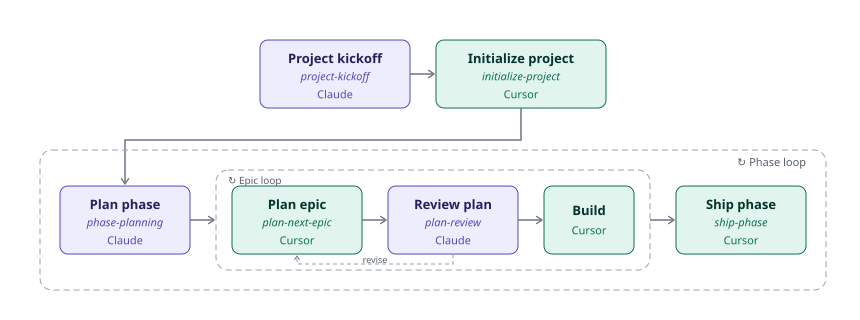

# Seminova

[](https://github.com/aaronwllms/seminova/actions/workflows/pull-request.yaml)
[](LICENSE)
[](.nvmrc)
[](CONTRIBUTING.md)
[](https://github.com/aaronwllms/seminova)

**An opinionated, AI-native starter for building SaaS products with Next.js and Supabase — with the planning workflow built in.**

<!-- TODO: hero screenshot — landing page, light and dark side by side, saved to images/ or .github/ -->

## Why this exists

Most starter templates hand you a blank slate with dependencies pre-installed. Seminova hands you a *curated* foundation: codified design-system structure, owned UI primitives, accessibility defaults, and — the part that makes it AI-native rather than just AI-friendly — a documented, skill-driven workflow for planning and building with AI coding tools. The structure enforces good patterns from the first commit, while each product built from it stays free to define its own identity and features on top.

**Structure is fixed and inherited; theme is meant to be re-skinned.** Semantic tokens, primitive-first components, accessibility defaults, and the agent workflow carry into every product spun off Seminova unchanged. Colors, type, and radius don't — they're replaced per product.

**What it is not:**

- A finished product
- A heavy boilerplate stuffed with billing, teams, or other features — those belong to individual products, not the template
- A fixed visual identity

**Who it's for:** the primary builder is a product manager who directs AI coding tools rather than writing most code by hand — making product and design calls and reviewing output, while the template encodes the engineering and design best practices. Seminova is public and open to contribution; its conventions, rules, and skills are documented precisely so others can adopt it, understand its opinions, and improve it.

---

## The AI-native workflow

Seminova ships with a two-environment planning system: **Claude** owns planning, decomposition, and adversarial review; **Cursor** owns implementation. Skills on both sides drive each step — from project kickoff, which turns a fresh clone into a real project, through phase planning, plan review, build, and ship.

<picture>
  <source media="(prefers-color-scheme: dark)" srcset="public/images/workflow-dark.svg">
  <source media="(prefers-color-scheme: light)" srcset="public/images/workflow-light.svg">
  
</picture>

> [!NOTE]
> **This diagram renders on GitHub; Cursor's built-in preview shows a broken image icon.** That's expected — Cursor doesn't currently render images in markdown preview. See [docs/WORKFLOW_GUIDE.md](docs/WORKFLOW_GUIDE.md#the-full-workflow) for the annotated version, or [docs/WORKFLOW_BACKLOG.md](docs/WORKFLOW_BACKLOG.md) for the plan to revisit this once Mermaid's swimlane support matures.

The full workflow — every step, skill, and document explained, plus the detailed diagram — lives in [docs/WORKFLOW_GUIDE.md](docs/WORKFLOW_GUIDE.md). One-time setup (connecting Claude Desktop, installing the skills) is in [docs/WORKFLOW_SETUP.md](docs/WORKFLOW_SETUP.md).

---

## Prerequisites

- Node.js `>=22.22.2` (see [.nvmrc](.nvmrc))
- [pnpm](https://pnpm.io/) 11
- A [Supabase](https://supabase.com) project
- [Cursor](https://cursor.com) — the IDE this template is built with
- [GitHub CLI](https://cli.github.com) (`gh`) — install via `brew install gh` (Mac) or see [cli.github.com](https://cli.github.com) for other platforms, then authenticate once with `gh auth login`

---

## Quick start

1. Create your repository from this template — click **Use this template** on GitHub (or fork/clone if contributing to Seminova itself) — then install dependencies:

   ```bash
   git clone <your-new-repo-url> my-project
   cd my-project
   pnpm install
   ```

2. Copy environment variables:

   ```bash
   cp .env.example .env.local
   ```

3. Fill in your Supabase credentials in `.env.local` (from [Project Settings → API](https://app.supabase.com/project/_/settings/api)):

   | Variable | Description |
   | -------- | ----------- |
   | `NEXT_PUBLIC_SUPABASE_URL` | Project URL — **required for `pnpm build`** (production deploy blocker) |
   | `NEXT_PUBLIC_SUPABASE_PUBLISHABLE_KEY` | Publishable (anon) key — **required for `pnpm build`** |
   | `SUPABASE_SECRET_KEY` | Secret key (server/CLI only — see [Initial setup](#initial-setup)) |
   | `NEXT_PUBLIC_SITE_URL` | Optional — canonical site URL for Open Graph and metadata (include `https://`); falls back to `VERCEL_URL` on Vercel, then `http://localhost:3000` locally |
   | `CSP_ENFORCE` | Optional — set to `true` for enforcing CSP instead of report-only (see [AGENTS.md](AGENTS.md); requires nonce strategy before production use) |
   | `VERCEL_URL` | Optional — auto-set on Vercel deploys; used as metadata base when `NEXT_PUBLIC_SITE_URL` is unset (do not set locally) |

> [!WARNING]
> **Development-only auth bypass:** if `NEXT_PUBLIC_SUPABASE_URL` and `NEXT_PUBLIC_SUPABASE_PUBLISHABLE_KEY` are not set, the auth proxy skips session checks in development so you can explore the UI before wiring Supabase. **Production deploys without those variables return 503** — configure env vars before shipping.

4. Link your local repo to your Supabase project and apply the schema that ships with the template (this is what creates the `profiles` table [Initial setup](#initial-setup) below depends on):

   ```bash
   pnpm exec supabase link
   pnpm db:push
   pnpm db:types
   ```

   `supabase link` requires Supabase dashboard access and only needs to run once per machine/clone. `db:push` applies the SQL files in [`supabase/migrations/`](supabase/migrations/) and will prompt for confirmation. `db:types` regenerates TypeScript types from the schema.

5. Start the development server:

   ```bash
   pnpm dev
   ```

   Open [http://localhost:3000](http://localhost:3000).

   `next-env.d.ts` is auto-generated by Next.js and not committed. If `pnpm type-check` fails on a fresh clone before the first dev run, start `pnpm dev` once (or run `pnpm build`) and retry.

---

## Initial setup

After Quick start, grant yourself admin access so you can use the admin shell:

### Email templates and redirect URLs

In the [Supabase Dashboard](https://app.supabase.com) for your linked project:

- **Email templates** — Authentication → Email Templates. Replace the default verify link in each template so confirmation routes through this app:
  - **Confirm signup:** `{{ .SiteURL }}/auth/confirm?token_hash={{ .TokenHash }}&type=email&next={{ .RedirectTo }}`
  - **Reset Password:** `{{ .SiteURL }}/auth/confirm?token_hash={{ .TokenHash }}&type=recovery&next={{ .RedirectTo }}`
- **Redirect URLs** — Authentication → URL Configuration → Redirect URLs. Add the patterns below (trailing glob matches any path under that origin):

```text
http://localhost:3000/**
https://yourapp.com/**
```

Replace `yourapp.com` with your deployed domain when you ship.

If these are skipped, email confirmation links may fail silently or log `Missing access token on protected route` in the server console.

### Grant admin access

- **CLI (bootstrap):** promote your account with the command below. The CLI prints the target Supabase project URL and asks for confirmation before acting. `SUPABASE_SECRET_KEY` is required for CLI commands only.

```bash
pnpm promote-admin your@email.com
```

- **In-app (once an admin exists):** another admin promotes you from `/admin/users`

1. **Configure Supabase Auth** (required before sign-up) — complete [Email templates and redirect URLs](#email-templates-and-redirect-urls) in the Supabase Dashboard.
2. Start the dev server and sign up at [http://localhost:3000/auth/sign-up](http://localhost:3000/auth/sign-up).
3. Add `SUPABASE_SECRET_KEY` to `.env.local` (from [Project Settings → API](https://app.supabase.com/project/_/settings/api) → **API Keys** → **secret key**, `sb_secret_...`):

> [!WARNING]
> **Never commit `SUPABASE_SECRET_KEY` or use a `NEXT_PUBLIC_*` prefix.** Supabase's **secret key** replaces the legacy **service role** key. This repo uses `SUPABASE_SECRET_KEY` — not `SUPABASE_SERVICE_ROLE_KEY`. The legacy JWT under "Legacy API keys" still works during Supabase's migration period, but prefer the secret key from **API Keys**.

4. Grant yourself admin access using one of the options in [Grant admin access](#grant-admin-access) above.
5. **Re-login** if you were already signed in — the admin role is embedded in the JWT and won't appear until you start a fresh session.

6. Open the admin area at [http://localhost:3000/admin](http://localhost:3000/admin) (admins land here after login; non-admins land on `/home`). `/admin/users` lists signed-up accounts with stat-tile filters (Total, Unverified, Banned), email search, column sort, configurable page size, refetch-on-focus freshness, and in-app promote/demote and ban/unban; `/admin/logs` browses persisted application logs with a live feed (Supabase Realtime INSERT subscription, live on/off toggle, manual refresh), stat-tile filters (level + unread), tag and free-text search, global read/unread triage, filtered empty state with reset and refresh, cursor paging, timestamp sort direction, row detail, and copy-to-clipboard; `/admin/settings` edits runtime configuration (registry-driven, per-row save).

Companion CLI commands (bootstrap / automation): `pnpm demote-admin <email>`, `pnpm delete-user <email>` (test-account cleanup; requires secret key and confirmation naming the target project), `pnpm list-admins` (read-only, no confirmation).

---

## Starting your own product

> [!IMPORTANT]
> **Don't hand-edit Seminova's identity out of the repo.** Once the template runs locally, turn it into *your* project through the workflow below — find-and-replace skips files the scrub pass handles and misses ones it doesn't.

1. **Set up the workflow** (one-time): [docs/WORKFLOW_SETUP.md](docs/WORKFLOW_SETUP.md) connects Claude Desktop to the repo and installs the planning skills.
2. **Run project kickoff** (Claude, `project-kickoff`): a structured session that captures your project's identity and roadmap, then writes `ROADMAP.md`, `site.ts`, this README, and `LEXICON.md`.
3. **Initialize the project** (Cursor, `/initialize-project`): the mechanical scrub pass that replaces remaining Seminova-specific content across the repo.

After that, the repo is a real project, not a template copy — and the phase-by-phase build loop in [docs/WORKFLOW_GUIDE.md](docs/WORKFLOW_GUIDE.md) takes over.

**Re-skinning:** colors, type, and radius are per-product by design. [DESIGN.md](DESIGN.md) documents the token architecture and re-skin workflow.

- Landing page hero, features, proof CTA, and tech-stack copy — [`src/config/landing-content.ts`](src/config/landing-content.ts)
- App name, logo, and nav/social links — [`src/config/site.ts`](src/config/site.ts)
- Social preview images — generated dynamically via [`src/utils/og-image.tsx`](src/utils/og-image.tsx) and per-route `opengraph-image.tsx` files; update template colors (mirroring `globals.css` light tokens) and font at [`src/assets/fonts/Inter-SemiBold.ttf`](src/assets/fonts/Inter-SemiBold.ttf)
- New routes with OG images — copy [`src/app/auth/login/opengraph-image.tsx`](src/app/auth/login/opengraph-image.tsx)

---

## Stack

- **Next.js 16** (App Router) — React 19, TypeScript
- **Supabase** — auth, database, storage via `@supabase/ssr`
- **Tailwind CSS + shadcn/ui** — owned primitives in `src/components/ui`
- **TanStack Query v5** — client-side data fetching
- **next-themes** — light/dark theming over CSS variables
- **Vitest + React Testing Library** — unit/integration tests (MSW v2 in devDependencies; global setup deferred until HTTP boundaries need it)
- **pnpm** — exclusive package manager
- **Husky + lint-staged** — pre-commit quality checks
- **GitHub Actions** — CI on pull requests

---

## Scripts

| Command | Description |
| ------- | ----------- |
| `pnpm dev` | Development server |
| `pnpm build` | Production build |
| `pnpm start` | Run production build |
| `pnpm type-check` | TypeScript validation |
| `pnpm lint` | ESLint (repo-wide) |
| `pnpm lint-fix` | ESLint with auto-fix |
| `pnpm format` | Prettier write |
| `pnpm format-check` | Prettier check |
| `pnpm test` | Vitest run once (default; non-watch) |
| `pnpm test:watch` | Vitest watch mode (local dev) |
| `pnpm test:file` | Run one test file or pattern (`pnpm test:file -- <path>`) |
| `pnpm test:ci` | Vitest run once with coverage gates (CI / agents) |
| `pnpm pre-push` | Full local CI mirror (type-check → hard-constraint checks → lint → format-check → test:ci) |
| `pnpm check:seo-base-url` | SEO base-URL centralization (hard constraint) |
| `pnpm check:a11y-structure` | Deterministic a11y structure (hard constraint) |
| `pnpm check:a11y-contrast` | Deterministic a11y token contrast (hard constraint) |
| `pnpm check:no-raw-console` | Application logging via wrappers (hard constraint) |
| `pnpm test:ui` | Vitest UI |
| `pnpm analyze` | Bundle analyzer |
| `pnpm promote-admin <email>` | Grant admin role via CLI (requires secret key; bootstrap / automation) |
| `pnpm demote-admin <email>` | Remove admin role via CLI |
| `pnpm delete-user <email>` | Delete a user via CLI (test-account cleanup; requires secret key and confirmation naming the target project) |
| `pnpm list-admins` | List all admin users (read-only) |
| `pnpm db:push` | Apply pending SQL migrations to the linked Supabase project (CLI prompts to confirm) |
| `pnpm db:types` | Regenerate TypeScript types from the linked project schema |

---

## Database migrations

Schema changes live in [`supabase/migrations/`](supabase/migrations/). Agents write SQL files only; humans apply them.

The one-time `pnpm exec supabase link` step is covered in Quick start above. From then on, whenever a new migration file lands:

1. Review the SQL in `supabase/migrations/`
2. Apply: `pnpm db:push` (confirm when prompted)
3. Regenerate types: `pnpm db:types`

One migration enables the **`pg_cron`** extension and schedules a daily purge of `app_logs` rows older than the **Log retention window** on `/admin/settings` — change that value anytime; the next scheduled run (03:00 UTC) picks it up with no redeploy. After the first push, you can confirm the job under Supabase Dashboard → Integrations → Cron (`purge-expired-app-logs`).

See [AGENTS.md](AGENTS.md) and [`.cursor/rules/do-migrations-agent.mdc`](.cursor/rules/do-migrations-agent.mdc) for agent constraints.

---

## Client log relay exposure

The template ships an **unauthenticated write path** into `app_logs` at `/api/client-logs`. Browser call sites post through [`clientLog`](src/utils/client-logger.ts); the relay validates same-origin requests, a closed key registry, and payload size caps, then forwards to the server logger. There is **no rate limit** in the template — anyone who can reach your deployment can insert rows at any rate.

**Mitigation (recommended for production):** rate-limit the relay path at your edge or WAF. On Vercel, add a [Web Application Firewall](https://vercel.com/docs/security/vercel-waf) rule scoped to `POST /api/client-logs` — for example, a fixed-window request cap per IP. Design rationale: [docs/adr/ADR-0007-client-log-relay-unauthenticated.md](docs/adr/ADR-0007-client-log-relay-unauthenticated.md).

---

## Documentation

| Document | Audience | Purpose |
| -------- | -------- | ------- |
| [ROADMAP.md](ROADMAP.md) | PM + agents | Phase status, planning horizon stubs |
| [docs/prds/](docs/prds/) | PM + agents | Per-phase epics/stories while Active |
| [docs/DOC_RULES.md](docs/DOC_RULES.md) | PM + agents | Doc maintenance — write discipline, doc roles, archive policy |
| [docs/WORKFLOW_GUIDE.md](docs/WORKFLOW_GUIDE.md) | PM + agents | Primary planning and build workflow |
| [docs/WORKFLOW_SETUP.md](docs/WORKFLOW_SETUP.md) | PM + agents | One-time workflow setup for new template users |
| [docs/WORKFLOW_BACKLOG.md](docs/WORKFLOW_BACKLOG.md) | PM + agents | Deferred workflow-system decisions |
| [LEXICON.md](LEXICON.md) | PM + agents | Architectural vocabulary |
| [docs/adr/](docs/adr/) | PM + agents | Architecture Decision Records |
| [docs/research/](docs/research/) | PM + agents | Exploratory research briefs (`docs/research/archive/` when retired) |
| [AGENTS.md](AGENTS.md) | Agents | Repo truth — routes, hard constraints, data model |
| [DESIGN.md](DESIGN.md) | PM + contributors | Token architecture and re-skin workflow |
| [.cursor/rules/](.cursor/rules/) | Agents | Coding standards and conventions |
| [.cursor/skills/](.cursor/skills/) | Agents | Workflows (`/sync-repo-docs`, `/create-migration`, etc.) |

---

## Contributing and quality

**Pre-commit** (Husky): lint-staged on staged files — ESLint + Prettier for JS/TS; Prettier for markdown, JSON, YAML, and CSS (agent-authored docs in `.prettierignore` are skipped) — plus full-project type-check.

**Pre-push** (Husky): `pnpm pre-push` — type-check → hard-constraint checks → lint → format-check → `test:ci` (with 80% coverage thresholds). Mirrors CI exactly.

**CI** (pull requests to `main`): same order as pre-push (`check:pnpm-only`, `check:no-shadcn-pkg`, `check:semantic-tokens`, `check:seo-base-url`, `check:a11y-structure`, `check:a11y-contrast`, `check:no-raw-console` before lint). See [.github/workflows/pull-request.yaml](.github/workflows/pull-request.yaml).

Before opening a PR, run locally:

```bash
pnpm pre-push
```

Imports use the TypeScript path alias `@/` → `src/` (e.g. `import { Button } from '@/components/ui/button'`).

---

## Like Seminova?

If Seminova gives your next product good bones, here's how to support it:

- ⭐ **[Star the repo](https://github.com/aaronwllms/seminova)** — helps other builders find it
- 🐛 **[Report bugs or rough edges](https://github.com/aaronwllms/seminova/issues)** — especially in the workflow docs; if a step confused you, it'll confuse others
- 📢 **Share it** — if the workflow saved you planning pain, tell another PM who builds with AI

---

## Acknowledgments

Seminova began as a fork of [supa-next-starter](https://github.com/michaeltroya/supa-next-starter) by [Michael Troya](https://github.com/michaeltroya), an MIT-licensed Next.js + Supabase starter kit. That project supplied the initial scaffolding — the Next.js/Supabase/Tailwind/shadcn wiring, tooling, and CI setup Seminova built on top of.

The foundation has since been substantially rebuilt, but because Seminova derives from that work, the original MIT copyright is retained alongside Seminova's own. This is why [LICENSE](LICENSE) carries two copyright lines: Michael Troya's, covering the original starter, and Aaron Williams', covering Seminova. Both fall under the same MIT license. Thank you to Michael for the starting point.

Some of the agent-skill conventions and workflow patterns draw on [mattpocock/skills](https://github.com/mattpocock/skills) by Matt Pocock (MIT-licensed) and [ECC (Everything Claude Code)](https://github.com/affaan-m/ECC) by Affaan Mustafa (MIT-licensed). Thanks to both for putting well-tested agent-workflow patterns into the open.

---

## License

MIT — see [LICENSE](LICENSE). The two copyright lines are explained in [Acknowledgments](#acknowledgments) above.
